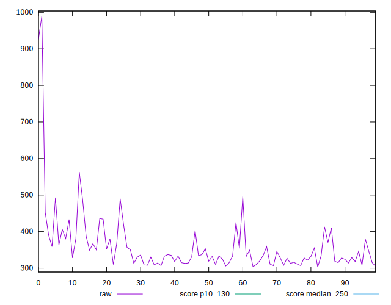
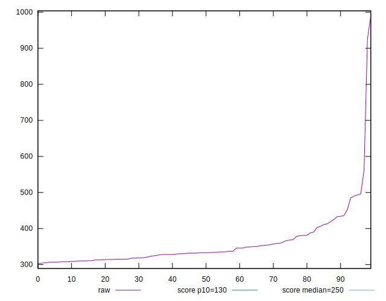
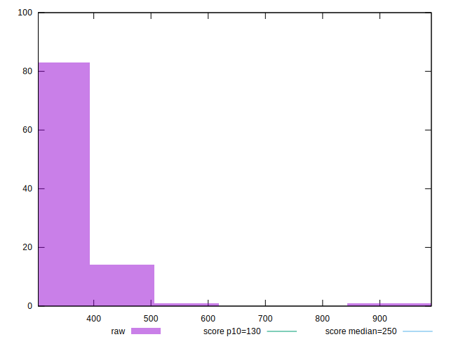
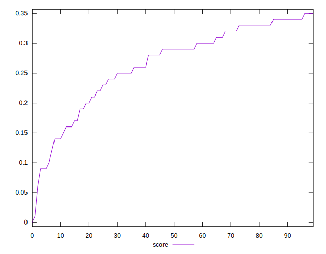
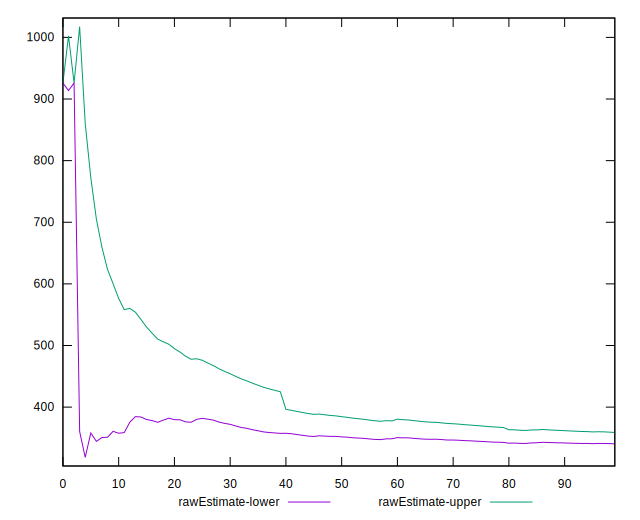
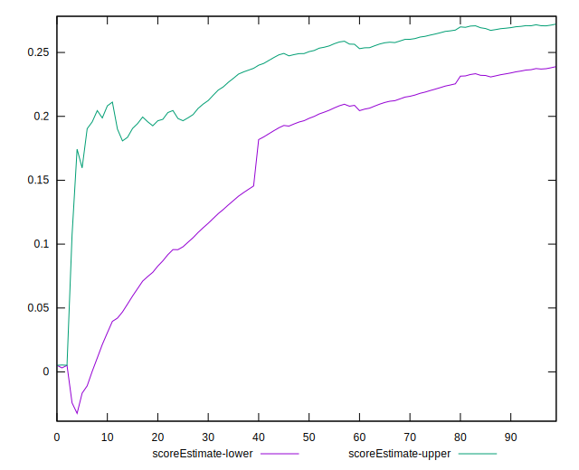
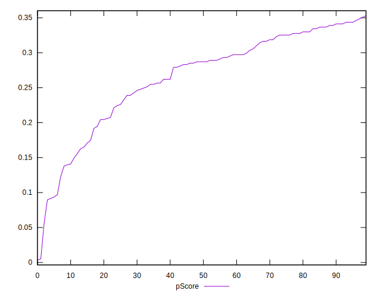
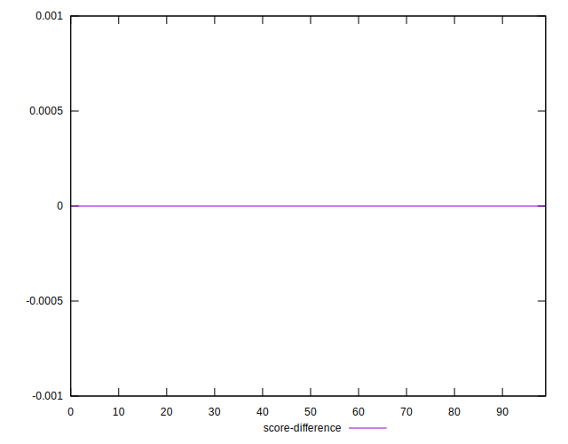

# //max-potential-fid/samples/pages

[→ Parent](../..)


## Raw


```yaml
p90min: 305.9999999999991
p90max: 496
p90range: 190.0000000000009
p90mean: 349.63829787234044
p90median: 333
p90stdev: 45.68901610723789
p90skewness: 1.5916271794083519
p90eccentricity: 0.9999999999999999
p90discretization: 1.323943661971831
outlandishness: 1.075339845813131
confidence: 38.67700797556271
p90confidence: 18.472512355010096

```


## Score


```yaml
p90min: 0.09
p90max: 0.35
p90range: 0.26
p90mean: 0.26659574468085095
p90median: 0.29
p90stdev: 0.06879747013361666
p90skewness: -0.9872519022110781
p90eccentricity: 0.9999999999999997
p90discretization: 4.086956521739131
outlandishness: 0.9643459442589182
confidence: 0.03143469403430991
p90confidence: 0.02781548444934331

```


## Raw Estimate


## Score Estimate


## P Score


```yaml
p90min: 0.08968880625091713
p90max: 0.3460087474833111
p90range: 0.256319941232394
p90mean: 0.2663736287038148
p90median: 0.2871150014950539
p90stdev: 0.06812410534320934
p90skewness: -0.9936455569932303
p90eccentricity: 0.9999999999999991
p90discretization: 1.323943661971831
outlandishness: 0.9641744481545202
confidence: 0.031285536822677734
p90confidence: 0.027543236533541567

```


## Score Difference


```yaml
p90min: 0
p90max: 5.551115123125783e-17
p90range: 5.551115123125783e-17
p90mean: 5.905441620346577e-19
p90median: 0
p90stdev: 5.695001657605475e-18
p90skewness: 9.539955591519908
p90eccentricity: 0.9999999999999996
p90discretization: 47
outlandishness: 14.137600000000003
confidence: 4.264066145825134e-18
p90confidence: 2.302544406624999e-18

```


## P Score Difference


```yaml
p90min: -0.004762995021792837
p90max: 0.004701745187188605
p90range: 0.009464740208981443
p90mean: -0.00025643668715326834
p90median: -0.0007148670504337484
p90stdev: 0.0028823612015512153
p90skewness: 0.1326271243780289
p90eccentricity: 1
p90discretization: 1.3055555555555556
outlandishness: 0.8860235296795115
confidence: 0.001191304806315402
p90confidence: 0.0011653665901293455

```

