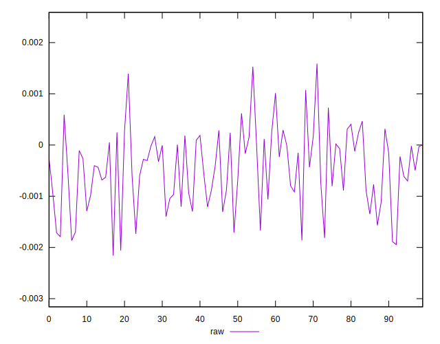
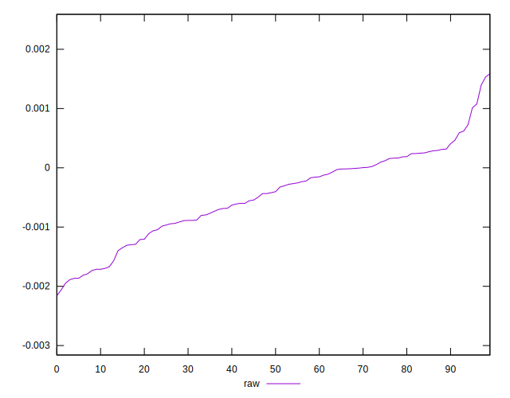
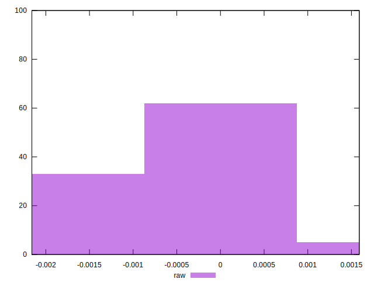

# //meta/pScore-difference/samples/pages+cached+noadtech+nomedia

[→ Parent](../..)


## Raw


```yaml
p90min: -0.0018865043760015298
p90max: 0.001075773602002139
p90range: 0.0029622779780036686
p90mean: -0.00047939448933588226
p90median: -0.000411423465608831
p90stdev: 0.0007108535582351715
p90skewness: -0.2568542634185107
p90eccentricity: 1
p90discretization: 1
outlandishness: 0.9495321195905662
confidence: 0.00032035641702864257
p90confidence: 0.00028740498824228103

```

