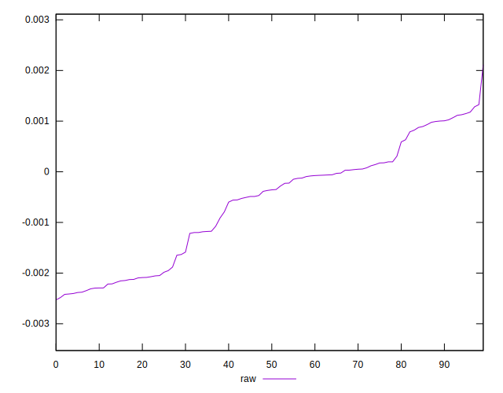

# //meta/pScore-difference/samples/pages+cached+noadtech

[→ Parent](../..)


## Raw


```yaml
p90min: -0.0024124253502431233
p90max: 0.0011791126339066218
p90range: 0.003591537984149745
p90mean: -0.0006267907431436083
p90median: -0.0003626346352066788
p90stdev: 0.0011335584447363957
p90skewness: -0.1733677479730857
p90eccentricity: 1
p90discretization: 1
outlandishness: 0.9668095544597864
confidence: 0.0004736750724799768
p90confidence: 0.00045830867371648016

```

