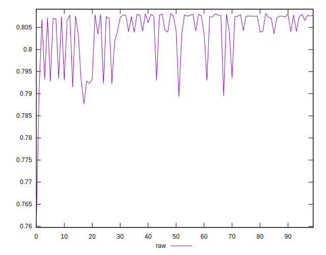
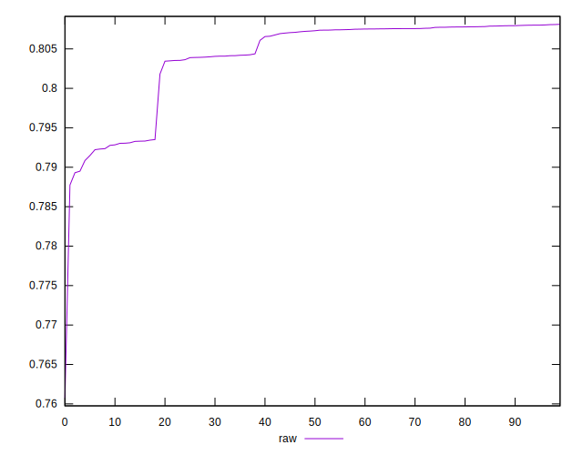
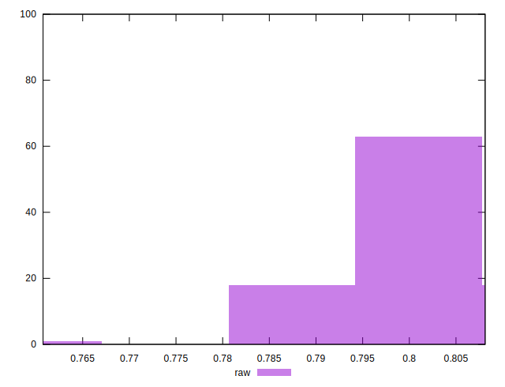

# //meta/pScore/samples/pages+cached+noadtech+nomedia+nocss

[→ Parent](../..)


## Raw


```yaml
p90min: 0.7895022545661513
p90max: 0.8080382742877287
p90range: 0.018536019721577368
p90mean: 0.8041919384107575
p90median: 0.8072808971652806
p90stdev: 0.005517497147315288
p90skewness: -1.5099838197265416
p90eccentricity: 0.9999999999999994
p90discretization: 1
outlandishness: 0.9984324257231249
confidence: 0.0028392986800985635
p90confidence: 0.00223077761147867

```

