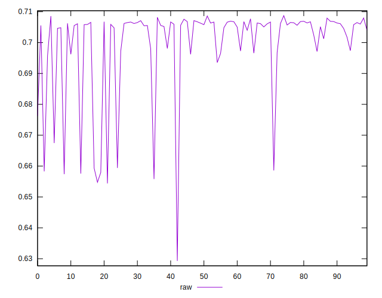
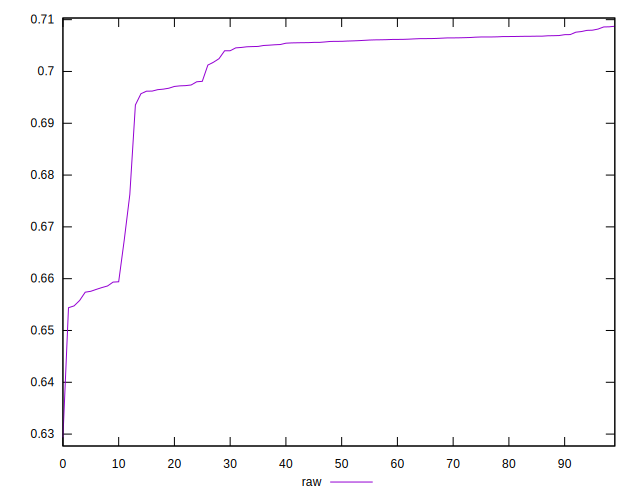
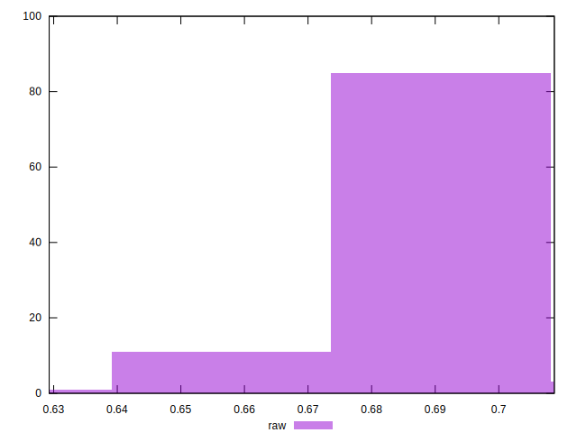

# //meta/pScore/samples/pages+cached+noadtech+nomedia

[→ Parent](../..)


## Raw


```yaml
p90min: 0.6557945601509089
p90max: 0.7081850514286571
p90range: 0.0523904912777482
p90mean: 0.6998873889897254
p90median: 0.7058151250069551
p90stdev: 0.014039417978112284
p90skewness: -2.3745591882077406
p90eccentricity: 1
p90discretization: 1
outlandishness: 0.9961472979941406
confidence: 0.006520220993838093
p90confidence: 0.005676272858428784

```

