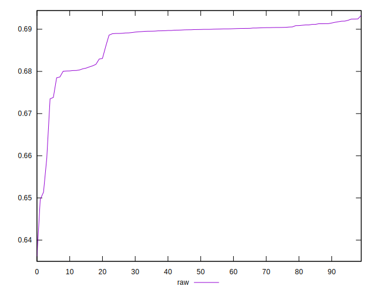

# //meta/pScore/samples/pages+cached+noadtech

[→ Parent](../..)


## Raw


```yaml
p90min: 0.6594331489438882
p90max: 0.6924046150645328
p90range: 0.03297146612064461
p90mean: 0.6879745572597108
p90median: 0.6899352981805542
p90stdev: 0.005144407454487891
p90skewness: -2.6806666031102835
p90eccentricity: 1
p90discretization: 1
outlandishness: 0.9967297125665874
confidence: 0.003490332463950102
p90confidence: 0.002079933830030086

```

