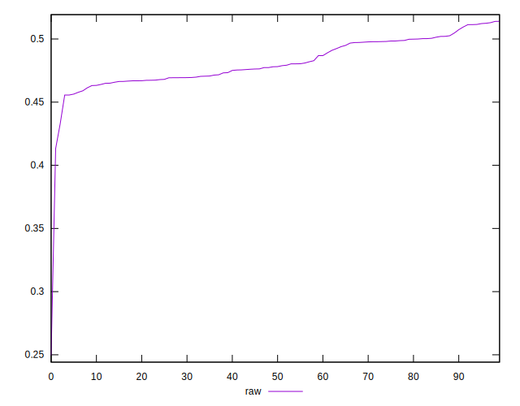
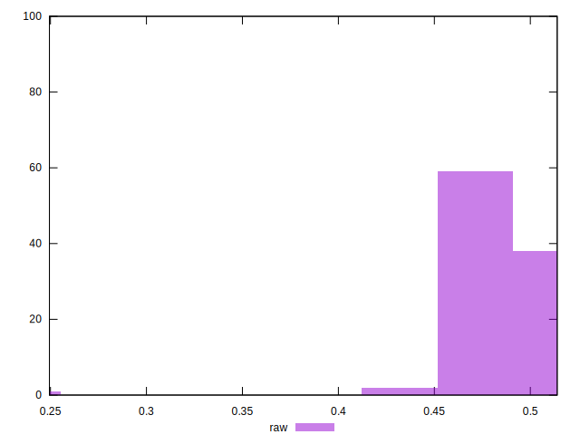

# //meta/pScore/samples/pages+cached

[→ Parent](../..)


## Raw


```yaml
p90min: 0.4556238536970343
p90max: 0.5124272337073933
p90range: 0.056803380010359006
p90mean: 0.4823390684784548
p90median: 0.4780622730098312
p90stdev: 0.01595683785566277
p90skewness: 0.2622673691957423
p90eccentricity: 0.9999999999999999
p90discretization: 1
outlandishness: 0.9893398359988794
confidence: 0.011606927324575925
p90confidence: 0.006451504312191306

```

