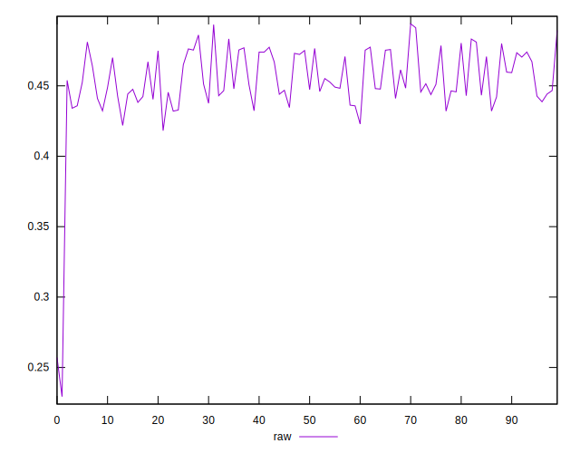
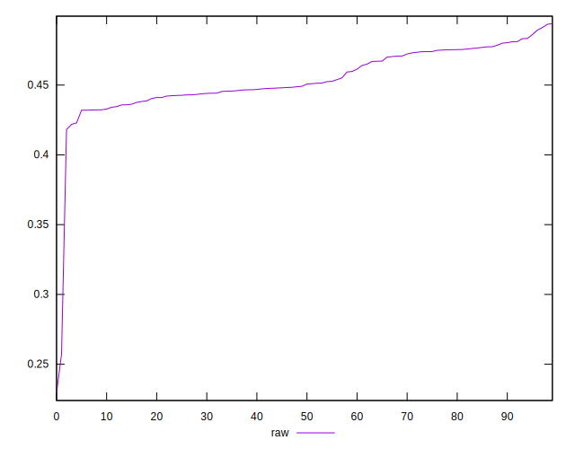
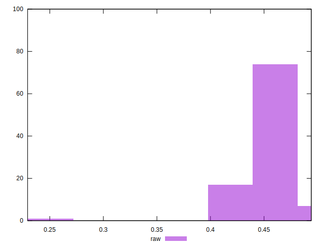

# //meta/pScore/samples/pages

[→ Parent](../..)


## Raw


```yaml
p90min: 0.42185571546608847
p90max: 0.4893359069583764
p90range: 0.06748019149228796
p90mean: 0.4557023888404474
p90median: 0.4499049426678452
p90stdev: 0.017006471966734132
p90skewness: 0.17722233692457495
p90eccentricity: 1.0000000000000007
p90discretization: 1
outlandishness: 0.9846584030630464
confidence: 0.013704574511733819
p90confidence: 0.006875881563815558

```

