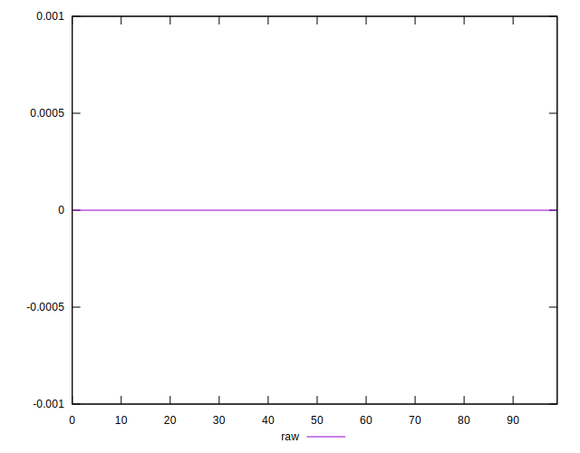

# //meta/score-difference/samples/pages+cached+noadtech

[→ Parent](../..)


## Raw


```yaml
p90min: 0
p90max: 1.6653345369377347e-17
p90range: 1.6653345369377347e-17
p90mean: 1.771632486103973e-19
p90median: 0
p90stdev: 1.7085004972816448e-18
p90skewness: 9.539955591519869
p90eccentricity: 0.9999999999999974
p90discretization: 47
outlandishness: 31.809600000000007
confidence: 2.0268335872571505e-18
p90confidence: 6.907633219875007e-19

```

