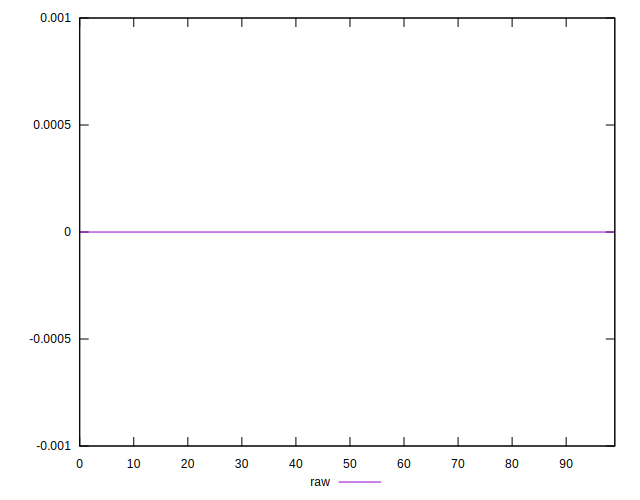
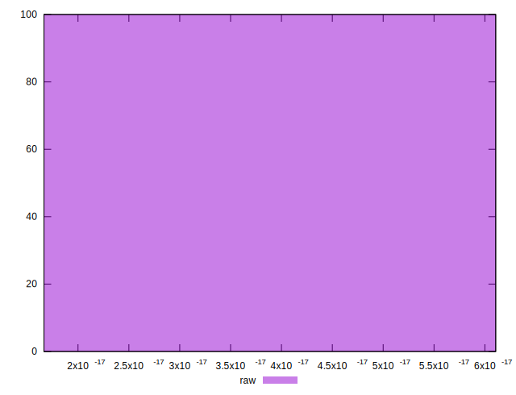

# //meta/score-difference/samples/pages+cached

[→ Parent](../..)


## Raw


```yaml
p90min: 1.6653345369377347e-17
p90max: 4.4408920985006264e-17
p90range: 2.7755575615628914e-17
p90mean: 2.043282800639918e-17
p90median: 1.6653345369377347e-17
p90stdev: 9.204156973048996e-18
p90skewness: 2.0968691532627006
p90eccentricity: 0.9999999999999979
p90discretization: 31.333333333333332
outlandishness: 1.0770360386247435
confidence: 4.06370015319552e-18
p90confidence: 3.7213299363468956e-18

```

