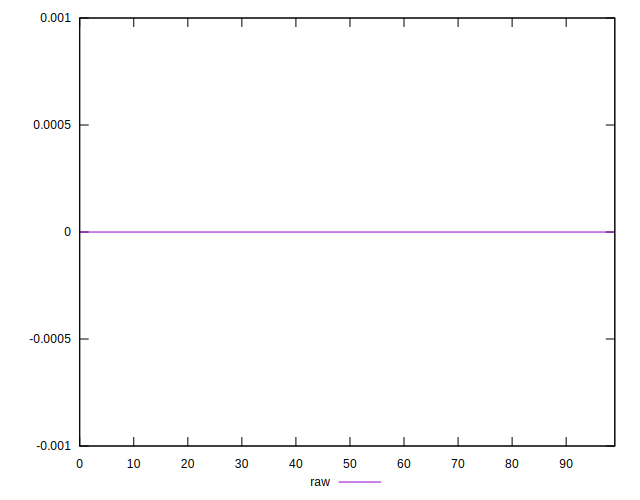

# //meta/score-difference/samples/pages

[→ Parent](../..)


## Raw


```yaml
p90min: 0
p90max: 2.7755575615628914e-17
p90range: 2.7755575615628914e-17
p90mean: 5.31489745831192e-18
p90median: 0
p90stdev: 9.831097129150173e-18
p90skewness: 1.5324123094751316
p90eccentricity: 1.0000000000000018
p90discretization: 23.5
outlandishness: 1.3079734444444453
confidence: 4.310163706832834e-18
p90confidence: 3.974807922220974e-18

```

