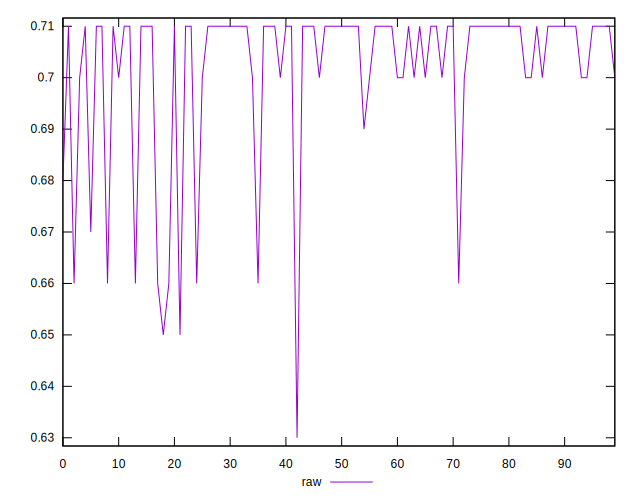
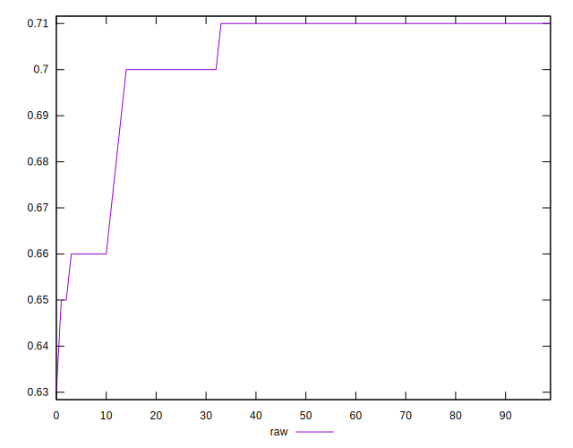
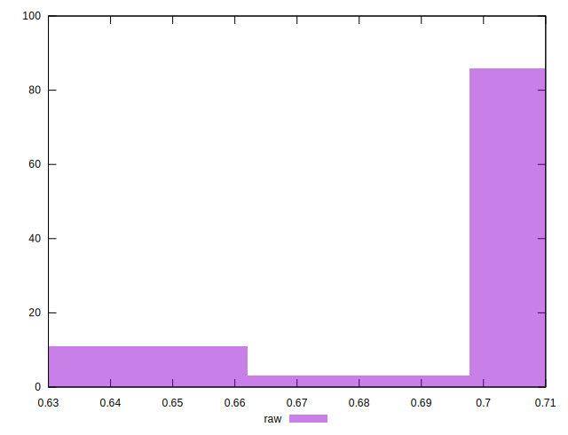

# //meta/score/samples/pages+cached+noadtech+nomedia

[→ Parent](../..)


## Raw


```yaml
p90min: 0.66
p90max: 0.71
p90range: 0.04999999999999993
p90mean: 0.7027659574468093
p90median: 0.71
p90stdev: 0.0145429850984128
p90skewness: -2.2514607003028093
p90eccentricity: 1.0000000000000007
p90discretization: 15.666666666666666
outlandishness: 0.9955484105725396
confidence: 0.0068633450039233485
p90confidence: 0.005879869929319845

```

