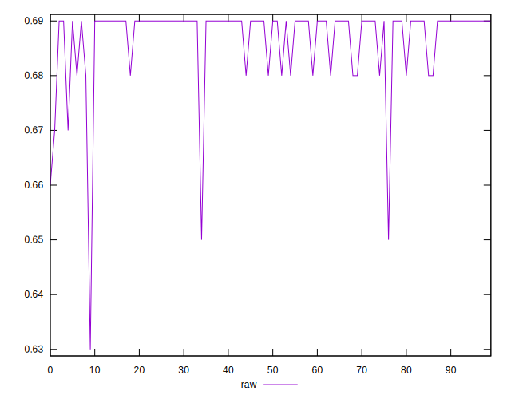
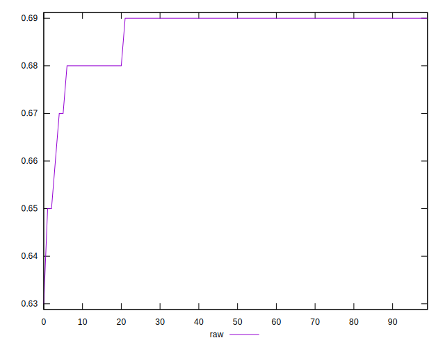
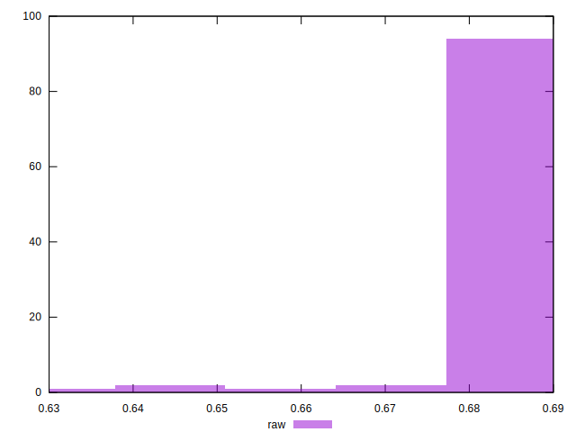

# //meta/score/samples/pages+cached+noadtech

[→ Parent](../..)


## Raw


```yaml
p90min: 0.66
p90max: 0.69
p90range: 0.029999999999999916
p90mean: 0.6876595744680843
p90median: 0.69
p90stdev: 0.00534461986684272
p90skewness: -2.643884831439556
p90eccentricity: 0.9999999999999996
p90discretization: 23.5
outlandishness: 0.9963399887265957
confidence: 0.003657105827034352
p90confidence: 0.002160881650227621

```

