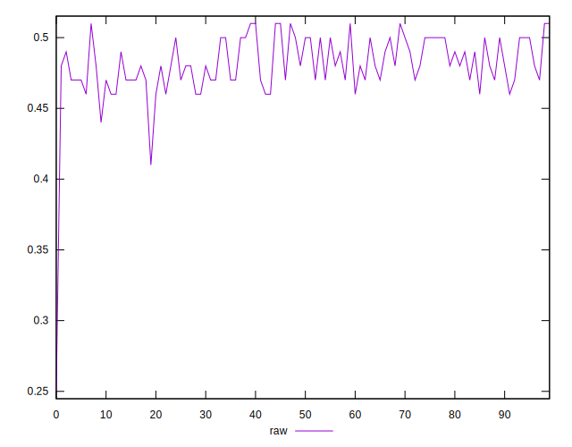
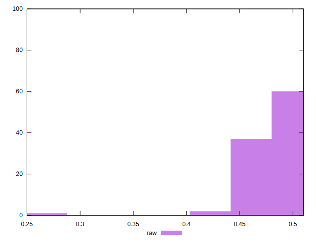

# //meta/score/samples/pages+cached

[→ Parent](../..)


## Raw


```yaml
p90min: 0.46
p90max: 0.51
p90range: 0.04999999999999999
p90mean: 0.4827659574468084
p90median: 0.48
p90stdev: 0.015601708534313754
p90skewness: 0.19090260791508143
p90eccentricity: 1.0000000000000007
p90discretization: 15.666666666666666
outlandishness: 0.9889859823155367
confidence: 0.011475350617295597
p90confidence: 0.006307922083131074

```

