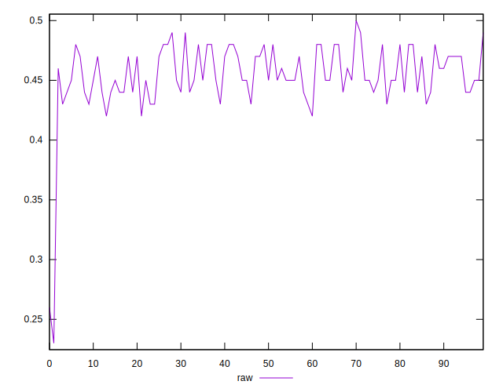
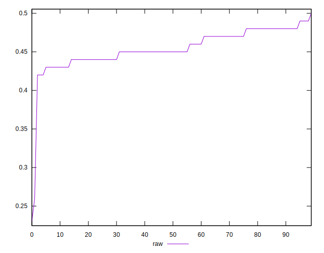
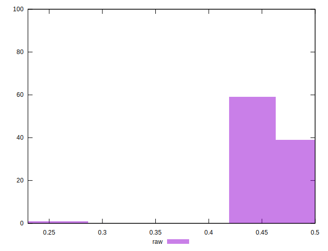

# //meta/score/samples/pages

[→ Parent](../..)


## Raw


```yaml
p90min: 0.42
p90max: 0.49
p90range: 0.07
p90mean: 0.45627659574468055
p90median: 0.45
p90stdev: 0.017923243114185406
p90skewness: 0.057567739127544475
p90eccentricity: 0.9999999999999982
p90discretization: 11.75
outlandishness: 0.9848190732080928
confidence: 0.013815507936682483
p90confidence: 0.007246541030595532

```

