# //offscreen-images/samples/pages+cached+noadtech

[→ Parent](../..)


## Raw


```yaml
p90min: 150
p90max: 310
p90range: 160
p90mean: 288.40425531914894
p90median: 300
p90stdev: 42.333608988336515
p90skewness: -2.9421608173390634
p90eccentricity: 1.000000000000001
p90discretization: 31.333333333333332
outlandishness: 0.9861493647817319
confidence: 19.82972191485205
p90confidence: 17.11588871237106

```

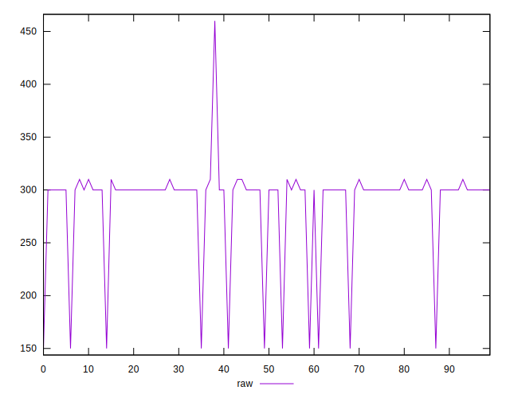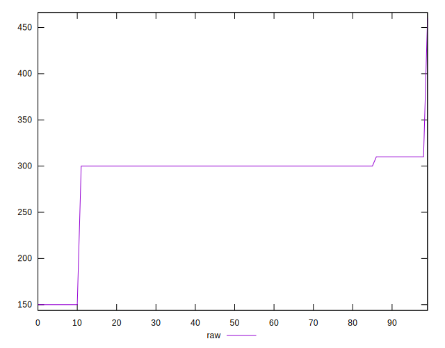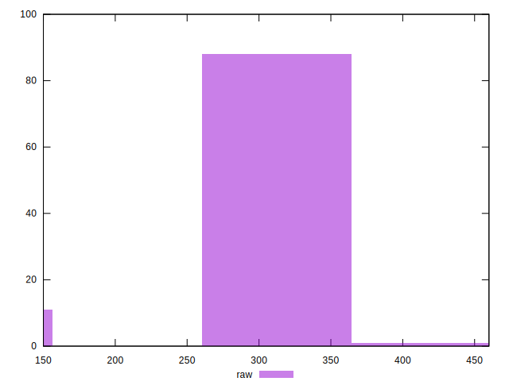
## Score


```yaml
p90min: 0.74
p90max: 0.88
p90range: 0.14
p90mean: 0.7598936170212767
p90median: 0.75
p90stdev: 0.036771134633518
p90skewness: 2.931711189805812
p90eccentricity: 0.9999999999999983
p90discretization: 31.333333333333332
outlandishness: 1.0058155144140573
confidence: 0.016661261765998147
p90confidence: 0.014866926379659893

```

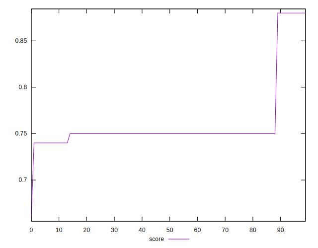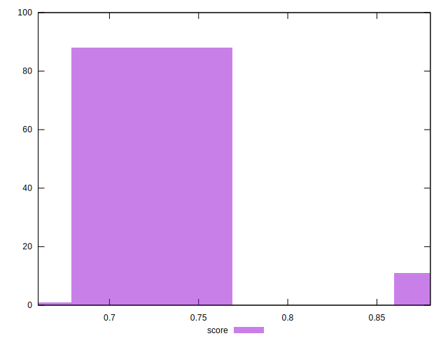
## Raw Estimate

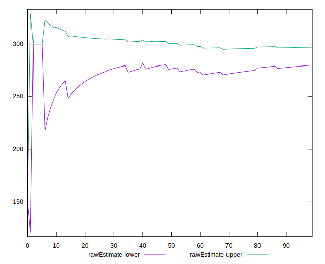
## Score Estimate

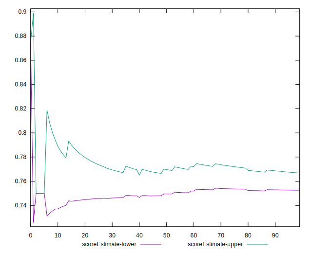
## P Score


```yaml
p90min: 0.7444444444444445
p90max: 0.875
p90range: 0.13055555555555554
p90mean: 0.7599881796690309
p90median: 0.75
p90stdev: 0.03512314434582817
p90skewness: 2.9597065670542544
p90eccentricity: 0.9999999999999979
p90discretization: 31.333333333333332
outlandishness: 1.005667857605955
confidence: 0.015944145315306454
p90confidence: 0.014200627922305623

```

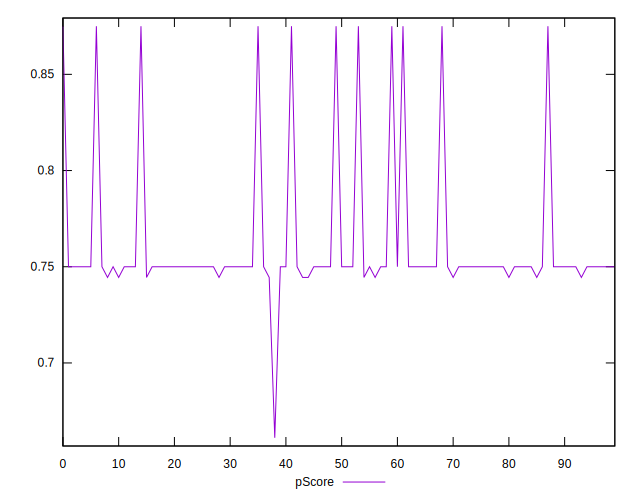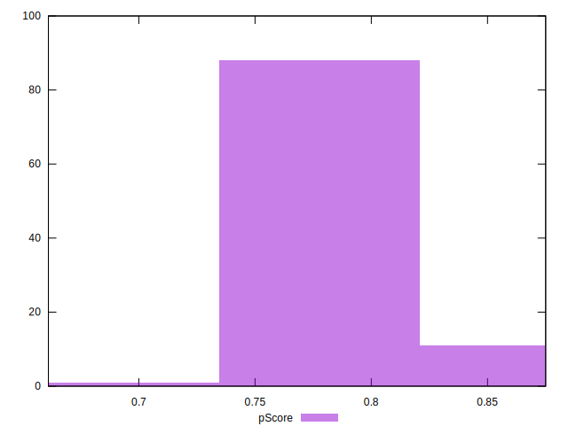
## Score Difference


```yaml
p90min: 0
p90max: 0
p90range: 0
p90mean: 0
p90median: 0
p90stdev: 0
p90skewness: .nan
p90eccentricity: .nan
p90discretization: 94
outlandishness: .nan
confidence: 0
p90confidence: 0

```


## P Score Difference


```yaml
p90min: -0.0050000000000000044
p90max: 0.004444444444444473
p90range: 0.009444444444444478
p90mean: 0.00005910165484633785
p90median: 0
p90stdev: 0.0020588085006269185
p90skewness: -0.2333003333115322
p90eccentricity: 0.9999999999999982
p90discretization: 23.5
outlandishness: 0.43296400000002955
confidence: 0.0009048782107886576
p90confidence: 0.0008323962454163193

```

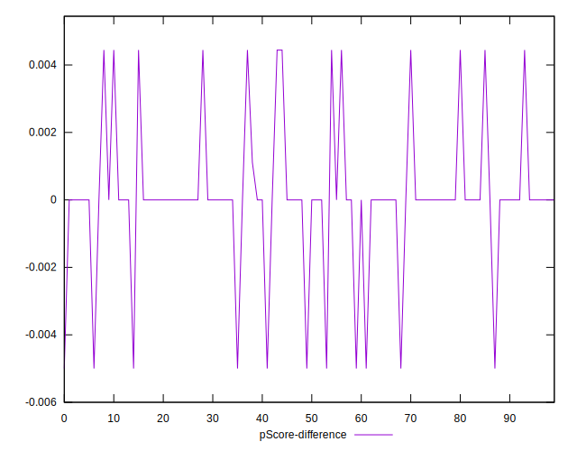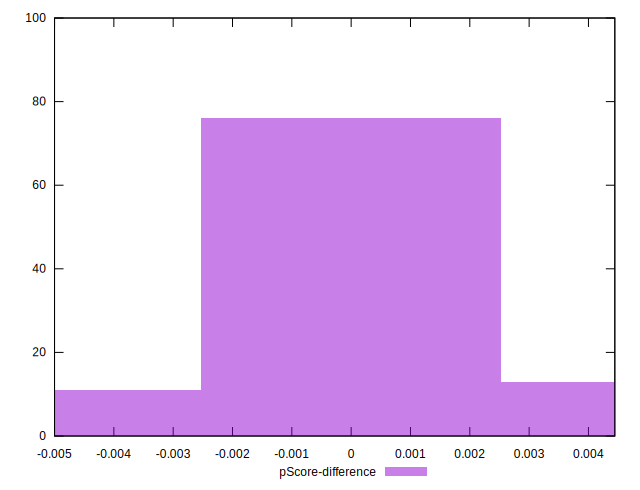