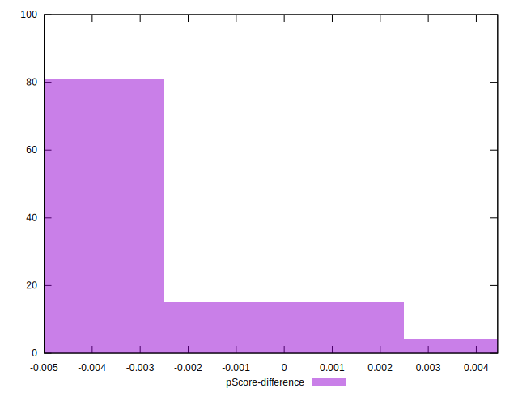

# //offscreen-images/samples/pages+cached

[→ Parent](../..)


## Raw


```yaml
p90min: 150
p90max: 310
p90range: 160
p90mean: 177.3404255319149
p90median: 150
p90stdev: 58.20315725725312
p90skewness: 1.6606017363687446
p90eccentricity: 1.0000000000000013
p90discretization: 31.333333333333332
outlandishness: 1.0520827638671428
confidence: 25.649002616344823
p90confidence: 23.532100998009476

```


## Score


```yaml
p90min: 0.74
p90max: 0.88
p90range: 0.14
p90mean: 0.856276595744681
p90median: 0.88
p90stdev: 0.0505077209718747
p90skewness: -1.6613480006201122
p90eccentricity: 0.9999999999999994
p90discretization: 31.333333333333332
outlandishness: 0.9918962212826106
confidence: 0.02154234924227864
p90confidence: 0.020420761468937707

```


## Raw Estimate


## Score Estimate


## P Score


```yaml
p90min: 0.7444444444444445
p90max: 0.875
p90range: 0.13055555555555554
p90mean: 0.8522754137115839
p90median: 0.875
p90stdev: 0.04836939696582725
p90skewness: -1.6593567513023328
p90eccentricity: 0.9999999999999983
p90discretization: 31.333333333333332
outlandishness: 0.9921986250958298
confidence: 0.0206706091474247
p90confidence: 0.01955621633345013

```


## Score Difference


```yaml
p90min: 0
p90max: 0
p90range: 0
p90mean: 0
p90median: 0
p90stdev: 0
p90skewness: .nan
p90eccentricity: .nan
p90discretization: 94
outlandishness: .nan
confidence: 0
p90confidence: 0

```


## P Score Difference


```yaml
p90min: -0.0050000000000000044
p90max: 0.004444444444444473
p90range: 0.009444444444444478
p90mean: -0.004083924349881801
p90median: -0.0050000000000000044
p90stdev: 0.002031902516269409
p90skewness: 2.007733506921245
p90eccentricity: 1.000000000000002
p90discretization: 23.5
outlandishness: 0.8912890138036903
confidence: 0.0009630526650023783
p90confidence: 0.0008215178949764405

```

