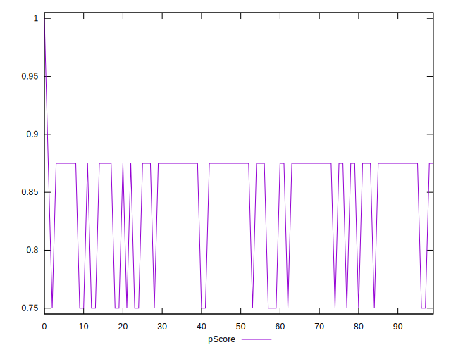

# //offscreen-images/samples/pages

[→ Parent](../..)


## Raw


```yaml
p90min: 150
p90max: 300
p90range: 150
p90mean: 183.51063829787233
p90median: 150
p90stdev: 62.47905941633586
p90skewness: 1.3281045550208694
p90eccentricity: 1.0000000000000004
p90discretization: 47
outlandishness: 1.0108116748582232
confidence: 26.104336425255696
p90confidence: 25.260889713377704

```


## Score


```yaml
p90min: 0.75
p90max: 0.88
p90range: 0.13
p90mean: 0.8509574468085105
p90median: 0.88
p90stdev: 0.05414851816082438
p90skewness: -1.3281045550208737
p90eccentricity: 1.0000000000000022
p90discretization: 47
outlandishness: 0.9977509846563047
confidence: 0.022518271788297295
p90confidence: 0.021892771084927334

```


## Raw Estimate


## Score Estimate


## P Score


```yaml
p90min: 0.75
p90max: 0.875
p90range: 0.125
p90mean: 0.8470744680851063
p90median: 0.875
p90stdev: 0.05206588284694649
p90skewness: -1.3281045550208699
p90eccentricity: 1.0000000000000022
p90discretization: 47
outlandishness: 0.9980543225332641
confidence: 0.021753613687713107
p90confidence: 0.021050741427814733

```


## Score Difference


```yaml
p90min: 0
p90max: 0
p90range: 0
p90mean: 0
p90median: 0
p90stdev: 0
p90skewness: .nan
p90eccentricity: .nan
p90discretization: 94
outlandishness: .nan
confidence: 0
p90confidence: 0

```


## P Score Difference


```yaml
p90min: -0.0050000000000000044
p90max: 0
p90range: 0.0050000000000000044
p90mean: -0.0038297872340425565
p90median: -0.0050000000000000044
p90stdev: 0.0021169945470353624
p90skewness: 1.2562972690740186
p90eccentricity: 1.000000000000002
p90discretization: 47
outlandishness: 0.9587673611111113
confidence: 0.0008486893005571292
p90confidence: 0.0008559214283321952

```

