# //render-blocking-resources/samples/pages+cached+noadtech+nomedia

[→ Parent](../..)


## Raw


```yaml
p90min: 318
p90max: 475
p90range: 157
p90mean: 333.67021276595744
p90median: 325
p90stdev: 30.698738035561117
p90skewness: 3.913401705387325
p90eccentricity: 1
p90discretization: 3.357142857142857
outlandishness: 1.0331152356401612
confidence: 18.466844732370365
p90confidence: 12.41179753825528

```

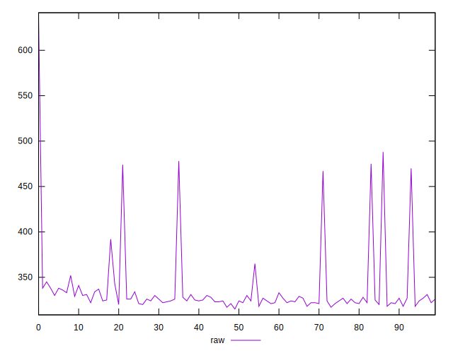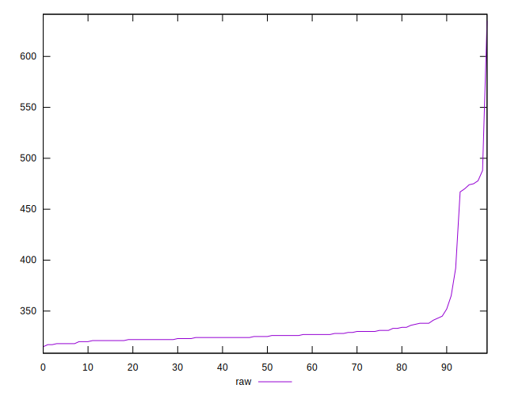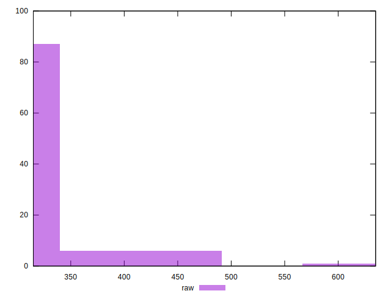
## Score


```yaml
p90min: 0.65
p90max: 0.74
p90range: 0.08999999999999997
p90mean: 0.7327659574468087
p90median: 0.74
p90stdev: 0.017709491103561542
p90skewness: -3.6978571858576785
p90eccentricity: 0.9999999999999984
p90discretization: 13.428571428571429
outlandishness: 0.991377552234456
confidence: 0.010531701923487666
p90confidence: 0.007160119019495755

```

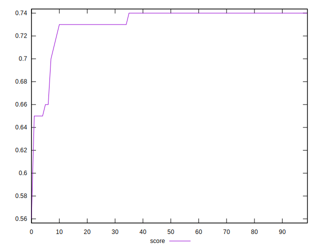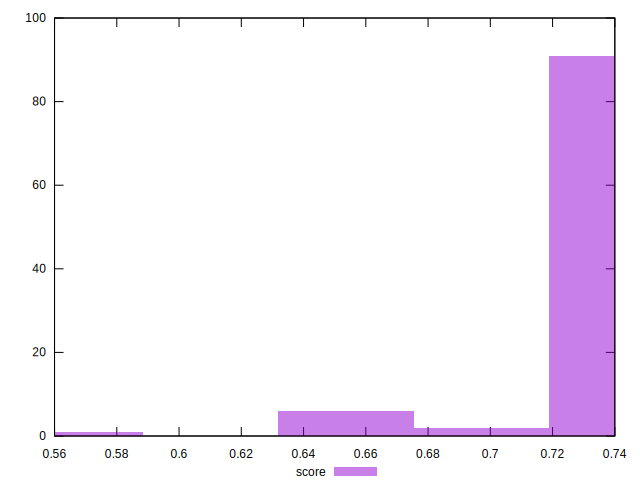
## Raw Estimate

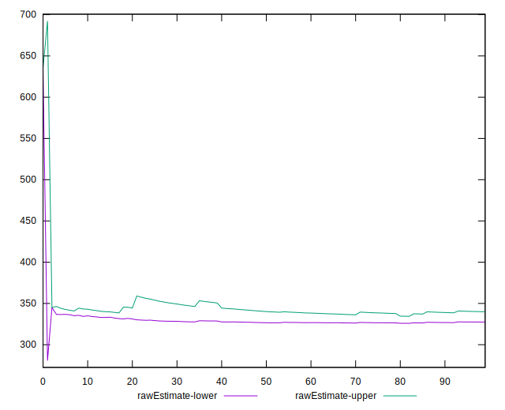
## Score Estimate

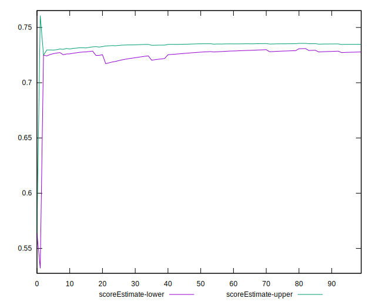
## P Score


```yaml
p90min: 0.6527777777777778
p90max: 0.74
p90range: 0.0872222222222222
p90mean: 0.731294326241135
p90median: 0.7361111111111112
p90stdev: 0.017054854464200613
p90skewness: -3.9134017053873715
p90eccentricity: 1.0000000000000004
p90discretization: 3.357142857142857
outlandishness: 0.9916914722968059
confidence: 0.0102593581846502
p90confidence: 0.006895443076808485

```

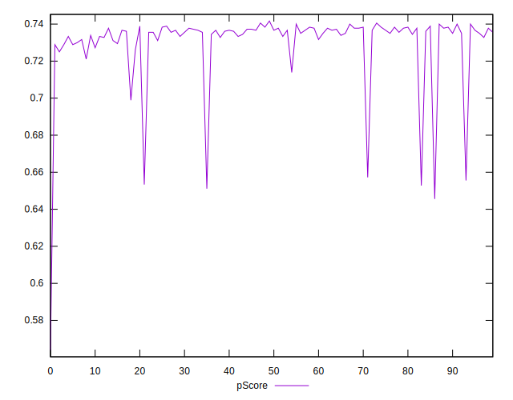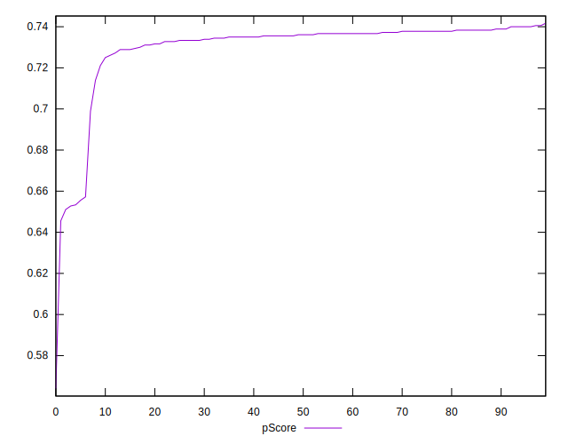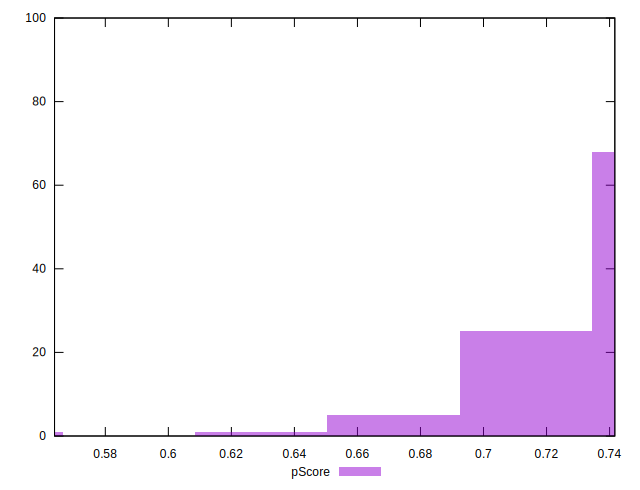
## Score Difference


```yaml
p90min: 0
p90max: 0
p90range: 0
p90mean: 0
p90median: 0
p90stdev: 0
p90skewness: .nan
p90eccentricity: .nan
p90discretization: 94
outlandishness: .inf
confidence: 4.330179641073934e-18
p90confidence: 0

```


## P Score Difference


```yaml
p90min: -0.0050000000000000044
p90max: 0.0038888888888889417
p90range: 0.008888888888888946
p90mean: -0.0014184397163120516
p90median: -0.0022222222222222365
p90stdev: 0.0026040433257178376
p90skewness: 0.6366854514619378
p90eccentricity: 1
p90discretization: 5.222222222222222
outlandishness: 0.9058280624999991
confidence: 0.0010937599827996855
p90confidence: 0.0010528399734938479

```

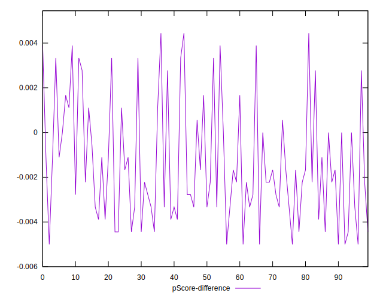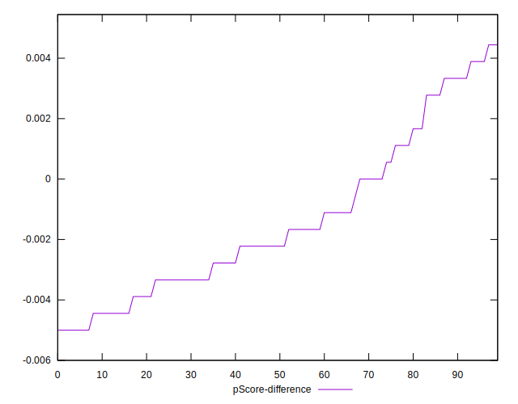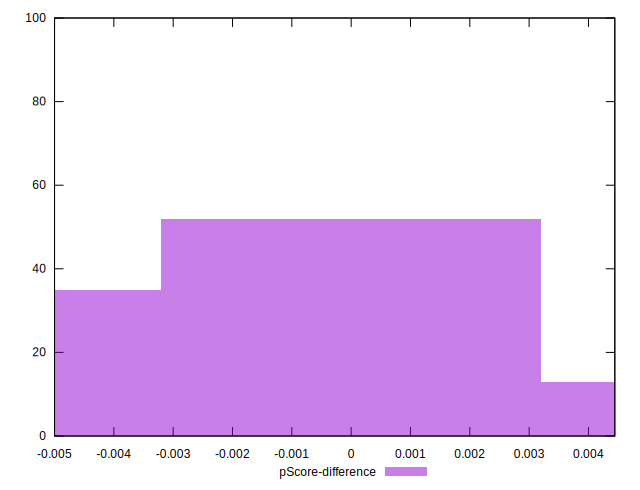