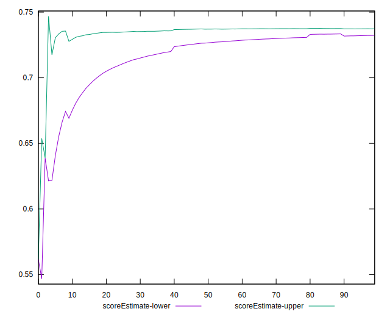
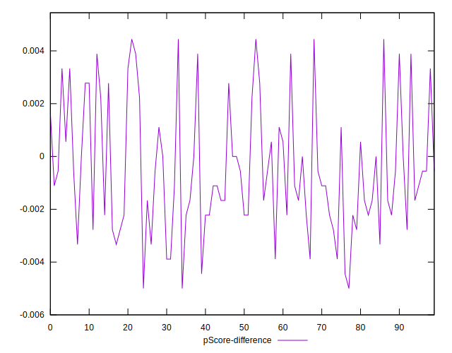

# //render-blocking-resources/samples/pages+cached+noadtech

[→ Parent](../..)


## Raw


```yaml
p90min: 316
p90max: 475
p90range: 159
p90mean: 327.2659574468085
p90median: 322.5
p90stdev: 22.23959260873374
p90skewness: 6.095918157565086
p90eccentricity: 1.0000000000000007
p90discretization: 4.476190476190476
outlandishness: 1.037962421541388
confidence: 17.488167208268017
p90confidence: 8.991682995995712

```


## Score


```yaml
p90min: 0.65
p90max: 0.74
p90range: 0.08999999999999997
p90mean: 0.7354255319148937
p90median: 0.74
p90stdev: 0.013342054262785369
p90skewness: -5.573821350119337
p90eccentricity: 1.0000000000000002
p90discretization: 31.333333333333332
outlandishness: 0.9904352479010637
confidence: 0.00995839165385211
p90confidence: 0.005394321944513799

```


## Raw Estimate


## Score Estimate


## P Score


```yaml
p90min: 0.6527777777777778
p90max: 0.7411111111111112
p90range: 0.08833333333333337
p90mean: 0.7348522458628839
p90median: 0.7375
p90stdev: 0.012355329227074306
p90skewness: -6.095918157565069
p90eccentricity: 0.9999999999999992
p90discretization: 4.476190476190476
outlandishness: 0.9907166120141647
confidence: 0.009715648449037788
p90confidence: 0.004995379442219843

```


## Score Difference


```yaml
p90min: 0
p90max: 0
p90range: 0
p90mean: 0
p90median: 0
p90stdev: 0
p90skewness: .nan
p90eccentricity: .nan
p90discretization: 94
outlandishness: .nan
confidence: 0
p90confidence: 0

```


## P Score Difference


```yaml
p90min: -0.004444444444444473
p90max: 0.004444444444444473
p90range: 0.008888888888888946
p90mean: -0.00047872340425531365
p90median: -0.0011111111111110628
p90stdev: 0.0023634233759620353
p90skewness: 0.5177332187481808
p90eccentricity: 0.9999999999999999
p90discretization: 4.947368421052632
outlandishness: 0.9502639231824397
confidence: 0.0010063505037033985
p90confidence: 0.000955554994007896

```

