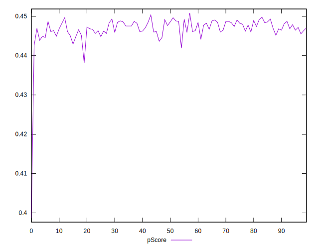

# //render-blocking-resources/samples/pages+cached

[→ Parent](../..)


## Raw


```yaml
p90min: 1178
p90max: 1238
p90range: 60
p90mean: 1199.840425531915
p90median: 1200
p90stdev: 13.505163072179345
p90skewness: 0.5162846260101125
p90eccentricity: 0.9999999999999999
p90discretization: 2.186046511627907
outlandishness: 1.0074976204149784
confidence: 17.276261943021574
p90confidence: 5.460268418162286

```


## Score


```yaml
p90min: 0.44
p90max: 0.45
p90range: 0.010000000000000009
p90mean: 0.44882978723404293
p90median: 0.45
p90stdev: 0.0032144563680293913
p90skewness: -2.3828522123572093
p90eccentricity: 1.0000000000000016
p90discretization: 47
outlandishness: 0.9971956166870262
confidence: 0.002311095918453649
p90confidence: 0.0012996358869644643

```


## Raw Estimate


## Score Estimate


## P Score


```yaml
p90min: 0.4425882352941176
p90max: 0.4496470588235294
p90range: 0.007058823529411784
p90mean: 0.4470775969962454
p90median: 0.4470588235294118
p90stdev: 0.0015888427143740441
p90skewness: -0.5162846260099572
p90eccentricity: 0.9999999999999997
p90discretization: 2.186046511627907
outlandishness: 0.9976385610395742
confidence: 0.002032501405061362
p90confidence: 0.0006423845197837997

```


## Score Difference


```yaml
p90min: 0
p90max: 0
p90range: 0
p90mean: 0
p90median: 0
p90stdev: 0
p90skewness: .nan
p90eccentricity: .nan
p90discretization: 94
outlandishness: .nan
confidence: 0
p90confidence: 0

```


## P Score Difference


```yaml
p90min: -0.004470588235294115
p90max: 0.0048235294117647265
p90range: 0.009294117647058842
p90mean: -0.0017571964956195382
p90median: -0.0018823529411765016
p90stdev: 0.0021489008170529475
p90skewness: 1.4438059198436208
p90eccentricity: 1
p90discretization: 2.1363636363636362
outlandishness: 0.8823417587925426
confidence: 0.0009561082556841644
p90confidence: 0.0008688214427627699

```

