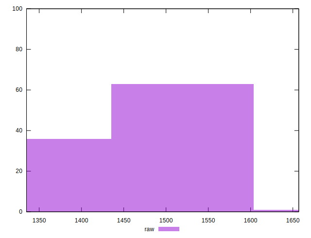
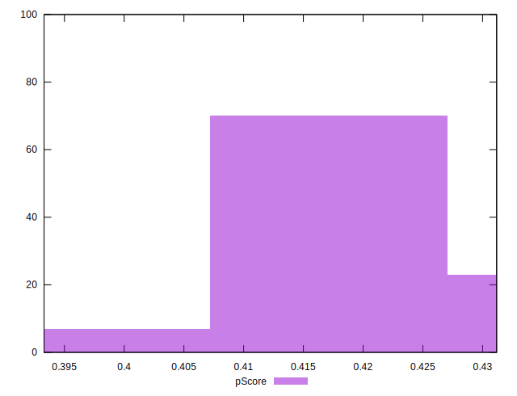
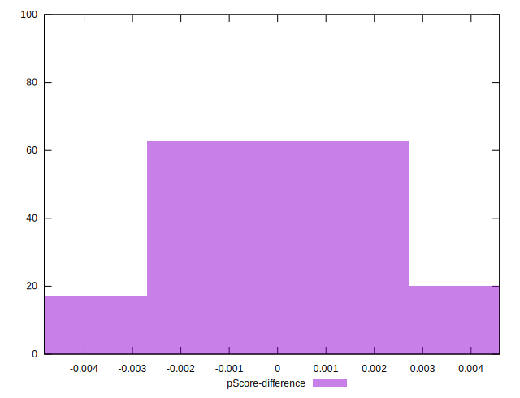

# //render-blocking-resources/samples/pages

[→ Parent](../..)


## Raw


```yaml
p90min: 1349
p90max: 1549
p90range: 200
p90mean: 1460.968085106383
p90median: 1492
p90stdev: 68.61245655276834
p90skewness: -0.545324438004029
p90eccentricity: 1
p90discretization: 1.3823529411764706
outlandishness: 1.0007693843016694
confidence: 28.981364133128213
p90confidence: 27.740681664139018

```


## Score


```yaml
p90min: 0.41
p90max: 0.43
p90range: 0.020000000000000018
p90mean: 0.4165957446808506
p90median: 0.41
p90stdev: 0.0090569347462948
p90skewness: 0.7224971979314982
p90eccentricity: 0.9999999999999992
p90discretization: 31.333333333333332
outlandishness: 0.9990604863523151
confidence: 0.0038214774437056167
p90confidence: 0.0036618065621454067

```


## Raw Estimate


## Score Estimate


## P Score


```yaml
p90min: 0.406
p90max: 0.4295294117647059
p90range: 0.023529411764705854
p90mean: 0.41635669586983726
p90median: 0.41270588235294114
p90stdev: 0.008072053712090393
p90skewness: 0.5453244380041081
p90eccentricity: 0.9999999999999997
p90discretization: 1.3823529411764706
outlandishness: 0.9996824723270632
confidence: 0.0034095722509562628
p90confidence: 0.003263609607545767

```


## Score Difference


```yaml
p90min: 0
p90max: 5.551115123125783e-17
p90range: 5.551115123125783e-17
p90mean: 3.3661017235975493e-17
p90median: 5.551115123125783e-17
p90stdev: 2.7120061523226158e-17
p90skewness: -0.43550355630934257
p90eccentricity: 1.0000000000000016
p90discretization: 47
outlandishness: 0.9790581717451521
confidence: 1.0660165364562847e-17
p90confidence: 1.0964903914336345e-17

```


## P Score Difference


```yaml
p90min: -0.0040000000000000036
p90max: 0.004235294117647004
p90range: 0.008235294117647007
p90mean: -0.00011389236545680921
p90median: -0.00047058823529411153
p90stdev: 0.002196451404266702
p90skewness: 0.2363320050344438
p90eccentricity: 1.0000000000000002
p90discretization: 1.6491228070175439
outlandishness: 0.922866368796024
confidence: 0.0009424372802497666
p90confidence: 0.00088804660637173

```

