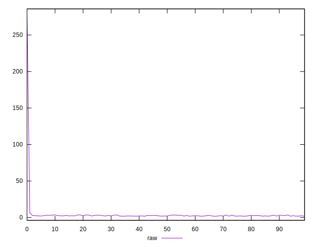
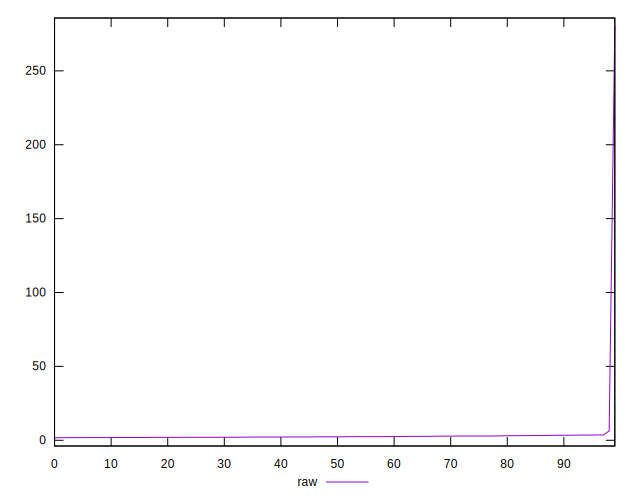
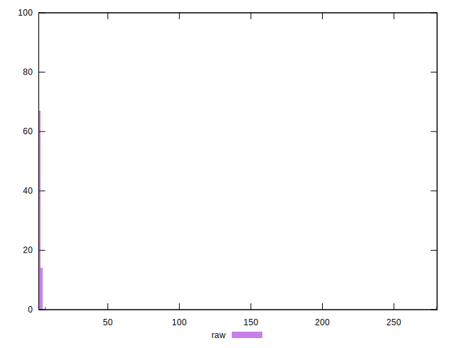
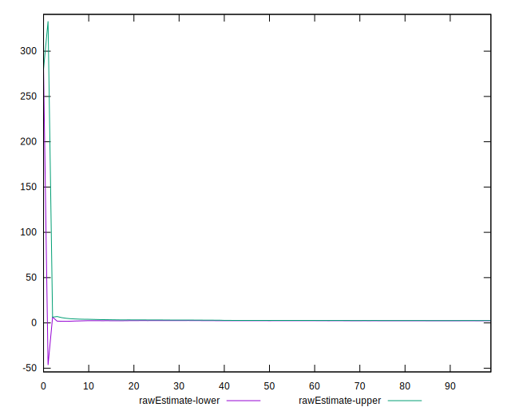

# //server-response-time/samples/pages+cached

[→ Parent](../..)


## Raw


```yaml
p90min: 1.799
p90max: 3.5959999999999996
p90range: 1.7969999999999997
p90mean: 2.467819148936171
p90median: 2.3365
p90stdev: 0.5144696290431402
p90skewness: 0.5670919364443964
p90eccentricity: 1.0000000000000002
p90discretization: 1.0217391304347827
outlandishness: 4.565436368318449
confidence: 10.833871433853432
p90confidence: 0.20800506092034995

```


## Score


```yaml
p90min: 1
p90max: 1
p90range: 0
p90mean: 1
p90median: 1
p90stdev: 0
p90skewness: .nan
p90eccentricity: .nan
p90discretization: 94
outlandishness: 1
confidence: 0
p90confidence: 0

```


## Raw Estimate


## Score Estimate


## P Score


```yaml
p90min: 1
p90max: 1
p90range: 0
p90mean: 1
p90median: 1
p90stdev: 0
p90skewness: .nan
p90eccentricity: .nan
p90discretization: 94
outlandishness: 1
confidence: 0
p90confidence: 0

```


## Score Difference


```yaml
p90min: 0
p90max: 0
p90range: 0
p90mean: 0
p90median: 0
p90stdev: 0
p90skewness: .nan
p90eccentricity: .nan
p90discretization: 94
outlandishness: .nan
confidence: 0
p90confidence: 0

```


## P Score Difference


```yaml
p90min: 0
p90max: 0
p90range: 0
p90mean: 0
p90median: 0
p90stdev: 0
p90skewness: .nan
p90eccentricity: .nan
p90discretization: 94
outlandishness: .nan
confidence: 0
p90confidence: 0

```

