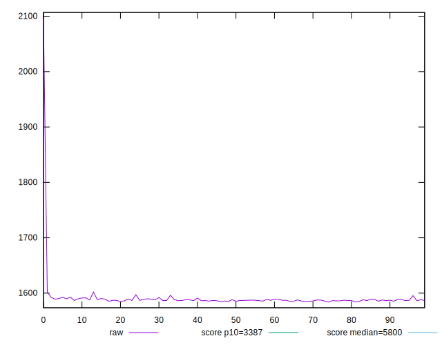
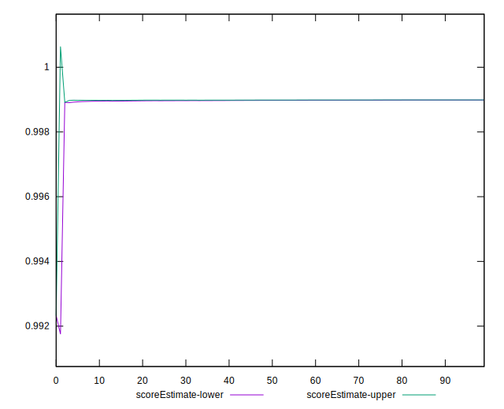

# //speed-index/samples/pages+cached+noadtech+nomedia+nocss

[→ Parent](../..)


## Raw


```yaml
p90min: 1584.5865
p90max: 1597.1285
p90range: 12.542000000000144
p90mean: 1587.7772436170208
p90median: 1587.124275
p90stdev: 2.3802522319658768
p90skewness: 1.6965765202132694
p90eccentricity: 1
p90discretization: 1
outlandishness: 1.0066445521526242
confidence: 19.879139870659014
p90confidence: 0.9623590637151971

```


## Score


```yaml
p90min: 1
p90max: 1
p90range: 0
p90mean: 1
p90median: 1
p90stdev: 0
p90skewness: .nan
p90eccentricity: .nan
p90discretization: 94
outlandishness: 0.9998000100000003
confidence: 0.0003900279083597579
p90confidence: 0

```


## Raw Estimate


## Score Estimate


## P Score


```yaml
p90min: 0.9989386611792923
p90max: 0.9990035567296741
p90range: 0.00006489555038180495
p90mean: 0.9989872956922972
p90median: 0.9989906865574083
p90stdev: 0.000012264026236831035
p90skewness: -1.7329936382390854
p90eccentricity: 1
p90discretization: 1
outlandishness: 0.9998647808610474
confidence: 0.0002597807249771186
p90confidence: 0.000004958464757706621

```


## Score Difference


```yaml
p90min: 0
p90max: 0
p90range: 0
p90mean: 0
p90median: 0
p90stdev: 0
p90skewness: .nan
p90eccentricity: .nan
p90discretization: 94
outlandishness: .nan
confidence: 0
p90confidence: 0

```


## P Score Difference


```yaml
p90min: -0.0010561981667603915
p90max: -0.000996414258103262
p90range: 0.00005978390865712946
p90mean: -0.001012013620867187
p90median: -0.0010091220661048173
p90stdev: 0.000011295547624360678
p90skewness: -1.5206758072580568
p90eccentricity: 0.9999999999999996
p90discretization: 1
outlandishness: 0.9382075884649513
confidence: 0.00013047719223652758
p90confidence: 0.0000045668994613029726

```

