# //speed-index/samples/pages+cached+noadtech+nomedia

[→ Parent](../..)


## Raw


```yaml
p90min: 1903.8154999999997
p90max: 2064.81205
p90range: 160.9965500000003
p90mean: 1925.0974776595745
p90median: 1916.0898249999998
p90stdev: 31.792728698374358
p90skewness: 3.4460613806712628
p90eccentricity: 1.0000000000000002
p90discretization: 1
outlandishness: 1.0082012726597396
confidence: 26.11838829830754
p90confidence: 12.854108573967906

```

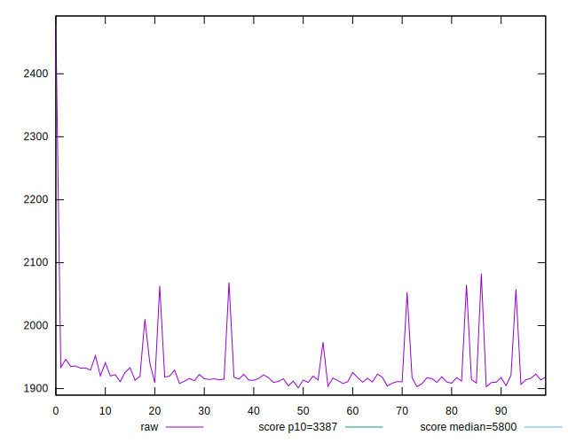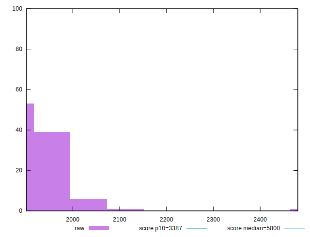
## Score


```yaml
p90min: 0.99
p90max: 1
p90range: 0.010000000000000009
p90mean: 0.9993617021276595
p90median: 1
p90stdev: 0.0024444947432076757
p90skewness: -3.5685919470917162
p90eccentricity: 0.9999999999999987
p90discretization: 47
outlandishness: 0.999276264697967
confidence: 0.0013000930278658607
p90confidence: 0.000988332934105525

```

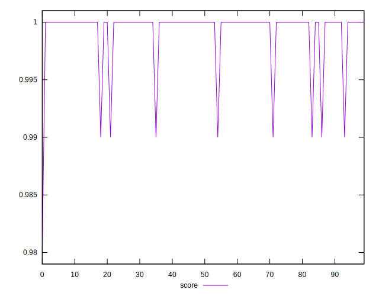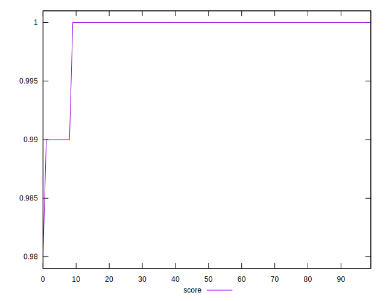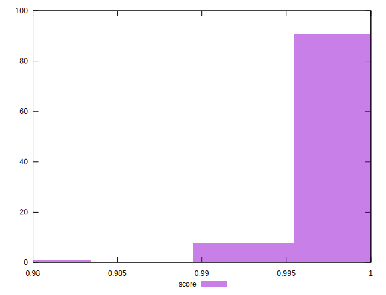
## Raw Estimate

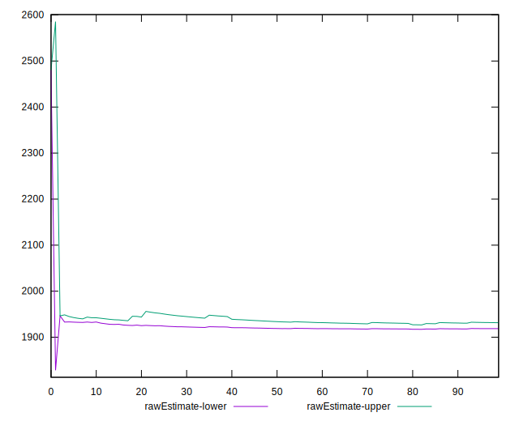
## Score Estimate

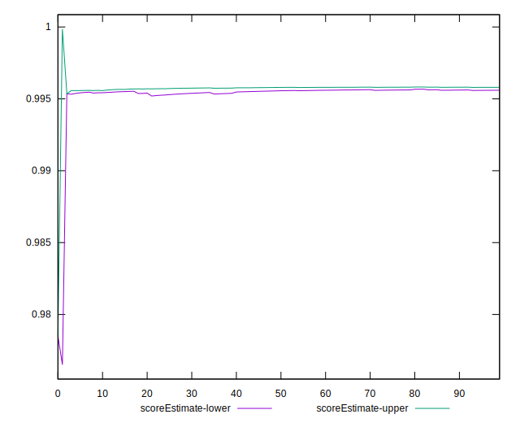
## P Score


```yaml
p90min: 0.99306549753917
p90max: 0.9960232855946517
p90range: 0.002957788055481747
p90mean: 0.9956770708255128
p90median: 0.9958391373857393
p90stdev: 0.000577879437103279
p90skewness: -3.627630708897492
p90eccentricity: 1.0000000000000002
p90discretization: 1
outlandishness: 0.9995626402969211
confidence: 0.0007208668854870759
p90confidence: 0.0002336422613378519

```

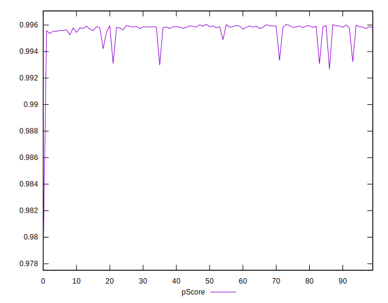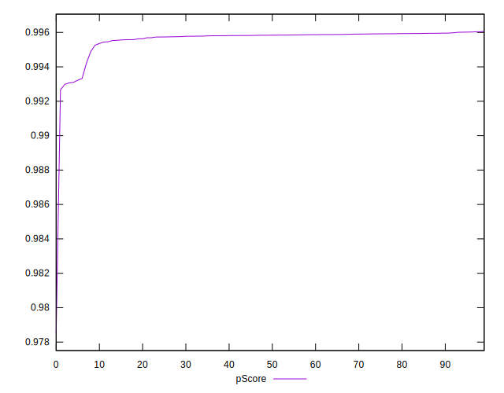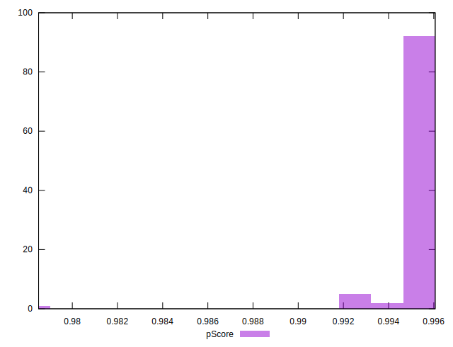
## Score Difference


```yaml
p90min: 0
p90max: 0
p90range: 0
p90mean: 0
p90median: 0
p90stdev: 0
p90skewness: .nan
p90eccentricity: .nan
p90discretization: 94
outlandishness: .nan
confidence: 0
p90confidence: 0

```


## P Score Difference


```yaml
p90min: -0.004542258369905294
p90max: 0.003220503676685138
p90range: 0.007762762046590432
p90mean: -0.003750524719593681
p90median: -0.004132243468081165
p90stdev: 0.0016294725112782774
p90skewness: 3.8091631797100987
p90eccentricity: 1.0000000000000002
p90discretization: 1
outlandishness: 0.891232738014788
confidence: 0.0008181983368394111
p90confidence: 0.0006588115407451048

```

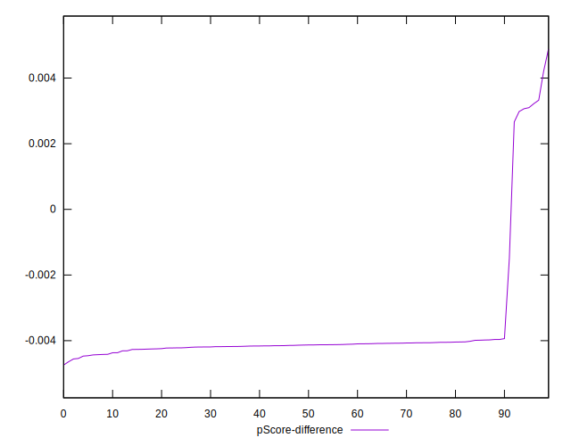