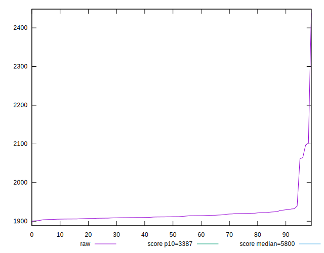
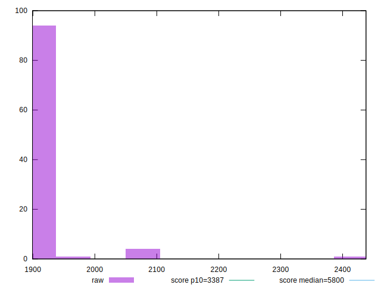

# //speed-index/samples/pages+cached+noadtech

[→ Parent](../..)


## Raw


```yaml
p90min: 1902.4739999999997
p90max: 2064.5838999999996
p90range: 162.10989999999993
p90mean: 1916.9673249999998
p90median: 1911.696
p90stdev: 22.82048876210398
p90skewness: 5.579135208291796
p90eccentricity: 0.9999999999999997
p90discretization: 1
outlandishness: 1.0087529424654702
confidence: 24.186097882522553
p90confidence: 9.226544944979764

```


## Score


```yaml
p90min: 0.99
p90max: 1
p90range: 0.010000000000000009
p90mean: 0.9997872340425532
p90median: 1
p90stdev: 0.0014430489325798455
p90skewness: -6.63488802697019
p90eccentricity: 1.0000000000000022
p90discretization: 47
outlandishness: 0.9992255171134153
confidence: 0.0010834896472067131
p90confidence: 0.0005834386797342843

```


## Raw Estimate


## Score Estimate


## P Score


```yaml
p90min: 0.9930705835994746
p90max: 0.9960430327732832
p90range: 0.0029724491738085668
p90mean: 0.9958139737229702
p90median: 0.995905778312949
p90stdev: 0.0004159605415532165
p90skewness: -5.880080071998588
p90eccentricity: 1.0000000000000007
p90discretization: 1
outlandishness: 0.9995658467306052
confidence: 0.0006445508728689673
p90confidence: 0.00016817688139756715

```


## Score Difference


```yaml
p90min: 0
p90max: 0
p90range: 0
p90mean: 0
p90median: 0
p90stdev: 0
p90skewness: .nan
p90eccentricity: .nan
p90discretization: 94
outlandishness: .nan
confidence: 0
p90confidence: 0

```


## P Score Difference


```yaml
p90min: -0.004380341132704912
p90max: 0.002202406508081456
p90range: 0.006582747640786368
p90mean: -0.003993569997545759
p90median: -0.004084669675753605
p90stdev: 0.000806953718553998
p90skewness: 6.690943440634484
p90eccentricity: 1
p90discretization: 1
outlandishness: 0.9064656563664598
confidence: 0.0005525273906406867
p90confidence: 0.00032625921514533636

```

