# //speed-index/samples/pages+cached

[→ Parent](../..)


## Raw


```yaml
p90min: 4455.964184059252
p90max: 6668.707150689571
p90range: 2212.7429666303187
p90mean: 5605.457156880687
p90median: 5658.606897538068
p90stdev: 627.9225056744067
p90skewness: 0.1118495494602954
p90eccentricity: 0.9999999999999997
p90discretization: 1
outlandishness: 1.0093475270160628
confidence: 300.0690913030538
p90confidence: 253.87515933445223

```

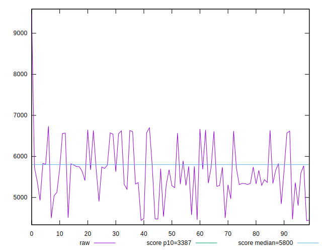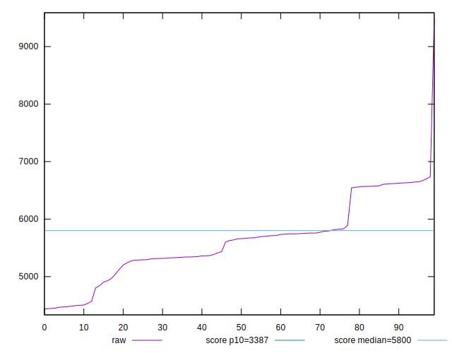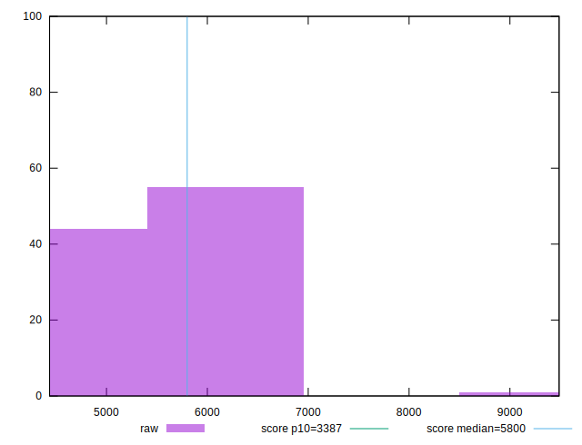
## Score


```yaml
p90min: 0.37
p90max: 0.74
p90range: 0.37
p90mean: 0.5369148936170214
p90median: 0.52
p90stdev: 0.10367734929531897
p90skewness: 0.059637397615086594
p90eccentricity: 1.0000000000000007
p90discretization: 3.9166666666666665
outlandishness: 0.9943650045270902
confidence: 0.04582937310793449
p90confidence: 0.041917757898250745

```


## Raw Estimate

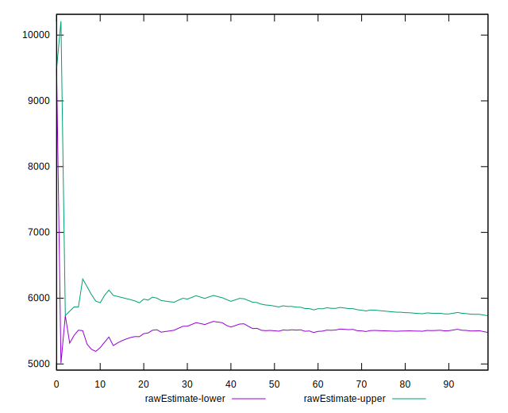
## Score Estimate

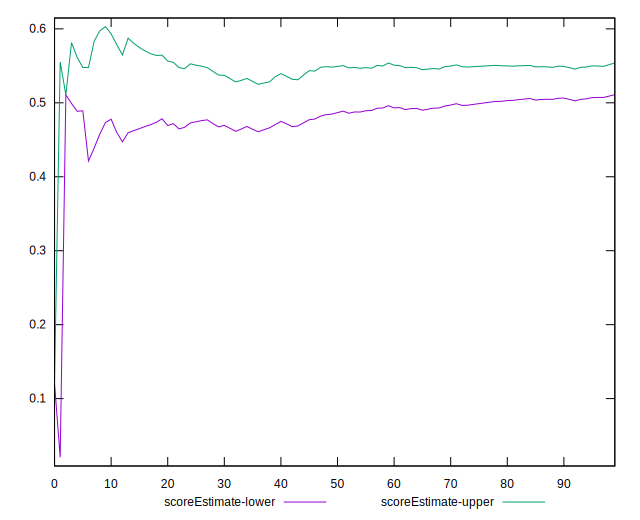
## P Score


```yaml
p90min: 0.3697506595300932
p90max: 0.7350138787510276
p90range: 0.36526321922093447
p90mean: 0.5368914152739652
p90median: 0.5234441027270105
p90stdev: 0.10338284162154454
p90skewness: 0.06097498478403201
p90eccentricity: 1.0000000000000007
p90discretization: 1
outlandishness: 0.9939843303012561
confidence: 0.04569329312704772
p90confidence: 0.041798685589281036

```

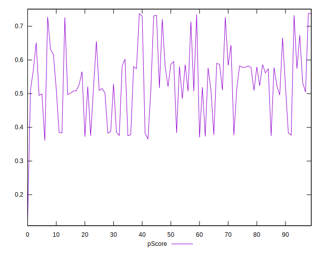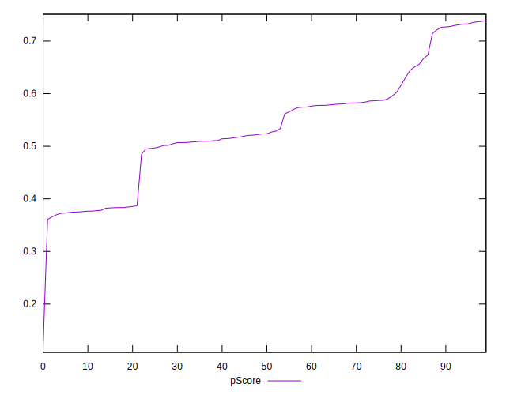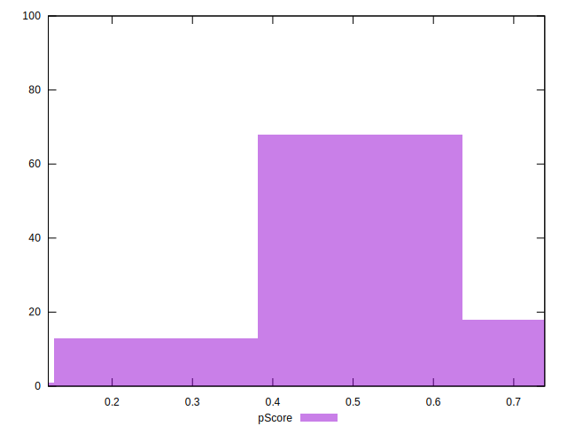
## Score Difference


```yaml
p90min: 0
p90max: 1.1102230246251565e-16
p90range: 1.1102230246251565e-16
p90mean: 2.362176648138631e-18
p90median: 0
p90stdev: 1.6021061506108986e-17
p90skewness: 6.6348880269703665
p90eccentricity: 0.9999999999999994
p90discretization: 47
outlandishness: 5.522500000000001
confidence: 9.484951648085949e-18
p90confidence: 6.477470556979047e-18

```

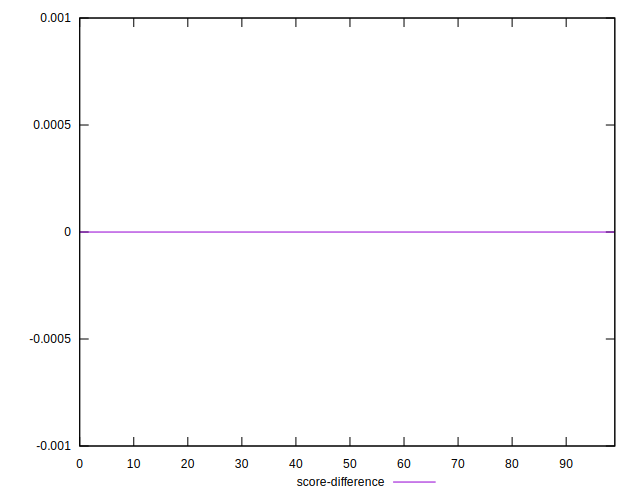
## P Score Difference


```yaml
p90min: -0.004719907653996658
p90max: 0.004762135169677606
p90range: 0.009482042823674264
p90mean: -0.0001344093472540886
p90median: -0.0001853641892824165
p90stdev: 0.0028709894474748146
p90skewness: 0.07184395841304095
p90eccentricity: 0.9999999999999999
p90discretization: 1
outlandishness: 0.877409391041021
confidence: 0.001188539326458228
p90confidence: 0.001160768879660348

```

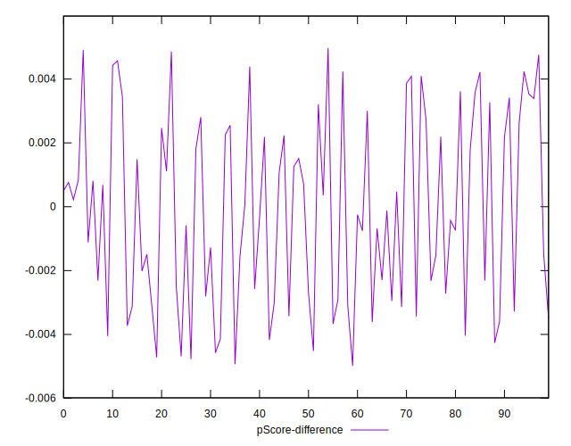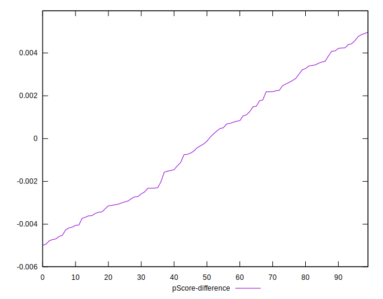