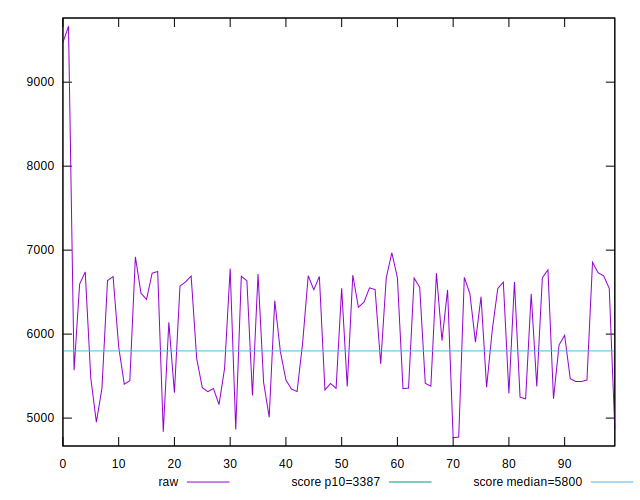
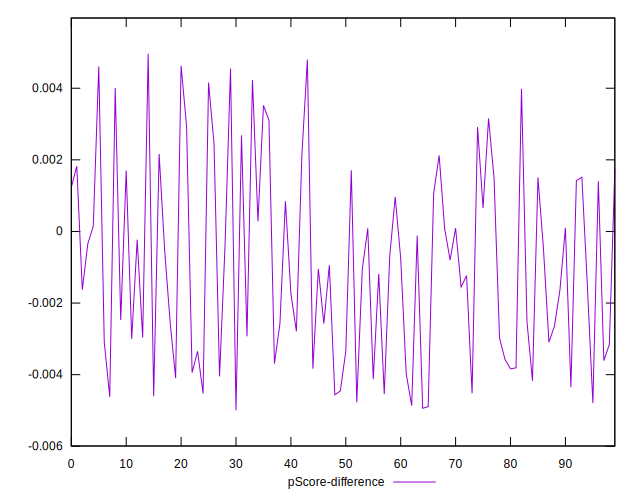
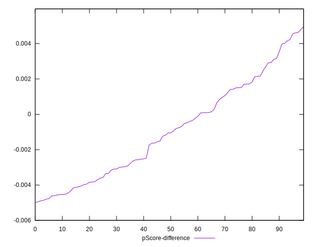

# //speed-index/samples/pages

[→ Parent](../..)


## Raw


```yaml
p90min: 4862.984752888895
p90max: 6919.787264506685
p90range: 2056.8025116177896
p90mean: 6011.264772998813
p90median: 6012.847820033223
p90stdev: 624.7668751661531
p90skewness: -0.14090770609790254
p90eccentricity: 1.0000000000000002
p90discretization: 1
outlandishness: 1.0147496960779898
confidence: 321.3780334561772
p90confidence: 252.5993073131537

```


## Score


```yaml
p90min: 0.34
p90max: 0.66
p90range: 0.32
p90mean: 0.4728723404255321
p90median: 0.46499999999999997
p90stdev: 0.09810570005807055
p90skewness: 0.20528418443833088
p90eccentricity: 1.0000000000000009
p90discretization: 3.357142857142857
outlandishness: 0.9895706426932848
confidence: 0.04478651083169121
p90confidence: 0.03966508607158497

```


## Raw Estimate


## Score Estimate


## P Score


```yaml
p90min: 0.3370356929391177
p90max: 0.6626844760027197
p90range: 0.325648783063602
p90mean: 0.4719244803586863
p90median: 0.46579864171376756
p90stdev: 0.09850386376129006
p90skewness: 0.20143657740651047
p90eccentricity: 0.9999999999999999
p90discretization: 1
outlandishness: 0.9897907682613233
confidence: 0.04483568870104212
p90confidence: 0.039826067518630694

```


## Score Difference


```yaml
p90min: 0
p90max: 1.1102230246251565e-16
p90range: 1.1102230246251565e-16
p90mean: 8.858162430519866e-18
p90median: 0
p90stdev: 2.7222740779366525e-17
p90skewness: 3.0484599206497407
p90eccentricity: 0.9999999999999997
p90discretization: 31.333333333333332
outlandishness: 1.7318559999999996
confidence: 1.2422256744948948e-17
p90confidence: 1.1006418133491431e-17

```


## P Score Difference


```yaml
p90min: -0.004866597272274675
p90max: 0.004610138767184635
p90range: 0.00947673603945931
p90mean: -0.0009429274446506409
p90median: -0.001051327612822367
p90stdev: 0.0027287197158152223
p90skewness: 0.3022893110757305
p90eccentricity: 1.0000000000000004
p90discretization: 1
outlandishness: 0.8922764699613167
confidence: 0.0011404906364145173
p90confidence: 0.0011032478472604084

```

