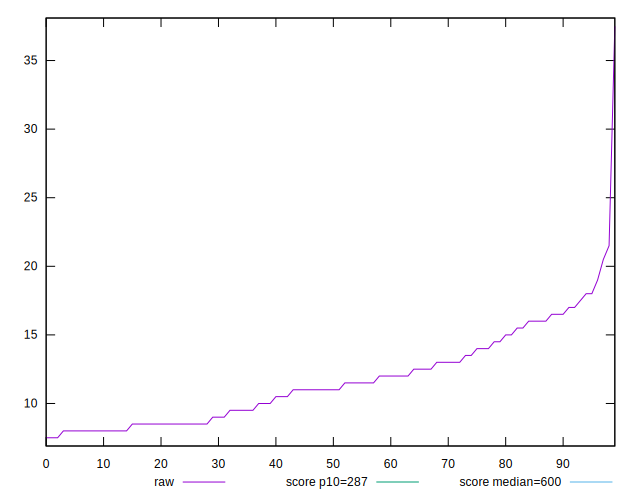

# //total-blocking-time/samples/pages+cached+noadtech+nomedia+nocss

[→ Parent](../..)


## Raw


```yaml
p90min: 8
p90max: 19
p90range: 11
p90mean: 11.542553191489361
p90median: 11
p90stdev: 2.9801288477678813
p90skewness: 0.6075077534759545
p90eccentricity: 1.0000000000000007
p90discretization: 4.2727272727272725
outlandishness: 1.0575421082630763
confidence: 1.628686437194401
p90confidence: 1.2048949977540289

```


## Score


```yaml
p90min: 1
p90max: 1
p90range: 0
p90mean: 1
p90median: 1
p90stdev: 0
p90skewness: .nan
p90eccentricity: .nan
p90discretization: 94
outlandishness: 1
confidence: 0
p90confidence: 0

```


## Raw Estimate


## Score Estimate


## P Score


```yaml
p90min: 0.9999999990087218
p90max: 0.9999999999999686
p90range: 9.912467513473189e-10
p90mean: 0.9999999999455611
p90median: 0.9999999999981568
p90stdev: 1.4323713098550394e-10
p90skewness: -4.158483467297407
p90eccentricity: 1.000000000000702
p90discretization: 4.2727272727272725
outlandishness: 0.9999999853890422
confidence: 2.8274068403179217e-8
p90confidence: 5.791216133031936e-11

```


## Score Difference


```yaml
p90min: 0
p90max: 0
p90range: 0
p90mean: 0
p90median: 0
p90stdev: 0
p90skewness: .nan
p90eccentricity: .nan
p90discretization: 94
outlandishness: .nan
confidence: 0
p90confidence: 0

```


## P Score Difference


```yaml
p90min: -9.912781706589158e-10
p90max: -3.141931159689193e-14
p90range: 9.912467513473189e-10
p90mean: -5.44387773630658e-11
p90median: -1.843192265482685e-12
p90stdev: 1.432371309855036e-10
p90skewness: -4.158483665193891
p90eccentricity: 1.0000000000000009
p90discretization: 4.2727272727272725
outlandishness: 18278.021417726326
confidence: 2.8274068403179197e-8
p90confidence: 5.791216133031923e-11

```

