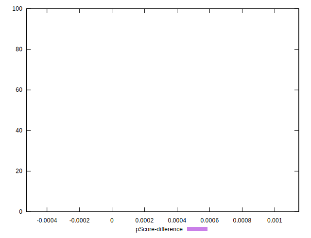

# //total-blocking-time/samples/pages+cached+noadtech+nomedia

[→ Parent](../..)


## Raw


```yaml
p90min: 7.5
p90max: 36.5
p90range: 29
p90mean: 11.082780851063829
p90median: 9.5
p90stdev: 4.767676889850678
p90skewness: 3.6433894922862837
p90eccentricity: 0.9999999999999992
p90discretization: 4.476190476190476
outlandishness: 1.881774769809052
confidence: 12.371560103166292
p90confidence: 1.9276180087955728

```


## Score


```yaml
p90min: 1
p90max: 1
p90range: 0
p90mean: 1
p90median: 1
p90stdev: 0
p90skewness: .nan
p90eccentricity: .nan
p90discretization: 94
outlandishness: 0.9974016900000001
confidence: 0.005070362808676841
p90confidence: 0

```


## Raw Estimate


## Score Estimate


## P Score


```yaml
p90min: 0.9999994276013517
p90max: 0.9999999999999867
p90range: 5.723986349348564e-7
p90mean: 0.9999999873896062
p90median: 0.9999999999997063
p90stdev: 8.263415795795337e-8
p90skewness: -6.611390704002559
p90eccentricity: 0.9999999999999989
p90discretization: 4.476190476190476
outlandishness: 0.9974138905899352
confidence: 0.00502543502424619
p90confidence: 3.3409791540298305e-8

```


## Score Difference


```yaml
p90min: 0
p90max: 0
p90range: 0
p90mean: 0
p90median: 0
p90stdev: 0
p90skewness: .nan
p90eccentricity: .nan
p90discretization: 94
outlandishness: .nan
confidence: 0
p90confidence: 0

```


## P Score Difference


```yaml
p90min: -5.723986482575327e-7
p90max: -1.3322676295501878e-14
p90range: 5.723986349348564e-7
p90mean: -6.5210464746732765e-9
p90median: -2.936539900133539e-13
p90stdev: 5.881639113891011e-8
p90skewness: -9.474744817201165
p90eccentricity: 0.9999999999999987
p90discretization: 4.476190476190476
outlandishness: 873778.9854140243
confidence: 0.00004942593144189983
p90confidence: 2.3780037404187086e-8

```

