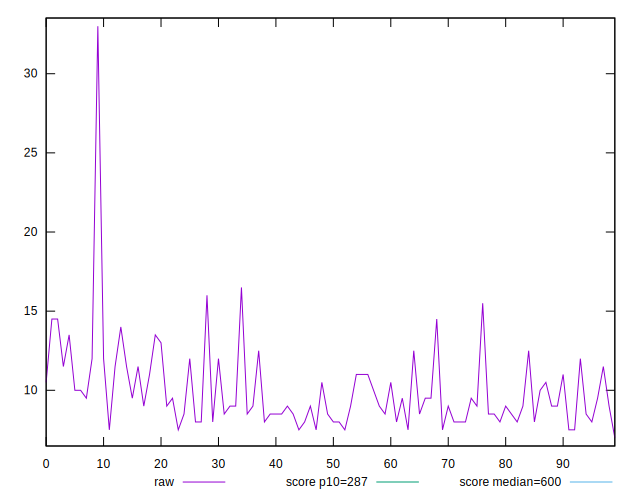
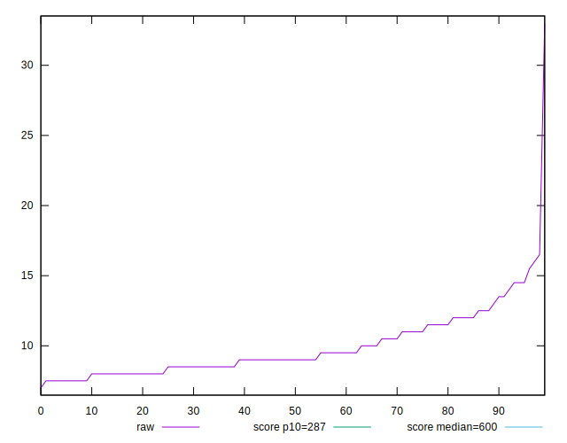
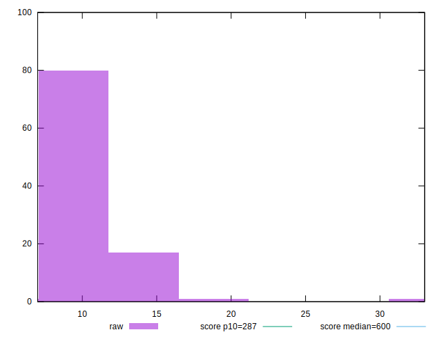
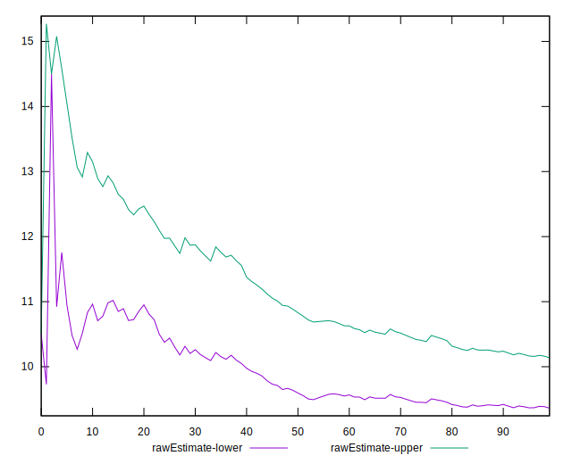
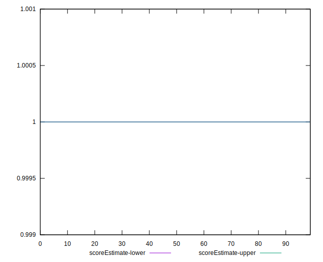
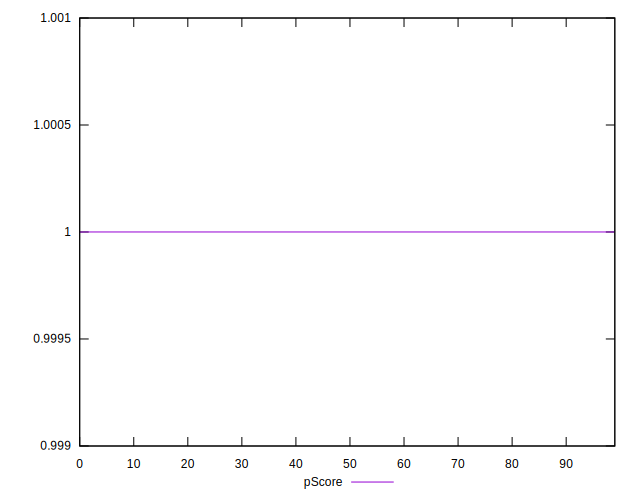
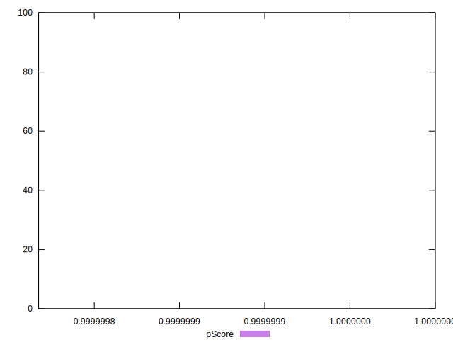
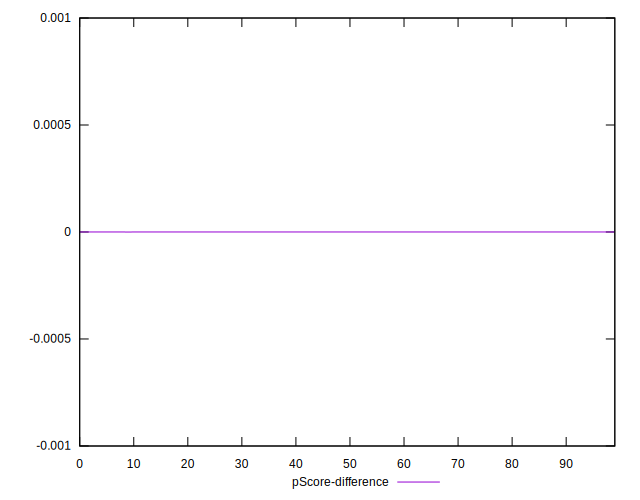
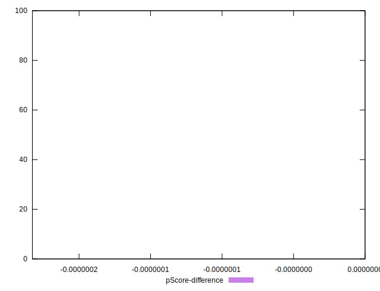

# //total-blocking-time/samples/pages+cached+noadtech

[→ Parent](../..)


## Raw


```yaml
p90min: 7.5
p90max: 15.5
p90range: 8
p90mean: 9.75
p90median: 9
p90stdev: 1.9126538319442605
p90skewness: 1.051369093467796
p90eccentricity: 0.9999999999999991
p90discretization: 5.875
outlandishness: 1.060371860618015
confidence: 1.226091811021986
p90confidence: 0.7733044952975177

```


## Score


```yaml
p90min: 1
p90max: 1
p90range: 0
p90mean: 1
p90median: 1
p90stdev: 0
p90skewness: .nan
p90eccentricity: .nan
p90discretization: 94
outlandishness: 1
confidence: 0
p90confidence: 0

```


## Raw Estimate


## Score Estimate


## P Score


```yaml
p90min: 0.9999999998943788
p90max: 0.9999999999999867
p90range: 1.0560785579372123e-10
p90mean: 0.9999999999953827
p90median: 0.9999999999998532
p90stdev: 1.4261274259656776e-11
p90skewness: -4.867138963569039
p90eccentricity: 1.0000000004783869
p90discretization: 5.875
outlandishness: 0.9999999953403802
confidence: 9.073490624248037e-9
p90confidence: 5.7659715048659966e-12

```


## Score Difference


```yaml
p90min: 0
p90max: 0
p90range: 0
p90mean: 0
p90median: 0
p90stdev: 0
p90skewness: .nan
p90eccentricity: .nan
p90discretization: 94
outlandishness: .nan
confidence: 0
p90confidence: 0

```


## P Score Difference


```yaml
p90min: -1.0562117847001673e-10
p90max: -1.3322676295501878e-14
p90range: 1.0560785579372123e-10
p90mean: -4.617757712853358e-12
p90median: -1.467714838554457e-13
p90stdev: 1.4261274255931192e-11
p90skewness: -4.867207540577921
p90eccentricity: 0.9999999999999999
p90discretization: 5.875
outlandishness: 255563.2568251926
confidence: 9.073490624248037e-9
p90confidence: 5.765971503359707e-12

```

