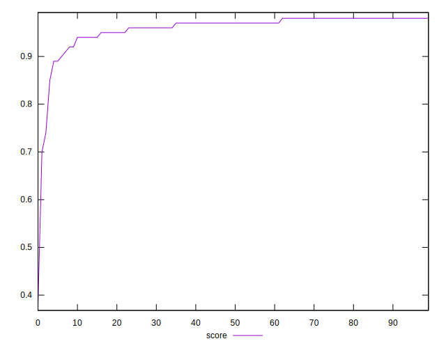
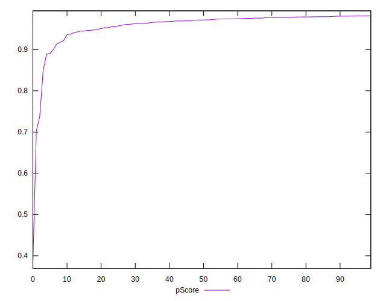
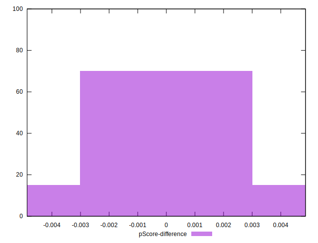

# //total-blocking-time/samples/pages+cached

[→ Parent](../..)


## Raw


```yaml
p90min: 180.5
p90max: 331.5
p90range: 151
p90mean: 209.71808510638297
p90median: 200.50000000000045
p90stdev: 29.254073958026552
p90skewness: 1.7454684374575613
p90eccentricity: 0.9999999999999992
p90discretization: 1.205128205128205
outlandishness: 1.0831198984797266
confidence: 25.60214881486733
p90confidence: 11.827705839750331

```


## Score


```yaml
p90min: 0.85
p90max: 0.98
p90range: 0.13
p90mean: 0.9636170212765951
p90median: 0.97
p90stdev: 0.02301022269718429
p90skewness: -2.426170513272325
p90eccentricity: 0.9999999999999994
p90discretization: 9.4
outlandishness: 0.9789068548454525
confidence: 0.027724838872745957
p90confidence: 0.009303256215183292

```


## Raw Estimate


## Score Estimate


## P Score


```yaml
p90min: 0.8487418407401004
p90max: 0.9815771610720299
p90range: 0.13283532033192946
p90mean: 0.9635140680852731
p90median: 0.971600426742256
p90stdev: 0.022857778803829068
p90skewness: -2.517457463780279
p90eccentricity: 1.0000000000000004
p90discretization: 1.205128205128205
outlandishness: 0.9790501837278122
confidence: 0.02766451013547454
p90confidence: 0.009241621670529485

```


## Score Difference


```yaml
p90min: 0
p90max: 1.1102230246251565e-16
p90range: 1.1102230246251565e-16
p90mean: 1.299197156476247e-17
p90median: 0
p90stdev: 3.568763471439183e-17
p90skewness: 2.3828522123573888
p90eccentricity: 1.0000000000000027
p90discretization: 47
outlandishness: 1.4312859504132236
confidence: 1.5100855782713646e-17
p90confidence: 1.4428856853370843e-17

```


## P Score Difference


```yaml
p90min: -0.004358887757601071
p90max: 0.004691391558088509
p90range: 0.00905027931568958
p90mean: -0.00003434666531362109
p90median: -0.0004115744011272682
p90stdev: 0.0024518571441137266
p90skewness: 0.11125158130751303
p90eccentricity: 1.0000000000000007
p90discretization: 1.205128205128205
outlandishness: 0.8720682232636918
confidence: 0.0010390464301305137
p90confidence: 0.0009913096242005874

```

