# //total-blocking-time/samples/pages

[→ Parent](../..)


## Raw


```yaml
p90min: 183.0000000000009
p90max: 343
p90range: 159.9999999999991
p90mean: 224.18944148936168
p90median: 211
p90stdev: 38.76898520188971
p90skewness: 1.233705204738012
p90eccentricity: 1.0000000000000002
p90discretization: 1.146341463414634
outlandishness: 1.0950579194694157
confidence: 32.90190133041836
p90confidence: 15.674676741827664

```

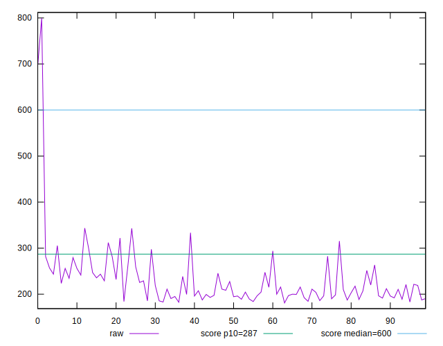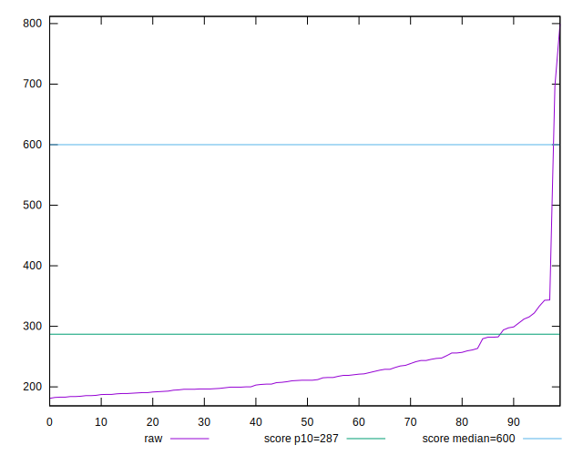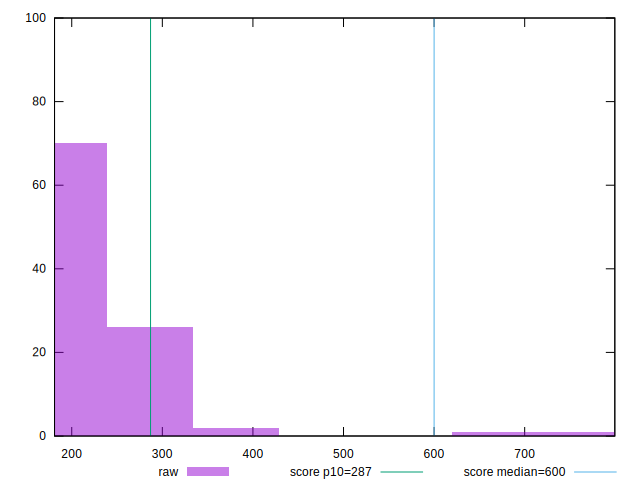
## Score


```yaml
p90min: 0.83
p90max: 0.98
p90range: 0.15000000000000002
p90mean: 0.9522340425531911
p90median: 0.97
p90stdev: 0.0331069914618916
p90skewness: -1.6882157559352784
p90eccentricity: 1.0000000000000009
p90discretization: 6.266666666666667
outlandishness: 0.9742622881230967
confidence: 0.03555050513600108
p90confidence: 0.013385477756438786

```

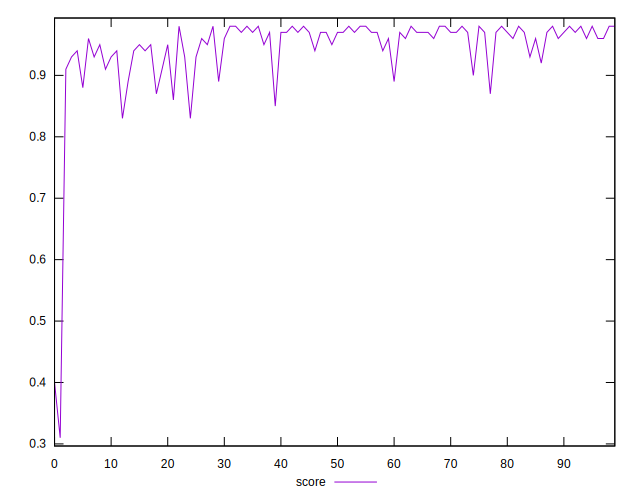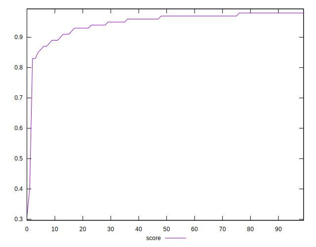
## Raw Estimate

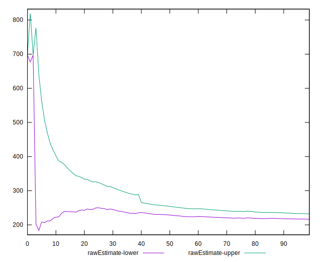
## Score Estimate

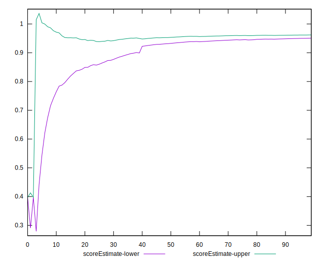
## P Score


```yaml
p90min: 0.8344220039730638
p90max: 0.9804705348577973
p90range: 0.14604853088473357
p90mean: 0.9520392092776386
p90median: 0.9653261517305216
p90stdev: 0.03301541983482225
p90skewness: -1.6933892867401201
p90eccentricity: 0.9999999999999996
p90discretization: 1.146341463414634
outlandishness: 0.9743336810611202
confidence: 0.03560788851817507
p90confidence: 0.013348454459451244

```

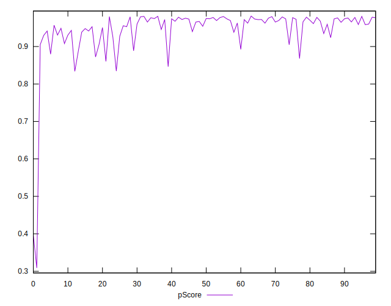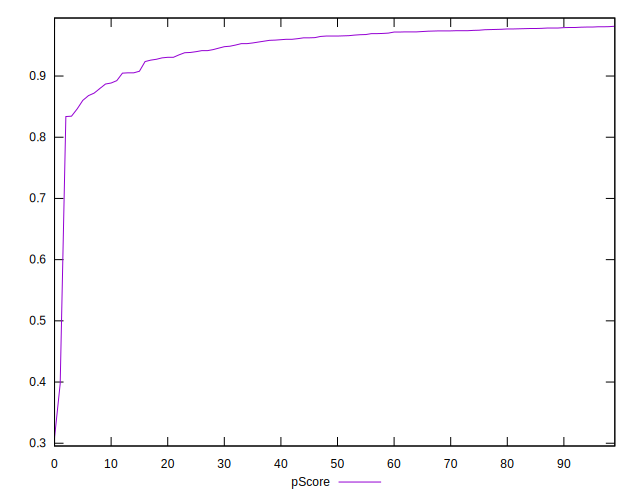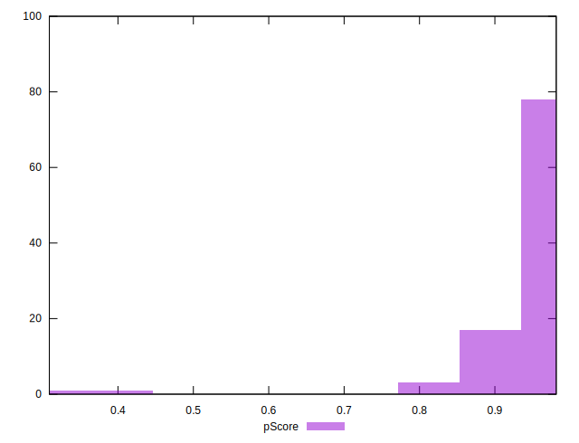
## Score Difference


```yaml
p90min: 0
p90max: 1.1102230246251565e-16
p90range: 1.1102230246251565e-16
p90mean: 1.4173059888831785e-17
p90median: 0
p90stdev: 3.7049293045681974e-17
p90skewness: 2.23151849572168
p90eccentricity: 0.9999999999999971
p90discretization: 47
outlandishness: 1.3806250000000002
confidence: 1.55397278579655e-17
p90confidence: 1.49793885235872e-17

```

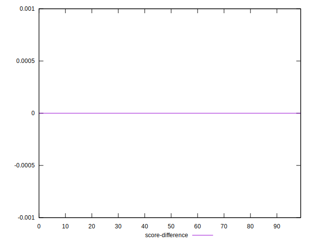
## P Score Difference


```yaml
p90min: -0.0046738482694783645
p90max: 0.004607288318270952
p90range: 0.009281136587749317
p90mean: -0.00016932913581827976
p90median: -0.00035920269325295795
p90stdev: 0.0026672508139806727
p90skewness: 0.11805032120159442
p90eccentricity: 1.0000000000000007
p90discretization: 1.1325301204819278
outlandishness: 0.869340999381084
confidence: 0.0011114209908726766
p90confidence: 0.0010783953740549778

```

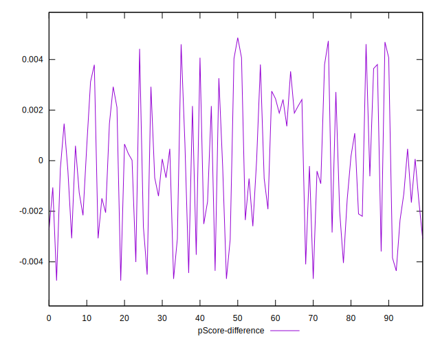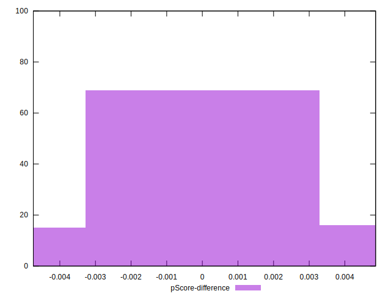