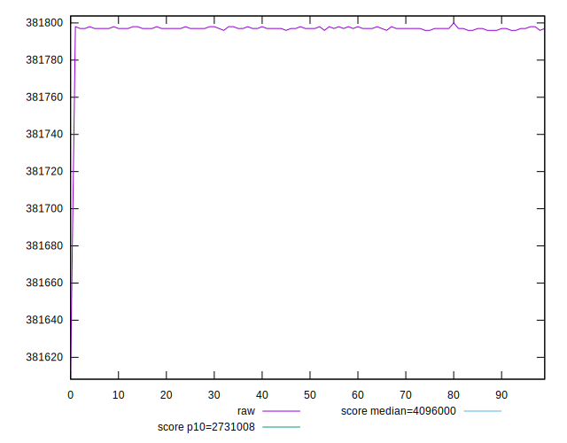
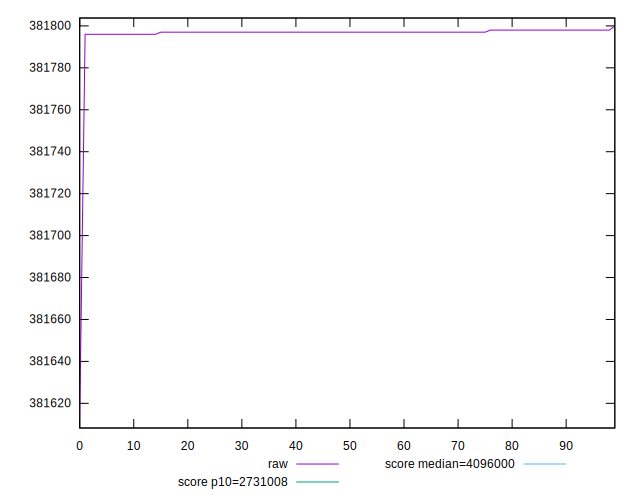
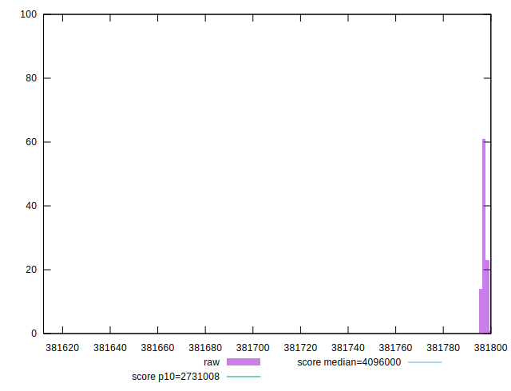
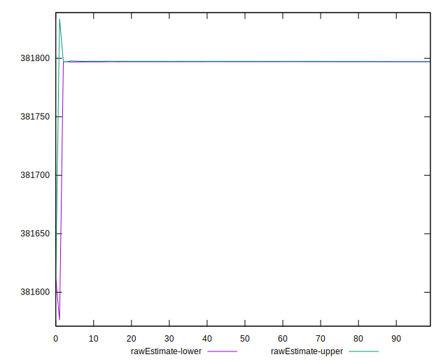

# //total-byte-weight/samples/pages+cached+noadtech+nomedia+nocss

[→ Parent](../..)


## Raw


```yaml
p90min: 381796
p90max: 381798
p90range: 2
p90mean: 381797.09574468085
p90median: 381797
p90stdev: 0.5847194078153747
p90skewness: -0.016694258629807557
p90eccentricity: 0.9999999999999997
p90discretization: 31.333333333333332
outlandishness: 0.9999904360701752
confidence: 7.224982353848705
p90confidence: 0.23640772783838962

```


## Score


```yaml
p90min: 1
p90max: 1
p90range: 0
p90mean: 1
p90median: 1
p90stdev: 0
p90skewness: .nan
p90eccentricity: .nan
p90discretization: 94
outlandishness: 1
confidence: 0
p90confidence: 0

```


## Raw Estimate


## Score Estimate


## P Score


```yaml
p90min: 0
p90max: 0
p90range: 0
p90mean: 0
p90median: 0
p90stdev: 0
p90skewness: .nan
p90eccentricity: .nan
p90discretization: 94
outlandishness: .nan
confidence: 0
p90confidence: 0

```


## Score Difference


```yaml
p90min: -1
p90max: -1
p90range: 0
p90mean: -1
p90median: -1
p90stdev: 0
p90skewness: .nan
p90eccentricity: .nan
p90discretization: 94
outlandishness: 1
confidence: 0
p90confidence: 0

```


## P Score Difference


```yaml
p90min: -1
p90max: -1
p90range: 0
p90mean: -1
p90median: -1
p90stdev: 0
p90skewness: .nan
p90eccentricity: .nan
p90discretization: 94
outlandishness: 1
confidence: 0
p90confidence: 0

```

