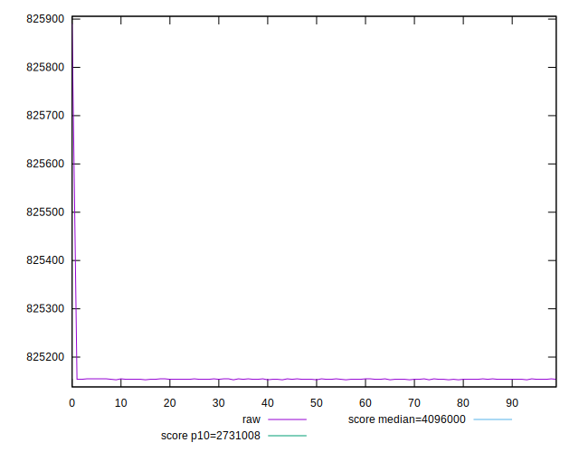
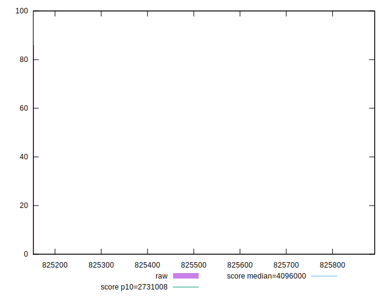
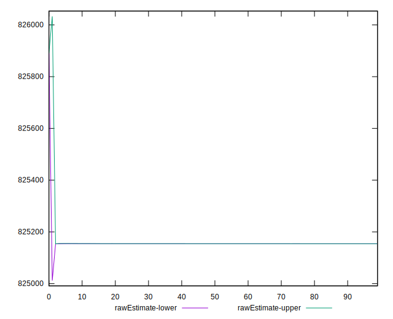
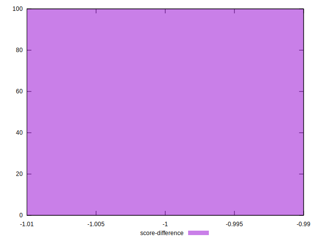

# //total-byte-weight/samples/pages+cached+noadtech+nomedia

[→ Parent](../..)


## Raw


```yaml
p90min: 825153
p90max: 825155
p90range: 2
p90mean: 825154.1702127659
p90median: 825154
p90stdev: 0.5949843171961516
p90skewness: -0.07353192131378947
p90eccentricity: 1.0000000000000016
p90discretization: 31.333333333333332
outlandishness: 1.0000178144163414
confidence: 28.740182620852497
p90confidence: 0.24055793026153663

```


## Score


```yaml
p90min: 1
p90max: 1
p90range: 0
p90mean: 1
p90median: 1
p90stdev: 0
p90skewness: .nan
p90eccentricity: .nan
p90discretization: 94
outlandishness: 1
confidence: 0
p90confidence: 0

```


## Raw Estimate


## Score Estimate


## P Score


```yaml
p90min: 0
p90max: 0
p90range: 0
p90mean: 0
p90median: 0
p90stdev: 0
p90skewness: .nan
p90eccentricity: .nan
p90discretization: 94
outlandishness: .nan
confidence: 0
p90confidence: 0

```


## Score Difference


```yaml
p90min: -1
p90max: -1
p90range: 0
p90mean: -1
p90median: -1
p90stdev: 0
p90skewness: .nan
p90eccentricity: .nan
p90discretization: 94
outlandishness: 1
confidence: 0
p90confidence: 0

```


## P Score Difference


```yaml
p90min: -1
p90max: -1
p90range: 0
p90mean: -1
p90median: -1
p90stdev: 0
p90skewness: .nan
p90eccentricity: .nan
p90discretization: 94
outlandishness: 1
confidence: 0
p90confidence: 0

```

