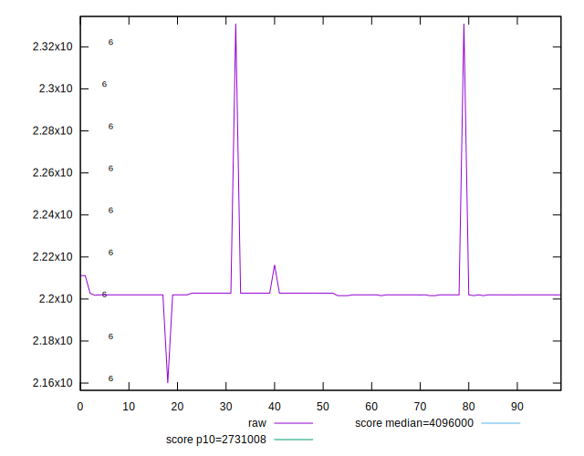
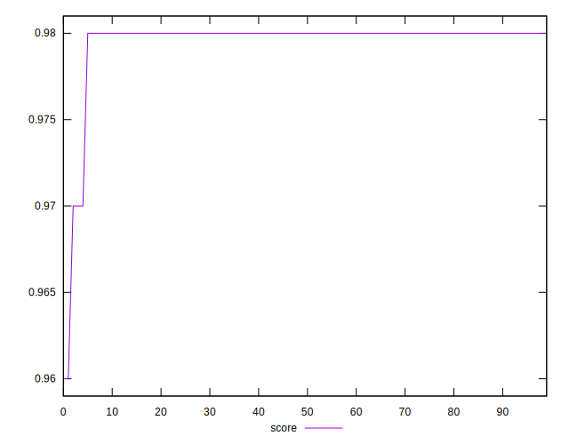
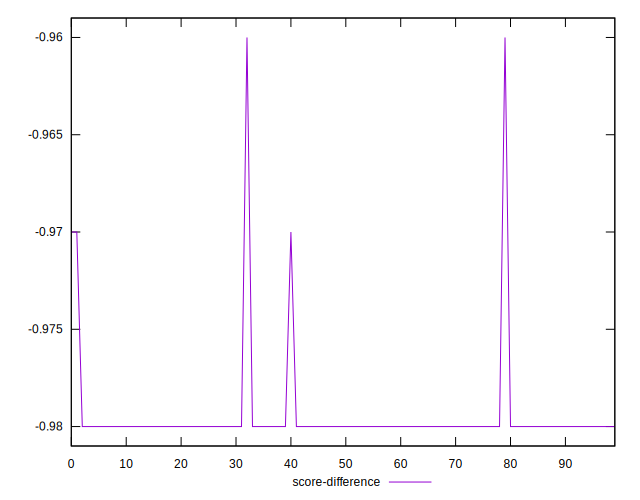
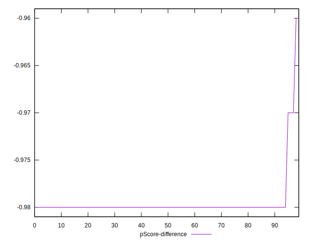

# //total-byte-weight/samples/pages

[→ Parent](../..)


## Raw


```yaml
p90min: 2201597
p90max: 2211156
p90range: 9559
p90mean: 2202396.1276595746
p90median: 2201976
p90stdev: 1353.3992997464188
p90skewness: 5.7370608319075105
p90eccentricity: 1
p90discretization: 2.764705882352941
outlandishness: 1.002063691954387
confidence: 7308.024707437479
p90confidence: 547.1924636579603

```


## Score


```yaml
p90min: 0.97
p90max: 0.98
p90range: 0.010000000000000009
p90mean: 0.9797872340425534
p90median: 0.98
p90stdev: 0.0014430489325798458
p90skewness: -6.634888026970641
p90eccentricity: 1.0000000000000044
p90discretization: 47
outlandishness: 0.9990056761745781
confidence: 0.0012708065502741999
p90confidence: 0.0005834386797342844

```


## Raw Estimate


## Score Estimate


## P Score


```yaml
p90min: 0
p90max: 0
p90range: 0
p90mean: 0
p90median: 0
p90stdev: 0
p90skewness: .nan
p90eccentricity: .nan
p90discretization: 94
outlandishness: .nan
confidence: 0
p90confidence: 0

```


## Score Difference


```yaml
p90min: -0.98
p90max: -0.97
p90range: 0.010000000000000009
p90mean: -0.9797872340425534
p90median: -0.98
p90stdev: 0.001443048932579845
p90skewness: 6.634888026970875
p90eccentricity: 1.0000000000000027
p90discretization: 47
outlandishness: 0.9990056761745781
confidence: 0.0012708065502741999
p90confidence: 0.0005834386797342842

```


## P Score Difference


```yaml
p90min: -0.98
p90max: -0.97
p90range: 0.010000000000000009
p90mean: -0.9797872340425534
p90median: -0.98
p90stdev: 0.001443048932579845
p90skewness: 6.634888026970875
p90eccentricity: 1.0000000000000027
p90discretization: 47
outlandishness: 0.9990056761745781
confidence: 0.0012708065502741999
p90confidence: 0.0005834386797342842

```

