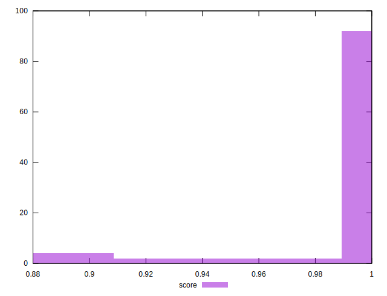
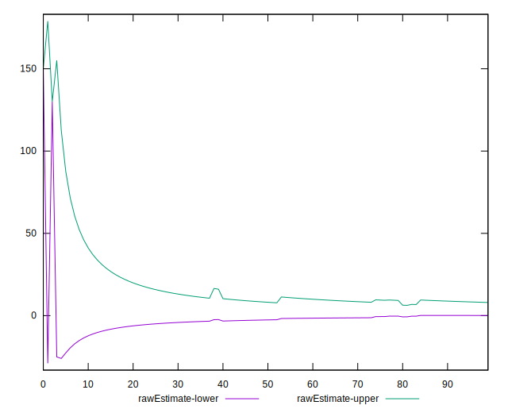
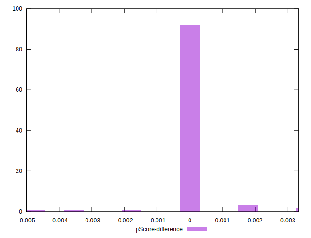

# //unminified-css/samples/pages

[→ Parent](../..)


## Raw


```yaml
p90min: 0
p90max: 130
p90range: 130
p90mean: 4.042553191489362
p90median: 0
p90stdev: 19.532795604303864
p90skewness: 5.240166078941414
p90eccentricity: 0.999999999999997
p90discretization: 15.666666666666666
outlandishness: 3.8189387811634345
confidence: 11.592586372317237
p90confidence: 7.897298713579219

```


## Score


```yaml
p90min: 0.89
p90max: 1
p90range: 0.10999999999999999
p90mean: 0.9965957446808511
p90median: 1
p90stdev: 0.016409208072050086
p90skewness: -5.238756766417092
p90eccentricity: 0.9999999999999978
p90discretization: 15.666666666666666
outlandishness: 0.9935969607275454
confidence: 0.009653215603562887
p90confidence: 0.006634401978265789

```


## Raw Estimate


## Score Estimate


## P Score


```yaml
p90min: 0.8916666666666666
p90max: 1
p90range: 0.10833333333333339
p90mean: 0.996631205673759
p90median: 1
p90stdev: 0.016277329670253197
p90skewness: -5.240166078941398
p90eccentricity: 1.0000000000000029
p90discretization: 15.666666666666666
outlandishness: 0.9935595937711786
confidence: 0.0096604886435977
p90confidence: 0.006581082261316006

```


## Score Difference


```yaml
p90min: 0
p90max: 0
p90range: 0
p90mean: 0
p90median: 0
p90stdev: 0
p90skewness: .nan
p90eccentricity: .nan
p90discretization: 94
outlandishness: .nan
confidence: 0
p90confidence: 0

```


## P Score Difference


```yaml
p90min: 0
p90max: 0.0016666666666665941
p90range: 0.0016666666666665941
p90mean: 0.00003546099290779987
p90median: 0
p90stdev: 0.00024050815542996372
p90skewness: 6.634888026970368
p90eccentricity: 0.9999999999999982
p90discretization: 47
outlandishness: 0.22089999999994112
confidence: 0.0003265953254226677
p90confidence: 0.0000972397799557098

```

