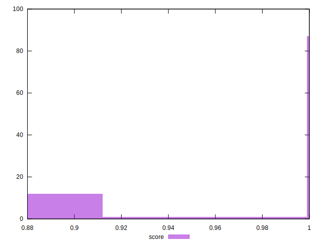
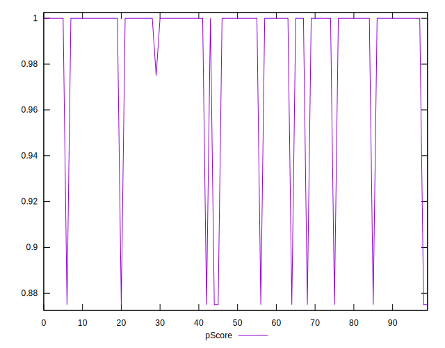

# //unminified-javascript/samples/pages+cached

[→ Parent](../..)


## Raw


```yaml
p90min: 0
p90max: 150
p90range: 150
p90mean: 14.680851063829786
p90median: 0
p90stdev: 44.139578603286246
p90skewness: 2.726287210833311
p90eccentricity: 1.000000000000004
p90discretization: 31.333333333333332
outlandishness: 1.5538164461247639
confidence: 19.099786177649378
p90confidence: 17.846059743995596

```


## Score


```yaml
p90min: 0.88
p90max: 1
p90range: 0.12
p90mean: 0.9882978723404255
p90median: 1
p90stdev: 0.0352992766447597
p90skewness: -2.7324654915236906
p90eccentricity: 1.0000000000000022
p90discretization: 31.333333333333332
outlandishness: 0.994144227419091
confidence: 0.015276860037616457
p90confidence: 0.01427183991909042

```


## Raw Estimate


## Score Estimate


## P Score


```yaml
p90min: 0.875
p90max: 1
p90range: 0.125
p90mean: 0.9877659574468084
p90median: 1
p90stdev: 0.036782982169405246
p90skewness: -2.7262872108332936
p90eccentricity: 1.0000000000000022
p90discretization: 31.333333333333332
outlandishness: 0.9939026991264768
confidence: 0.01591648848137447
p90confidence: 0.014871716453329678

```


## Score Difference


```yaml
p90min: 0
p90max: 0
p90range: 0
p90mean: 0
p90median: 0
p90stdev: 0
p90skewness: .nan
p90eccentricity: .nan
p90discretization: 94
outlandishness: .nan
confidence: 0
p90confidence: 0

```


## P Score Difference


```yaml
p90min: -0.0050000000000000044
p90max: 0
p90range: 0.0050000000000000044
p90mean: -0.0005319148936170217
p90median: 0
p90stdev: 0.0015416358240627065
p90skewness: -2.5532425695667196
p90eccentricity: 1.000000000000002
p90discretization: 47
outlandishness: 1.4932840000000005
confidence: 0.0006591426193324982
p90confidence: 0.0006232983161660413

```

