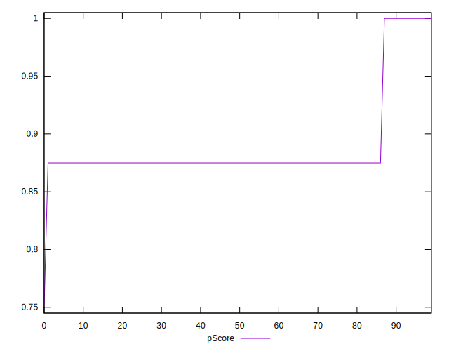
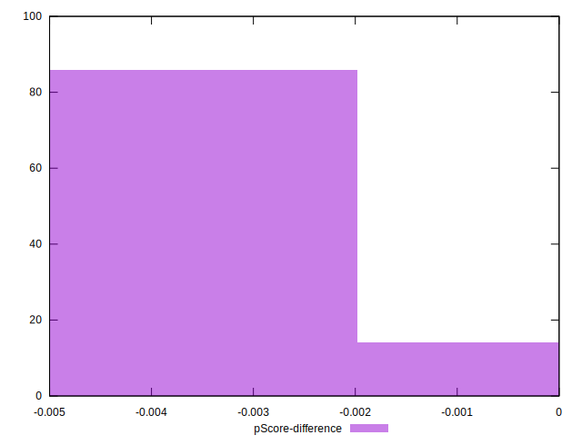

# //unused-css-rules/samples/pages+cached+noadtech+nomedia

[→ Parent](../..)


## Raw


```yaml
p90min: 0
p90max: 150
p90range: 150
p90mean: 134.04255319148936
p90median: 150
p90stdev: 46.249074721881186
p90skewness: -2.553242569566715
p90eccentricity: 1.000000000000001
p90discretization: 47
outlandishness: 0.9697560090702947
confidence: 20.83839017513743
p90confidence: 18.698949484981235

```


## Score


```yaml
p90min: 0.88
p90max: 1
p90range: 0.12
p90mean: 0.8927659574468082
p90median: 0.88
p90stdev: 0.036999259777504935
p90skewness: 2.553242569566724
p90eccentricity: 0.9999999999999972
p90discretization: 47
outlandishness: 1.003439558857407
confidence: 0.016798663683511232
p90confidence: 0.014959159587984982

```


## Raw Estimate


## Score Estimate


## P Score


```yaml
p90min: 0.875
p90max: 1
p90range: 0.125
p90mean: 0.8882978723404256
p90median: 0.875
p90stdev: 0.03854089560156764
p90skewness: 2.5532425695667147
p90eccentricity: 1.000000000000001
p90discretization: 47
outlandishness: 1.0038360070278605
confidence: 0.017365325145947862
p90confidence: 0.015582457904151022

```


## Score Difference


```yaml
p90min: 0
p90max: 0
p90range: 0
p90mean: 0
p90median: 0
p90stdev: 0
p90skewness: .nan
p90eccentricity: .nan
p90discretization: 94
outlandishness: .nan
confidence: 0
p90confidence: 0

```


## P Score Difference


```yaml
p90min: -0.0050000000000000044
p90max: 0
p90range: 0.0050000000000000044
p90mean: -0.004414893617021281
p90median: -0.0050000000000000044
p90stdev: 0.0016072281840146952
p90skewness: 2.3828522123573896
p90eccentricity: 1.000000000000003
p90discretization: 47
outlandishness: 0.9486290608215993
confidence: 0.0006800820847600484
p90confidence: 0.0006498179434822319

```

