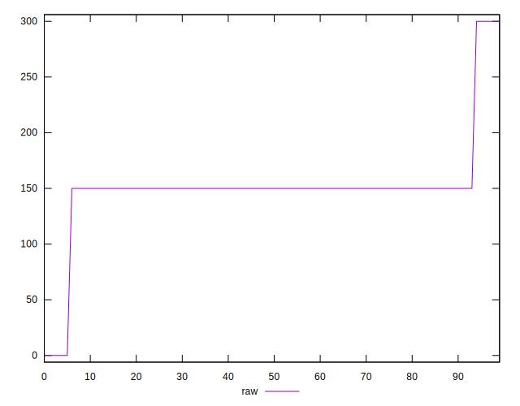
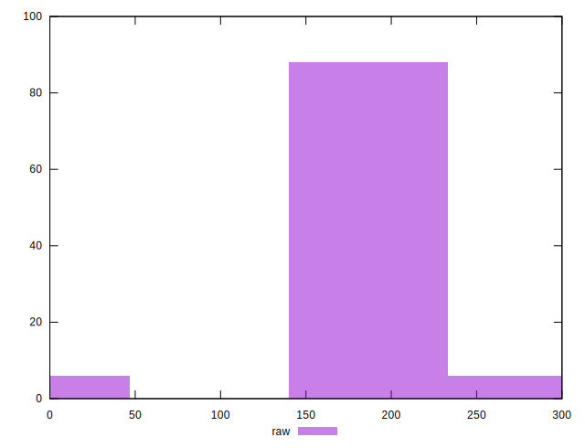
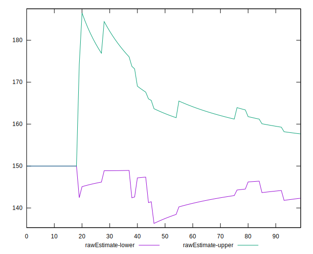

# //unused-css-rules/samples/pages+cached+noadtech

[→ Parent](../..)


## Raw


```yaml
p90min: 0
p90max: 300
p90range: 300
p90mean: 150
p90median: 150
p90stdev: 37.89683644799335
p90skewness: 0
p90eccentricity: 1
p90discretization: 31.333333333333332
outlandishness: 1
confidence: 20.368543213371098
p90confidence: 15.322058541559503

```


## Score


```yaml
p90min: 0.75
p90max: 1
p90range: 0.25
p90mean: 0.8796808510638298
p90median: 0.88
p90stdev: 0.03160434011602375
p90skewness: -0.4438654358430131
p90eccentricity: 1.000000000000001
p90discretization: 31.333333333333332
outlandishness: 0.9993615724826299
confidence: 0.016985731353213056
p90confidence: 0.012777941242921722

```


## Raw Estimate


## Score Estimate


## P Score


```yaml
p90min: 0.75
p90max: 1
p90range: 0.25
p90mean: 0.875
p90median: 0.875
p90stdev: 0.03158069703999446
p90skewness: -1.5117930548087238e-16
p90eccentricity: 1.0000000000000002
p90discretization: 31.333333333333332
outlandishness: 1
confidence: 0.01697378601114258
p90confidence: 0.012768382117966253

```


## Score Difference


```yaml
p90min: 0
p90max: 0
p90range: 0
p90mean: 0
p90median: 0
p90stdev: 0
p90skewness: .nan
p90eccentricity: .nan
p90discretization: 94
outlandishness: .nan
confidence: 0
p90confidence: 0

```


## P Score Difference


```yaml
p90min: -0.0050000000000000044
p90max: 0
p90range: 0.0050000000000000044
p90mean: -0.004521276595744685
p90median: -0.0050000000000000044
p90stdev: 0.0014712039027595053
p90skewness: 2.7477857990363095
p90eccentricity: 1.0000000000000007
p90discretization: 47
outlandishness: 0.9470724429065744
confidence: 0.0006369129072842692
p90confidence: 0.000594822007256111

```

