# //unused-css-rules/samples/pages+cached

[→ Parent](../..)


## Raw


```yaml
p90min: 0
p90max: 150
p90range: 150
p90mean: 64.7872340425532
p90median: 0
p90stdev: 73.58203879191586
p90skewness: 0.28495511836807697
p90eccentricity: 0.9999999999999994
p90discretization: 18.8
outlandishness: 1.0221243201997405
confidence: 28.940512550332286
p90confidence: 29.749931963957767

```

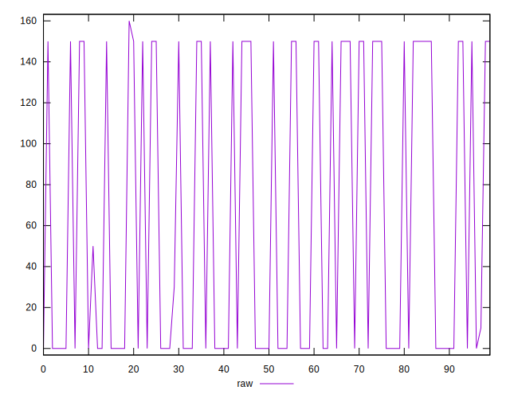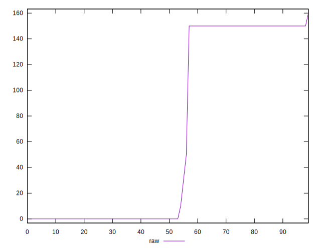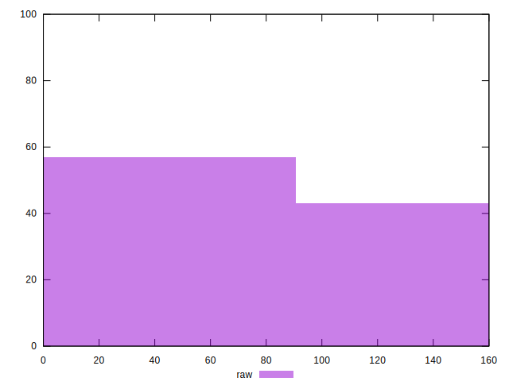
## Score


```yaml
p90min: 0.88
p90max: 1
p90range: 0.12
p90mean: 0.9481914893617017
p90median: 1
p90stdev: 0.058871709890586474
p90skewness: -0.28596747579328025
p90eccentricity: 0.9999999999999999
p90discretization: 18.8
outlandishness: 0.9987527732942934
confidence: 0.023164883899541425
p90confidence: 0.02380240331203257

```

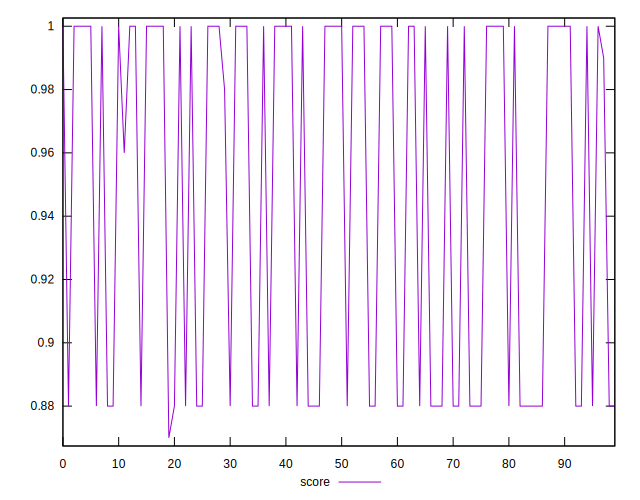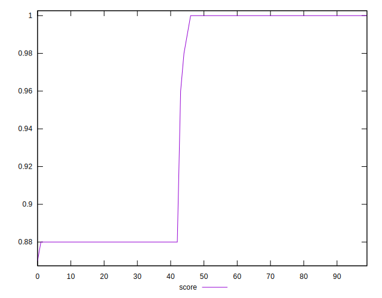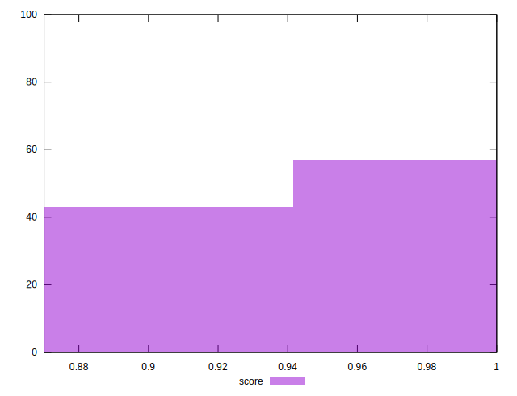
## Raw Estimate

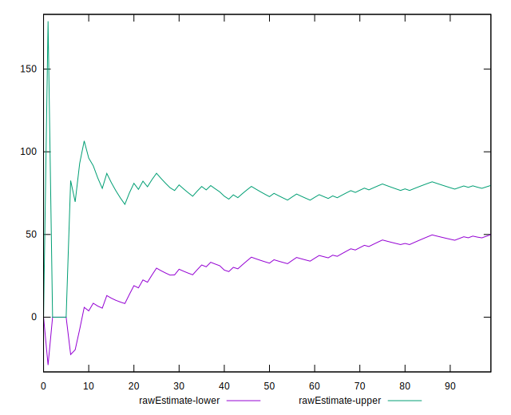
## Score Estimate

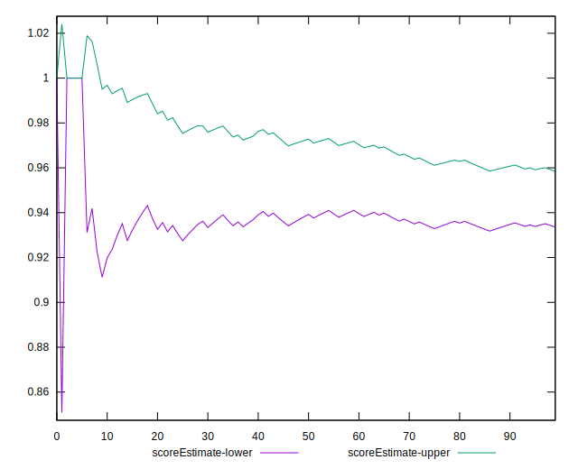
## P Score


```yaml
p90min: 0.875
p90max: 1
p90range: 0.125
p90mean: 0.9460106382978724
p90median: 1
p90stdev: 0.06131836565992991
p90skewness: -0.28495511836807735
p90eccentricity: 0.9999999999999982
p90discretization: 18.8
outlandishness: 0.9987446543649626
confidence: 0.024117093791943593
p90confidence: 0.024791609969964816

```

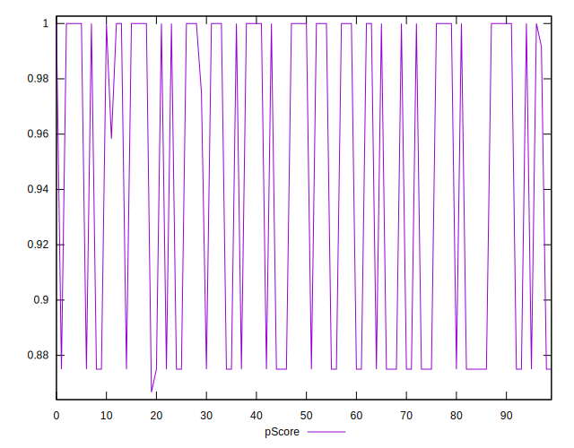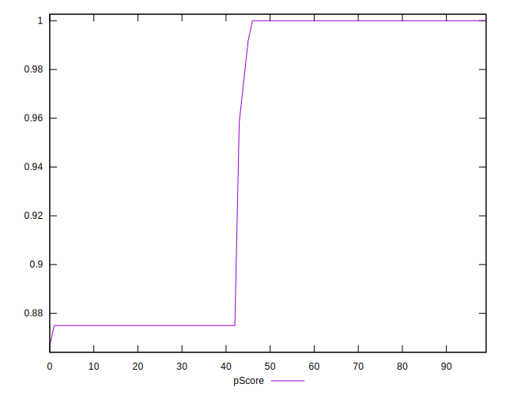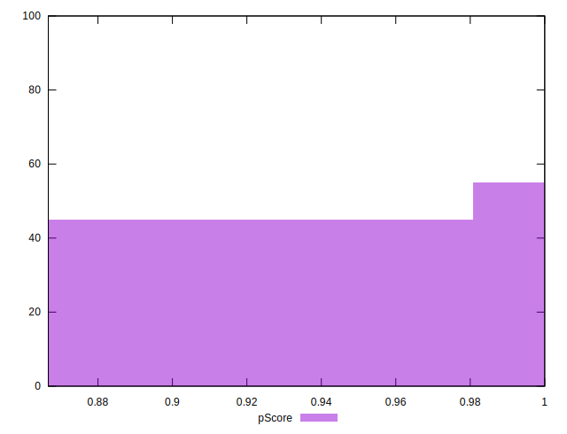
## Score Difference


```yaml
p90min: 0
p90max: 0
p90range: 0
p90mean: 0
p90median: 0
p90stdev: 0
p90skewness: .nan
p90eccentricity: .nan
p90discretization: 94
outlandishness: .nan
confidence: 0
p90confidence: 0

```


## P Score Difference


```yaml
p90min: -0.0050000000000000044
p90max: 0
p90range: 0.0050000000000000044
p90mean: -0.002180851063829788
p90median: 0
p90stdev: 0.0024555937462961497
p90skewness: -0.2573885367933486
p90eccentricity: 1.0000000000000002
p90discretization: 23.5
outlandishness: 1.002277718289378
confidence: 0.000972088569532104
p90confidence: 0.0009928203687046618

```

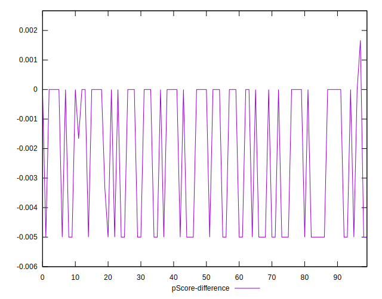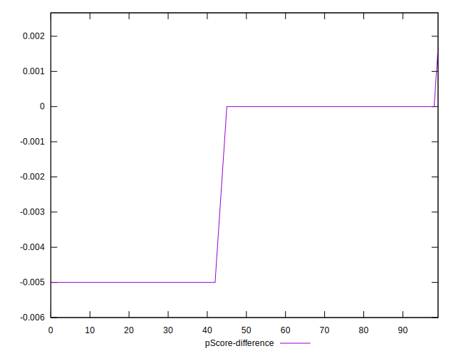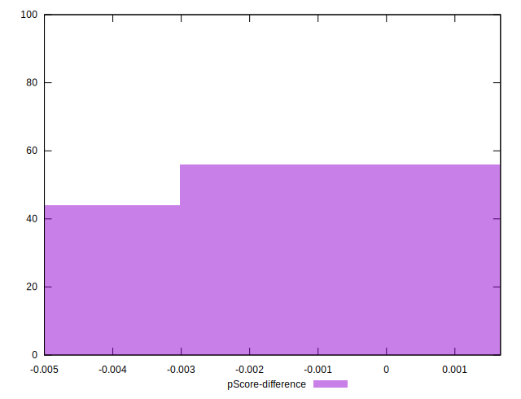