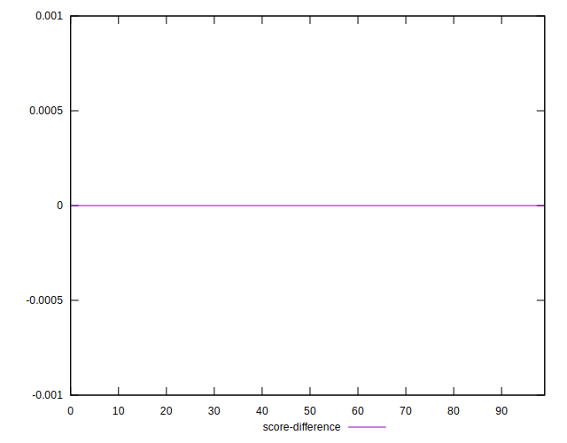

# //unused-css-rules/samples/pages

[→ Parent](../..)


## Raw


```yaml
p90min: 0
p90max: 160
p90range: 160
p90mean: 66.59574468085107
p90median: 50
p90stdev: 60.32806043218431
p90skewness: 0.2597818590884098
p90eccentricity: 0.9999999999999996
p90discretization: 6.714285714285714
outlandishness: 1.0610974532760358
confidence: 25.093785609634416
p90confidence: 24.391219961306614

```


## Score


```yaml
p90min: 0.87
p90max: 1
p90range: 0.13
p90mean: 0.9457446808510639
p90median: 0.96
p90stdev: 0.04902212617467112
p90skewness: -0.23830194217585365
p90eccentricity: 1.0000000000000007
p90discretization: 7.833333333333333
outlandishness: 0.996313864366504
confidence: 0.020488890158460372
p90confidence: 0.01982012108347897

```


## Raw Estimate


## Score Estimate


## P Score


```yaml
p90min: 0.8666666666666667
p90max: 1
p90range: 0.1333333333333333
p90mean: 0.9445035460992909
p90median: 0.9583333333333334
p90stdev: 0.0502733836934869
p90skewness: -0.2597818590884038
p90eccentricity: 1.0000000000000007
p90discretization: 6.714285714285714
outlandishness: 0.9964664272303748
confidence: 0.020911488008028667
p90confidence: 0.020326016634422166

```


## Score Difference


```yaml
p90min: 0
p90max: 0
p90range: 0
p90mean: 0
p90median: 0
p90stdev: 0
p90skewness: .nan
p90eccentricity: .nan
p90discretization: 94
outlandishness: .inf
confidence: 7.423946114831068e-18
p90confidence: 0

```


## P Score Difference


```yaml
p90min: -0.0050000000000000044
p90max: 0.0033333333333332993
p90range: 0.008333333333333304
p90mean: -0.0011879432624113501
p90median: 0
p90stdev: 0.0025569441491991164
p90skewness: -0.22353786892185099
p90eccentricity: 1.0000000000000007
p90discretization: 11.75
outlandishness: 0.96449988861662
confidence: 0.0010514211729103578
p90confidence: 0.0010337973196071723

```

