# //unused-javascript/samples/pages+cached+noadtech+nomedia+nocss

[→ Parent](../..)


## Raw


```yaml
p90min: 1050
p90max: 1060
p90range: 10
p90mean: 1050.212765957447
p90median: 1050
p90stdev: 1.4430489325798441
p90skewness: 6.634888026970213
p90eccentricity: 0.9999999999999982
p90discretization: 47
outlandishness: 1.0058878958652926
confidence: 8.242202033964176
p90confidence: 0.5834386797342838

```

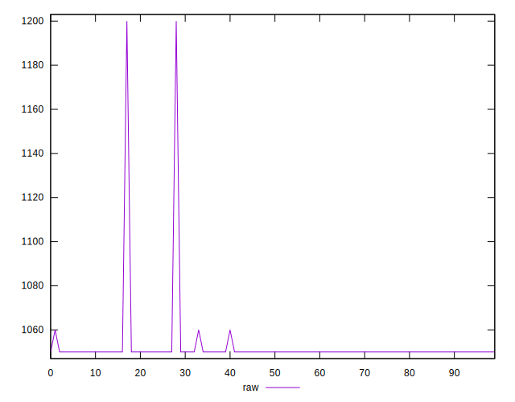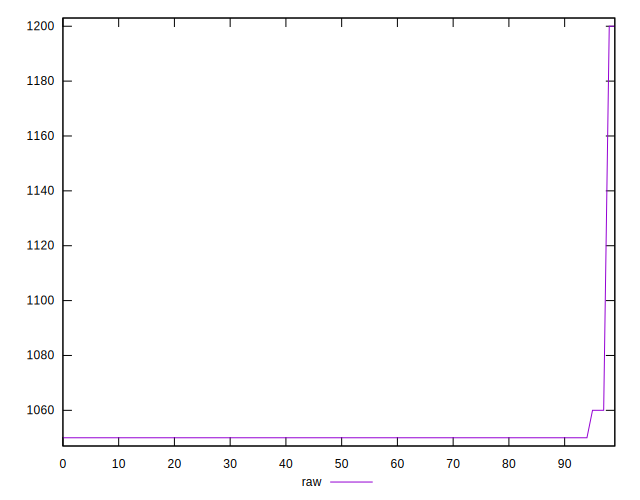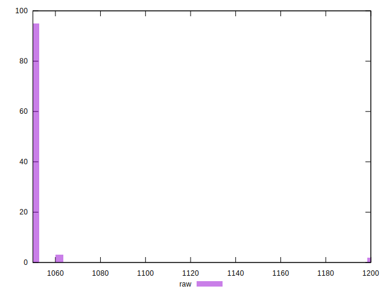
## Score


```yaml
p90min: 0.46
p90max: 0.46
p90range: 0
p90mean: 0.4600000000000007
p90median: 0.46
p90stdev: 6.661338147750939e-16
p90skewness: -1
p90eccentricity: 1
p90discretization: 94
outlandishness: 0.9991306238185255
confidence: 0.000548789915671216
p90confidence: 2.6932436221960113e-16

```

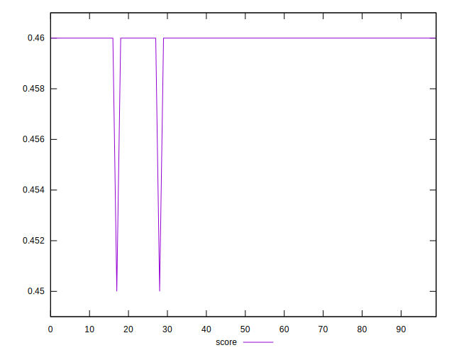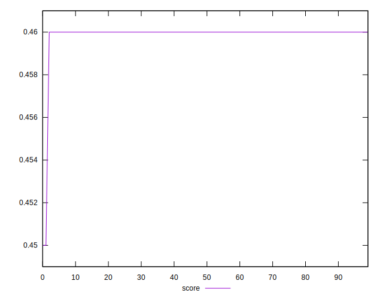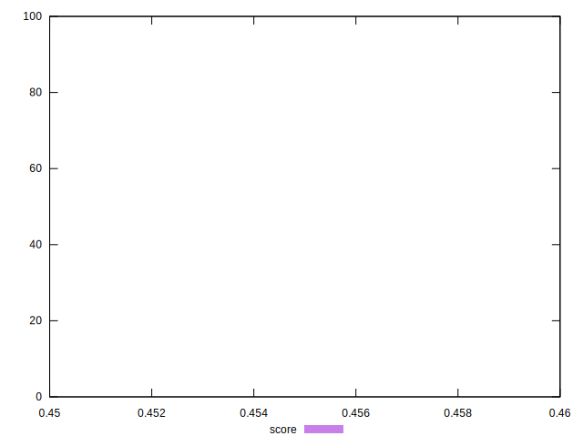
## Raw Estimate

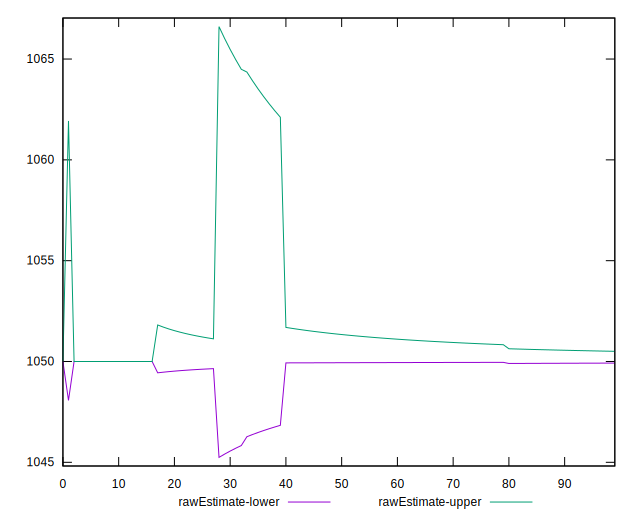
## Score Estimate

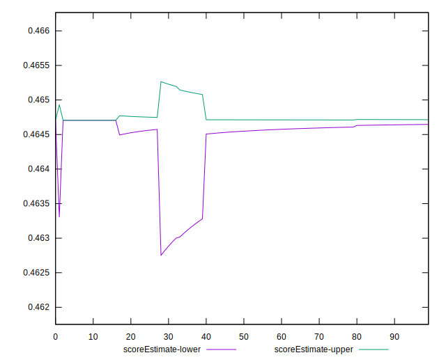
## P Score


```yaml
p90min: 0.46352941176470586
p90max: 0.4647058823529412
p90range: 0.0011764705882353343
p90mean: 0.46468085106382895
p90median: 0.4647058823529412
p90stdev: 0.00016977046265645804
p90skewness: -6.634888026955305
p90eccentricity: 0.9999999999999979
p90discretization: 47
outlandishness: 0.9984373702494681
confidence: 0.0009696708275251968
p90confidence: 0.00006863984467462396

```

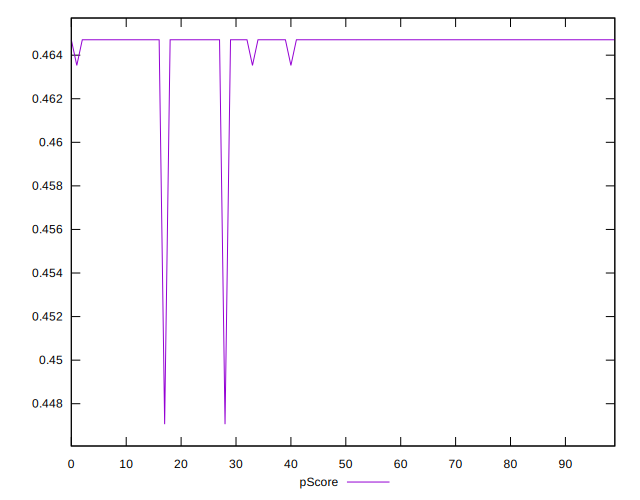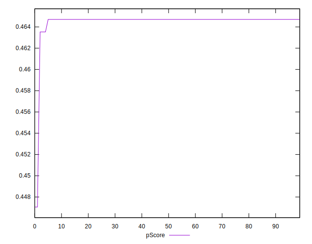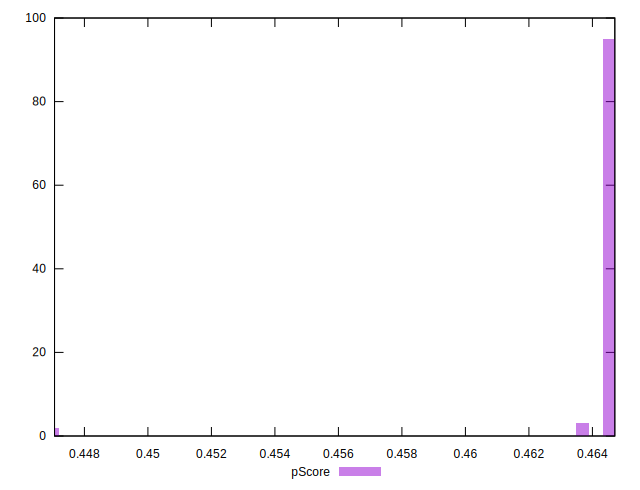
## Score Difference


```yaml
p90min: 0
p90max: 0
p90range: 0
p90mean: 0
p90median: 0
p90stdev: 0
p90skewness: .nan
p90eccentricity: .nan
p90discretization: 94
outlandishness: .nan
confidence: 0
p90confidence: 0

```


## P Score Difference


```yaml
p90min: 0.0035294117647058365
p90max: 0.004705882352941171
p90range: 0.0011764705882353343
p90mean: 0.004680851063829781
p90median: 0.004705882352941171
p90stdev: 0.00016977046265645812
p90skewness: -6.634888026970375
p90eccentricity: 0.999999999999998
p90discretization: 47
outlandishness: 0.9314830392633474
confidence: 0.0004250257959065844
p90confidence: 0.00006863984467462399

```

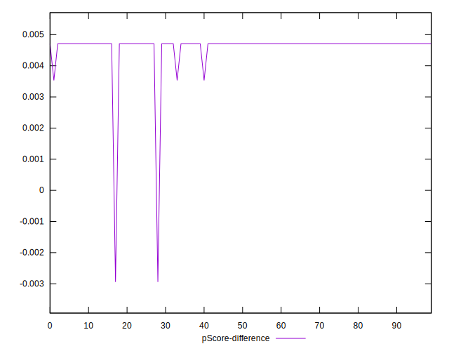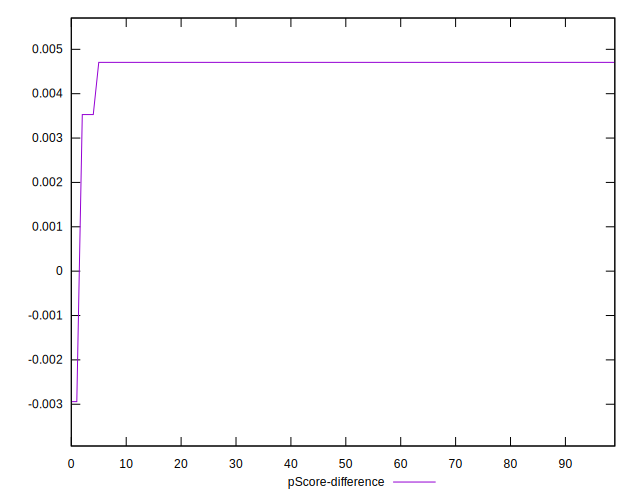