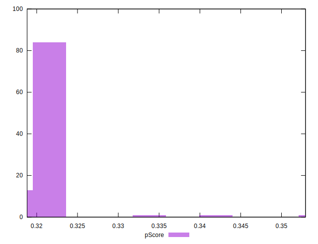

# //unused-javascript/samples/pages+cached+noadtech+nomedia

[→ Parent](../..)


## Raw


```yaml
p90min: 2250
p90max: 2290
p90range: 40
p90mean: 2257.446808510638
p90median: 2250
p90stdev: 14.06188224839005
p90skewness: 1.5148354642364739
p90eccentricity: 1.0000000000000009
p90discretization: 23.5
outlandishness: 0.9965063555046055
confidence: 13.423964886677913
p90confidence: 5.685355380785544

```


## Score


```yaml
p90min: 0.32
p90max: 0.32
p90range: 0
p90mean: 0.32000000000000023
p90median: 0.32
p90stdev: 2.220446049250313e-16
p90skewness: -1
p90eccentricity: 1
p90discretization: 94
outlandishness: 1.0037535156250001
confidence: 0.0014477223257830607
p90confidence: 8.977478740653372e-17

```


## Raw Estimate


## Score Estimate


## P Score


```yaml
p90min: 0.31882352941176473
p90max: 0.32352941176470584
p90range: 0.004705882352941115
p90mean: 0.3226533166458076
p90median: 0.32352941176470584
p90stdev: 0.0016543390880458665
p90skewness: -1.514835464237121
p90eccentricity: 1.0000000000000002
p90discretization: 23.5
outlandishness: 1.0028802711641924
confidence: 0.0015792899866679873
p90confidence: 0.0006688653389159375

```


## Score Difference


```yaml
p90min: 0
p90max: 0
p90range: 0
p90mean: 0
p90median: 0
p90stdev: 0
p90skewness: .nan
p90eccentricity: .nan
p90discretization: 94
outlandishness: .inf
confidence: 2.165089820536967e-18
p90confidence: 0

```


## P Score Difference


```yaml
p90min: -0.0011764705882352788
p90max: 0.0035294117647058365
p90range: 0.004705882352941115
p90mean: 0.0026032540675844473
p90median: 0.0035294117647058365
p90stdev: 0.0016559952493256083
p90skewness: -1.4334333887103552
p90eccentricity: 1.0000000000000016
p90discretization: 15.666666666666666
outlandishness: 0.9353121671597633
confidence: 0.0006817491895608214
p90confidence: 0.0006695349409846298

```

