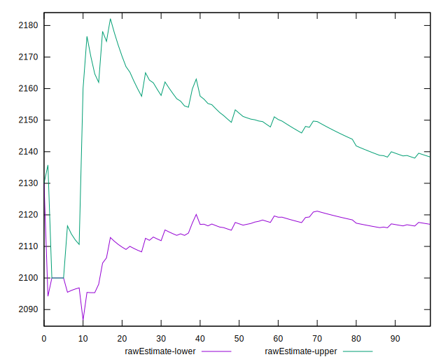
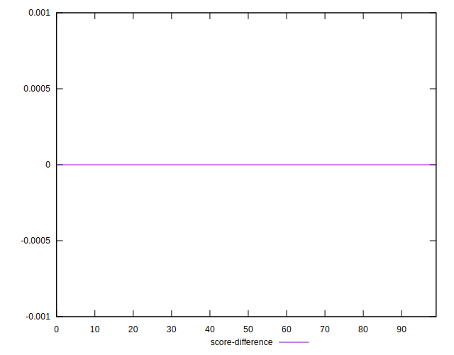
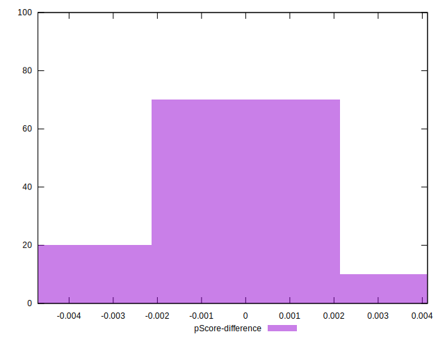

# //unused-javascript/samples/pages+cached+noadtech

[→ Parent](../..)


## Raw


```yaml
p90min: 2100
p90max: 2280
p90range: 180
p90mean: 2127.659574468085
p90median: 2100
p90stdev: 52.72218500127139
p90skewness: 1.9975838765417584
p90eccentricity: 0.9999999999999979
p90discretization: 11.75
outlandishness: 0.9994740691690002
confidence: 26.80666178864496
p90confidence: 21.31609075435595

```


## Score


```yaml
p90min: 0.32
p90max: 0.34
p90range: 0.020000000000000018
p90mean: 0.3374468085106382
p90median: 0.34
p90stdev: 0.00667420729419495
p90skewness: -2.2315184957216503
p90eccentricity: 0.9999999999999967
p90discretization: 47
outlandishness: 1.0003152833589635
confidence: 0.0031542635187310824
p90confidence: 0.002698446742922609

```


## Raw Estimate


## Score Estimate


## P Score


```yaml
p90min: 0.32
p90max: 0.3411764705882353
p90range: 0.021176470588235297
p90mean: 0.3379224030037543
p90median: 0.3411764705882353
p90stdev: 0.006202610000149585
p90skewness: -1.9975838765415597
p90eccentricity: 0.9999999999999991
p90discretization: 11.75
outlandishness: 1.0003896675824424
confidence: 0.0031537249163111764
p90confidence: 0.00250777538286541

```


## Score Difference


```yaml
p90min: 0
p90max: 0
p90range: 0
p90mean: 0
p90median: 0
p90stdev: 0
p90skewness: .nan
p90eccentricity: .nan
p90discretization: 94
outlandishness: .inf
confidence: 3.0463960003014037e-18
p90confidence: 0

```


## P Score Difference


```yaml
p90min: -0.0035294117647059475
p90max: 0.0035294117647058365
p90range: 0.007058823529411784
p90mean: 0.0005193992490613055
p90median: 0.0011764705882352788
p90stdev: 0.0017328292945919025
p90skewness: -0.8616472817819385
p90eccentricity: 1.0000000000000016
p90discretization: 10.444444444444445
outlandishness: 0.8835999999999957
confidence: 0.0007613148955891634
p90confidence: 0.0007005996907077515

```

