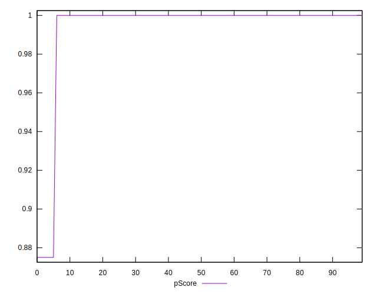
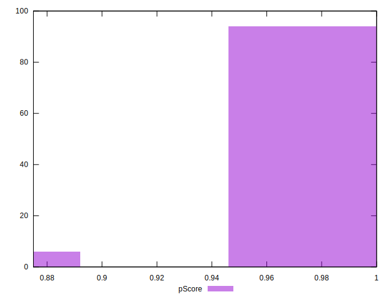

# //uses-http2/samples/pages+cached+noadtech+nomedia+nocss

[→ Parent](../..)


## Raw


```yaml
p90min: 0
p90max: 150
p90range: 150
p90mean: 4.787234042553192
p90median: 0
p90stdev: 26.36602921573137
p90skewness: 5.326002287485447
p90eccentricity: 0.9999999999999988
p90discretization: 47
outlandishness: 3.5343999999999998
confidence: 13.963969698421502
p90confidence: 10.660041338972905

```


## Score


```yaml
p90min: 0.88
p90max: 1
p90range: 0.12
p90mean: 0.9961702127659574
p90median: 1
p90stdev: 0.021092823372585067
p90skewness: -5.326002287485468
p90eccentricity: 1.000000000000003
p90discretization: 47
outlandishness: 0.9932451066651509
confidence: 0.011171175758737193
p90confidence: 0.008528033071178312

```


## Raw Estimate


## Score Estimate


## P Score


```yaml
p90min: 0.875
p90max: 1
p90range: 0.125
p90mean: 0.9960106382978723
p90median: 1
p90stdev: 0.02197169101310945
p90skewness: -5.326002287485478
p90eccentricity: 1.0000000000000024
p90discretization: 47
outlandishness: 0.9929630243083347
confidence: 0.01163664141535126
p90confidence: 0.00888336778247741

```


## Score Difference


```yaml
p90min: 0
p90max: 0
p90range: 0
p90mean: 0
p90median: 0
p90stdev: 0
p90skewness: .nan
p90eccentricity: .nan
p90discretization: 94
outlandishness: .nan
confidence: 0
p90confidence: 0

```


## P Score Difference


```yaml
p90min: -0.0050000000000000044
p90max: 0
p90range: 0.0050000000000000044
p90mean: -0.00015957446808510654
p90median: 0
p90stdev: 0.0008788676405243787
p90skewness: -5.326002287485487
p90eccentricity: 1.0000000000000033
p90discretization: 47
outlandishness: 3.534399999999999
confidence: 0.00046546565661404995
p90confidence: 0.00035533471129909673

```

