# //uses-http2/samples/pages+cached+noadtech

[→ Parent](../..)


## Raw


```yaml
p90min: 0
p90max: 150
p90range: 150
p90mean: 100.53191489361703
p90median: 150
p90stdev: 70.52036104463092
p90skewness: -0.7241005155222721
p90eccentricity: 1.0000000000000007
p90discretization: 47
outlandishness: 1.0294196019148398
confidence: 30.979833307527997
p90confidence: 28.512065955177135

```

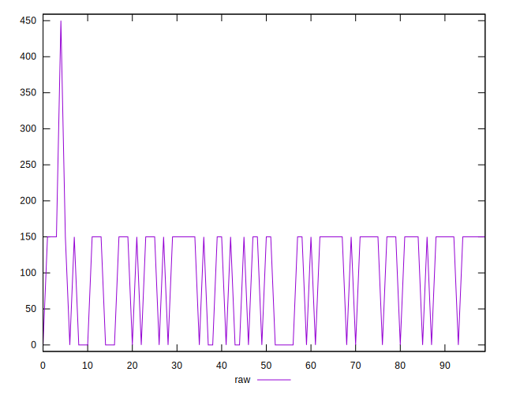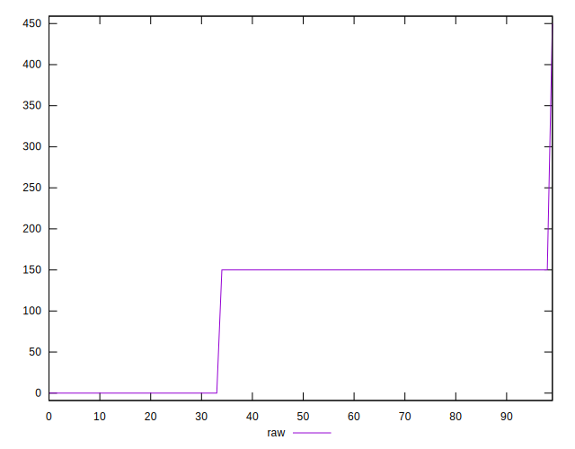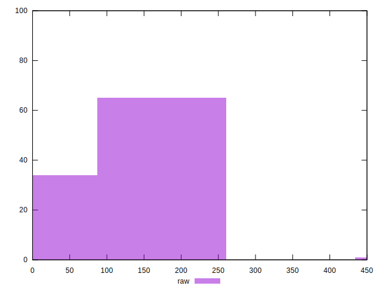
## Score


```yaml
p90min: 0.88
p90max: 1
p90range: 0.12
p90mean: 0.9195744680851059
p90median: 0.88
p90stdev: 0.056416288835704716
p90skewness: 0.7241005155222945
p90eccentricity: 1.0000000000000004
p90discretization: 47
outlandishness: 0.9980990070335232
confidence: 0.024288722704069204
p90confidence: 0.0228096527641417

```

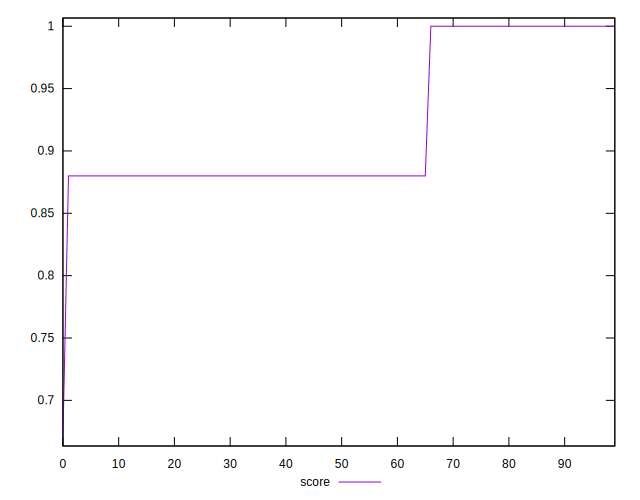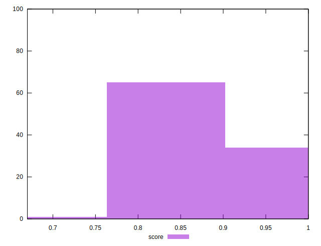
## Raw Estimate

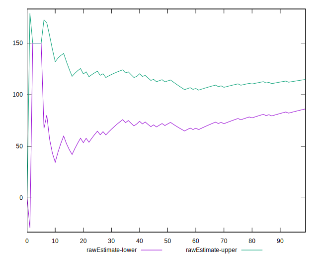
## Score Estimate

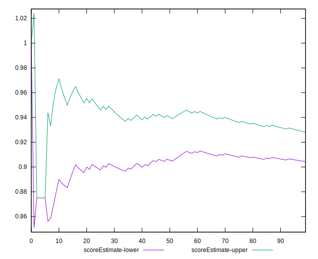
## P Score


```yaml
p90min: 0.875
p90max: 1
p90range: 0.125
p90mean: 0.9162234042553191
p90median: 0.875
p90stdev: 0.05876696753719243
p90skewness: 0.7241005155222741
p90eccentricity: 1.0000000000000004
p90discretization: 47
outlandishness: 0.9982397689964799
confidence: 0.025139610307168294
p90confidence: 0.023760054962647614

```

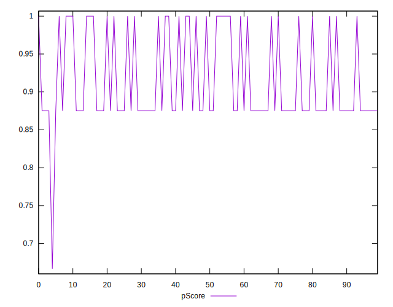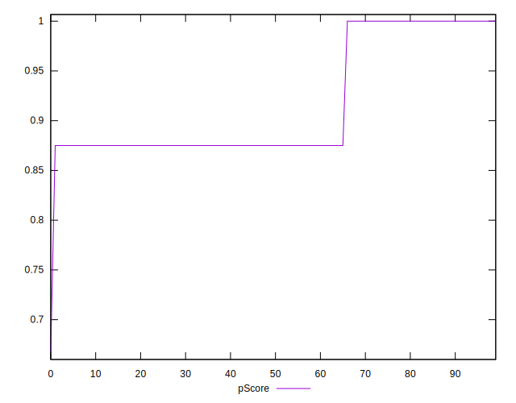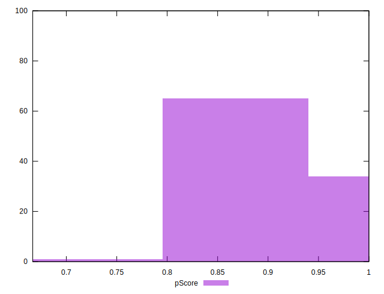
## Score Difference


```yaml
p90min: 0
p90max: 0
p90range: 0
p90mean: 0
p90median: 0
p90stdev: 0
p90skewness: .nan
p90eccentricity: .nan
p90discretization: 94
outlandishness: .nan
confidence: 0
p90confidence: 0

```


## P Score Difference


```yaml
p90min: -0.0050000000000000044
p90max: 0
p90range: 0.0050000000000000044
p90mean: -0.003333333333333337
p90median: -0.0050000000000000044
p90stdev: 0.002344451727101504
p90skewness: 0.7108982656372304
p90eccentricity: 0.9999999999999999
p90discretization: 31.333333333333332
outlandishness: 0.970225
confidence: 0.0009260354514846
p90confidence: 0.0009478845723654487

```

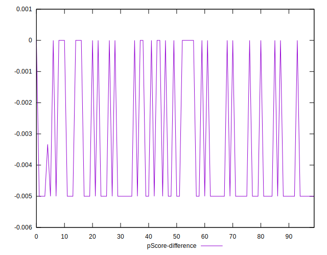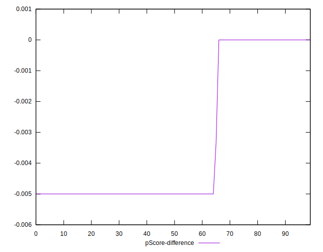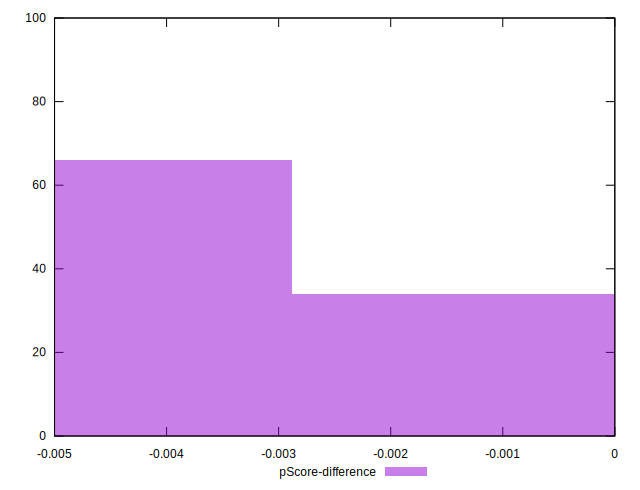