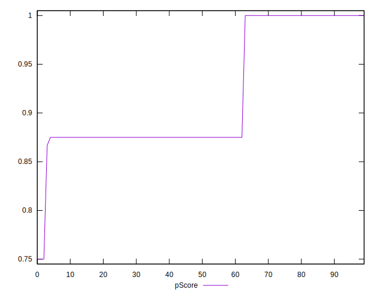
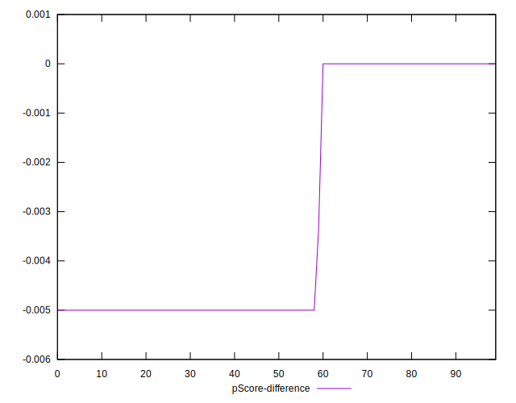

# //uses-http2/samples/pages+cached

[→ Parent](../..)


## Raw


```yaml
p90min: 0
p90max: 160
p90range: 160
p90mean: 95.85106382978724
p90median: 150
p90stdev: 72.16130828748801
p90skewness: -0.574995673222208
p90eccentricity: 0.9999999999999979
p90discretization: 31.333333333333332
outlandishness: 1.0689402594970934
confidence: 31.38437886454044
p90confidence: 29.175516841194252

```


## Score


```yaml
p90min: 0.87
p90max: 1
p90range: 0.13
p90mean: 0.9232978723404252
p90median: 0.88
p90stdev: 0.05774832221699017
p90skewness: 0.5746180388222815
p90eccentricity: 1.0000000000000004
p90discretization: 31.333333333333332
outlandishness: 0.9937326299975058
confidence: 0.02541564734472589
p90confidence: 0.023348206779735467

```


## Raw Estimate


## Score Estimate


## P Score


```yaml
p90min: 0.8666666666666667
p90max: 1
p90range: 0.1333333333333333
p90mean: 0.9201241134751774
p90median: 0.875
p90stdev: 0.06013442357290664
p90skewness: 0.5749956732222141
p90eccentricity: 1.0000000000000016
p90discretization: 31.333333333333332
outlandishness: 0.9941236981731799
confidence: 0.026153649053783676
p90confidence: 0.024312930700995196

```


## Score Difference


```yaml
p90min: 0
p90max: 0
p90range: 0
p90mean: 0
p90median: 0
p90stdev: 0
p90skewness: .nan
p90eccentricity: .nan
p90discretization: 94
outlandishness: .nan
confidence: 0
p90confidence: 0

```


## P Score Difference


```yaml
p90min: -0.0050000000000000044
p90max: 0
p90range: 0.0050000000000000044
p90mean: -0.0030141843971631227
p90median: -0.0050000000000000044
p90stdev: 0.0024344430062886407
p90skewness: 0.42373203145388266
p90eccentricity: 0.9999999999999988
p90discretization: 31.333333333333332
outlandishness: 0.9796341730103807
confidence: 0.0009570432756572917
p90confidence: 0.0009842689193762437

```

