# //uses-http2/samples/pages

[→ Parent](../..)


## Raw


```yaml
p90min: 0
p90max: 300
p90range: 300
p90mean: 146.80851063829786
p90median: 150
p90stdev: 65.56161250268346
p90skewness: -0.10866313394966334
p90eccentricity: 0.9999999999999982
p90discretization: 31.333333333333332
outlandishness: 1.0245547078344888
confidence: 30.625752758010577
p90confidence: 26.507195824213607

```

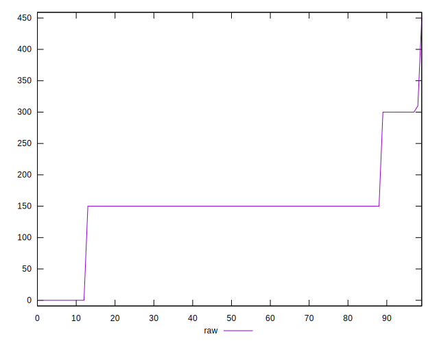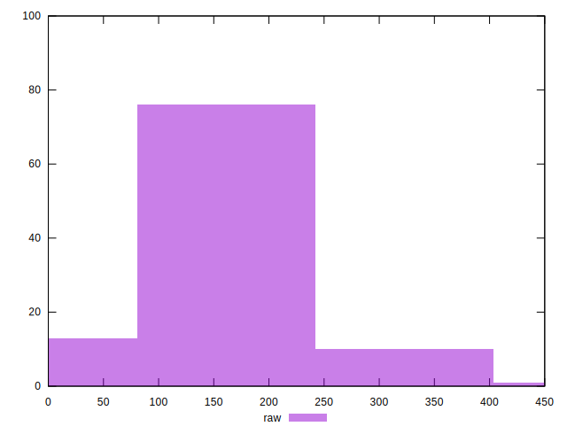
## Score


```yaml
p90min: 0.75
p90max: 1
p90range: 0.25
p90mean: 0.8817021276595742
p90median: 0.88
p90stdev: 0.05447307158025847
p90skewness: -0.11325324208568469
p90eccentricity: 0.9999999999999992
p90discretization: 31.333333333333332
outlandishness: 0.9970485130849268
confidence: 0.0248841028883792
p90confidence: 0.022023991180284284

```

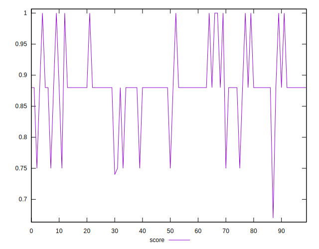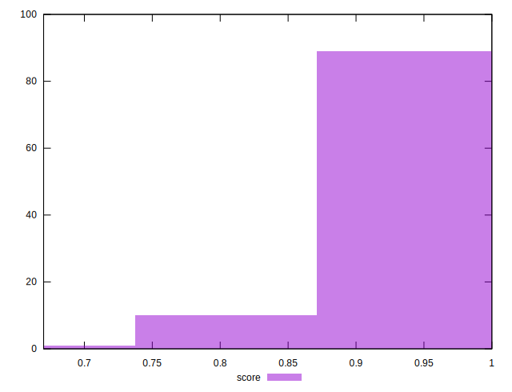
## Raw Estimate

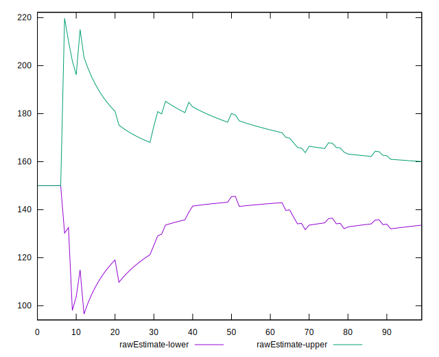
## Score Estimate

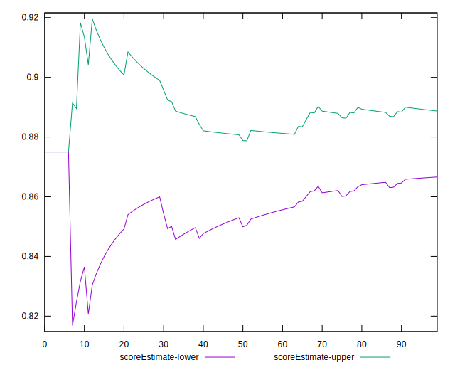
## P Score


```yaml
p90min: 0.75
p90max: 1
p90range: 0.25
p90mean: 0.8776595744680851
p90median: 0.875
p90stdev: 0.05463467708556946
p90skewness: 0.10866313394966605
p90eccentricity: 1.000000000000001
p90discretization: 31.333333333333332
outlandishness: 0.9976122015105036
confidence: 0.02491353889624909
p90confidence: 0.022089329853511305

```

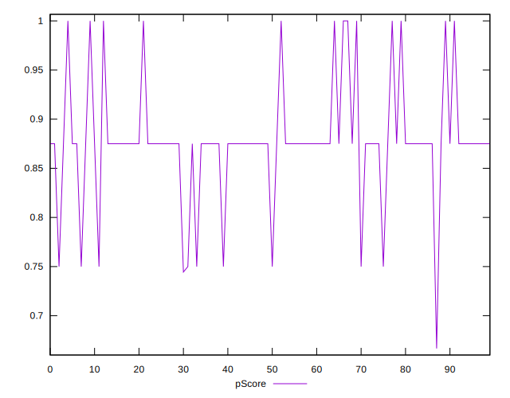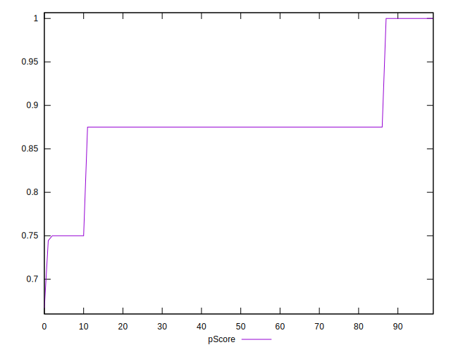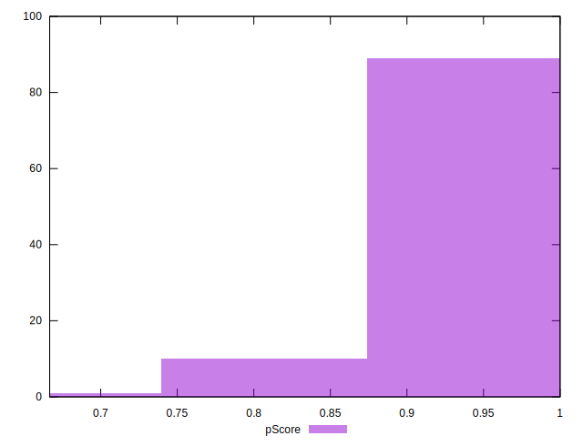
## Score Difference


```yaml
p90min: 0
p90max: 0
p90range: 0
p90mean: 0
p90median: 0
p90stdev: 0
p90skewness: .nan
p90eccentricity: .nan
p90discretization: 94
outlandishness: .nan
confidence: 0
p90confidence: 0

```


## P Score Difference


```yaml
p90min: -0.0050000000000000044
p90max: 0
p90range: 0.0050000000000000044
p90mean: -0.003918439716312061
p90median: -0.0050000000000000044
p90stdev: 0.0020442424309123045
p90skewness: 1.3836932243843756
p90eccentricity: 1
p90discretization: 31.333333333333332
outlandishness: 0.9349694050308369
confidence: 0.0008723898959214382
p90confidence: 0.000826507042152769

```

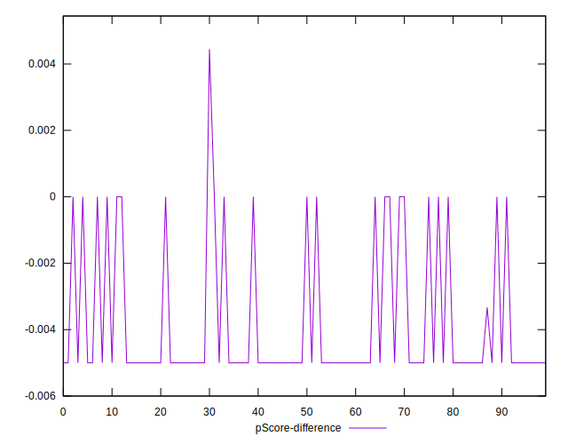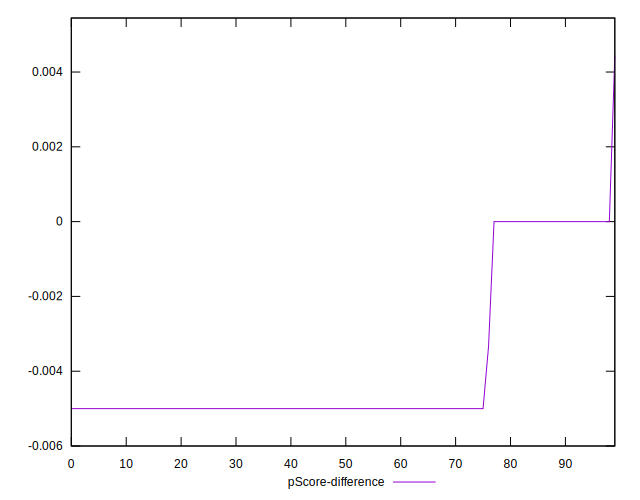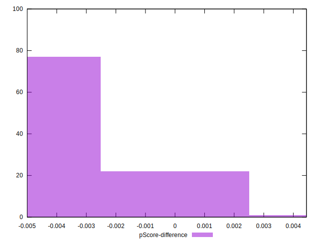