# //uses-long-cache-ttl/samples/pages+cached+noadtech+nomedia+nocss

[→ Parent](../..)


## Raw


```yaml
p90min: 238511.51666666666
p90max: 238513.28333333333
p90range: 1.7666666666627862
p90mean: 238512.47517730482
p90median: 238512.4
p90stdev: 0.5098772895104255
p90skewness: -0.0030049308655883955
p90eccentricity: 0.999999999999998
p90discretization: 31.333333333333332
outlandishness: 0.999993550223617
confidence: 3.0980814975845115
p90confidence: 0.20614833350566103

```

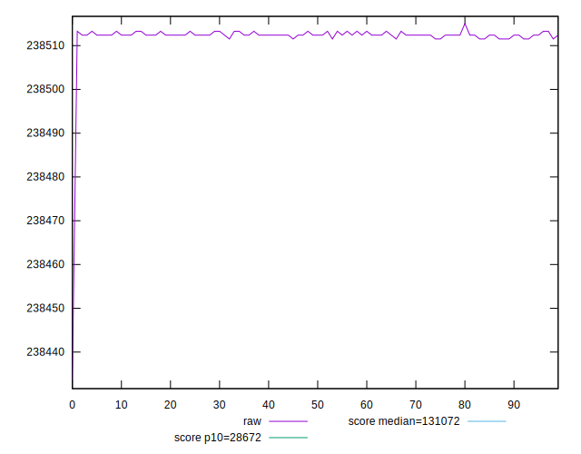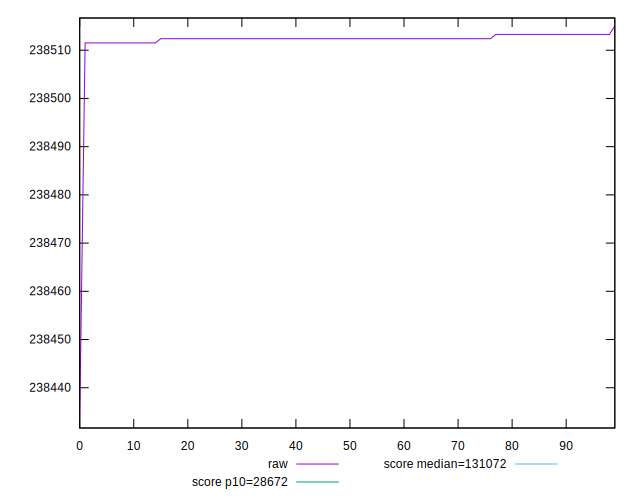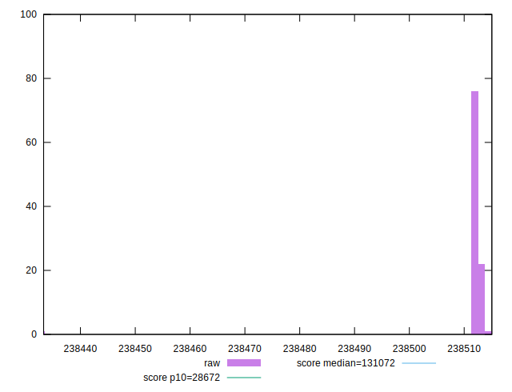
## Score


```yaml
p90min: 0.31
p90max: 0.31
p90range: 0
p90mean: 0.3099999999999995
p90median: 0.31
p90stdev: 4.996003610813204e-16
p90skewness: 1
p90eccentricity: 1
p90discretization: 94
outlandishness: 0.9999999999999996
confidence: 2.175997143072433e-16
p90confidence: 2.0199327166470086e-16

```

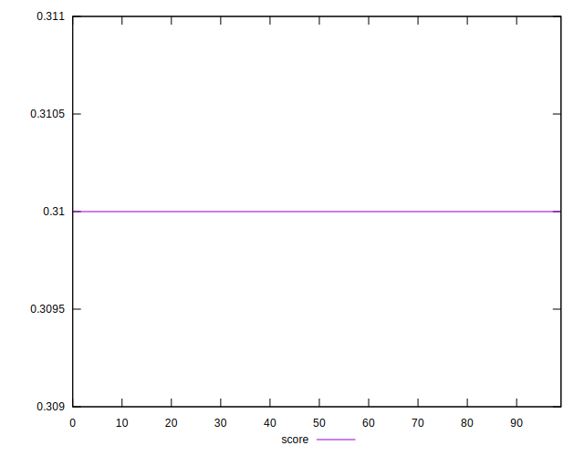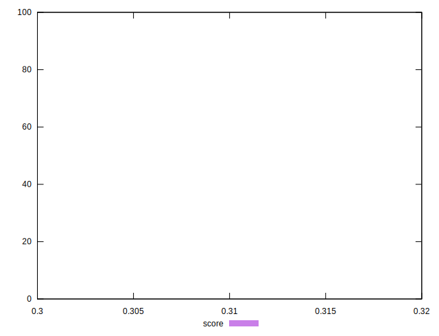
## Raw Estimate

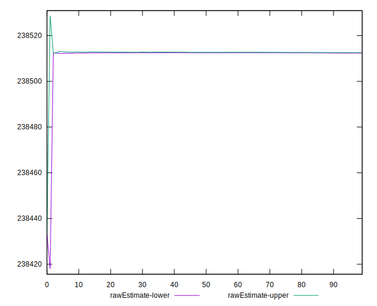
## Score Estimate

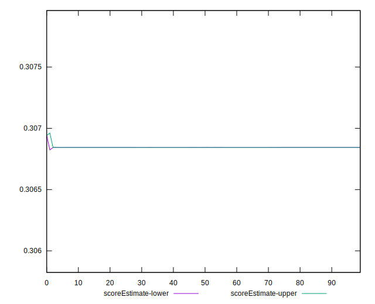
## P Score


```yaml
p90min: 0.30684296121706534
p90max: 0.30684515482521774
p90range: 0.0000021936081524009943
p90mean: 0.306843964674204
p90median: 0.30684405801824605
p90stdev: 6.330964989822597e-7
p90skewness: 0.003013788685252764
p90eccentricity: 1.0000000000000027
p90discretization: 31.333333333333332
outlandishness: 1.000006226582759
confidence: 0.000003847682933612662
p90confidence: 2.5596705501195433e-7

```

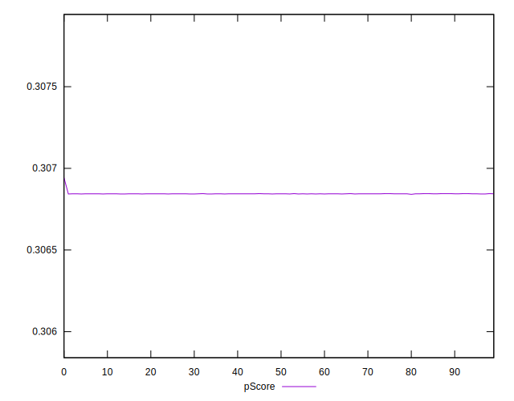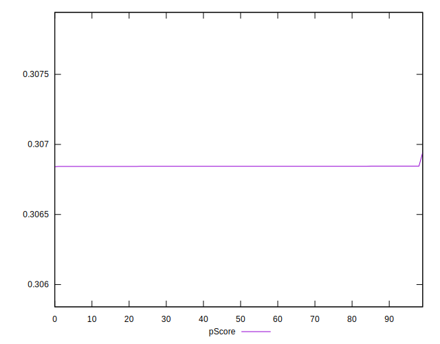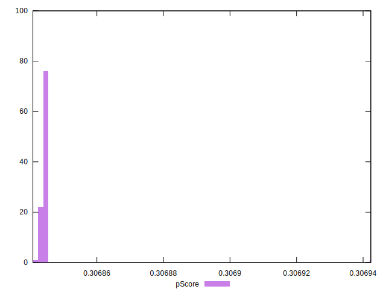
## Score Difference


```yaml
p90min: 0
p90max: 0
p90range: 0
p90mean: 0
p90median: 0
p90stdev: 0
p90skewness: .nan
p90eccentricity: .nan
p90discretization: 94
outlandishness: .nan
confidence: 0
p90confidence: 0

```


## P Score Difference


```yaml
p90min: -0.0031570387829346624
p90max: -0.0031548451747822615
p90range: 0.0000021936081524009943
p90mean: -0.0031560353257960145
p90median: -0.0031559419817539514
p90stdev: 6.330964989822601e-7
p90skewness: 0.0030137882146482314
p90eccentricity: 1.000000000000001
p90discretization: 31.333333333333332
outlandishness: 0.9993947161507256
confidence: 0.000003847682933612662
p90confidence: 2.559670550119545e-7

```

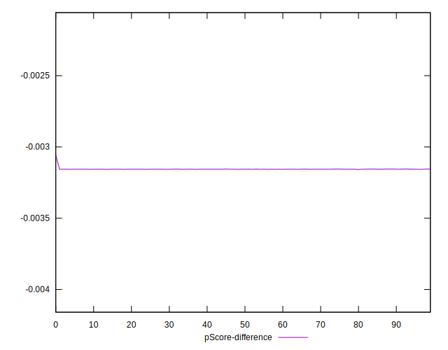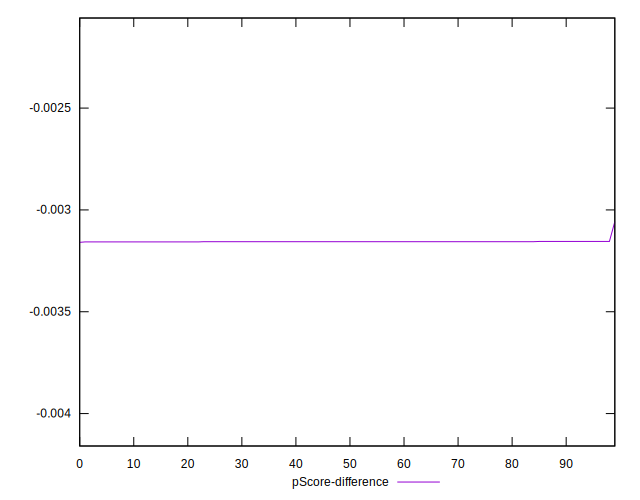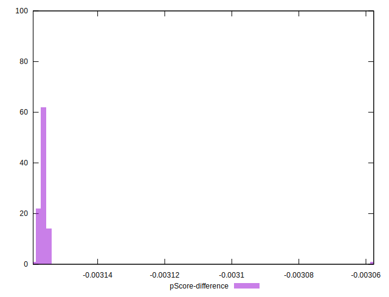